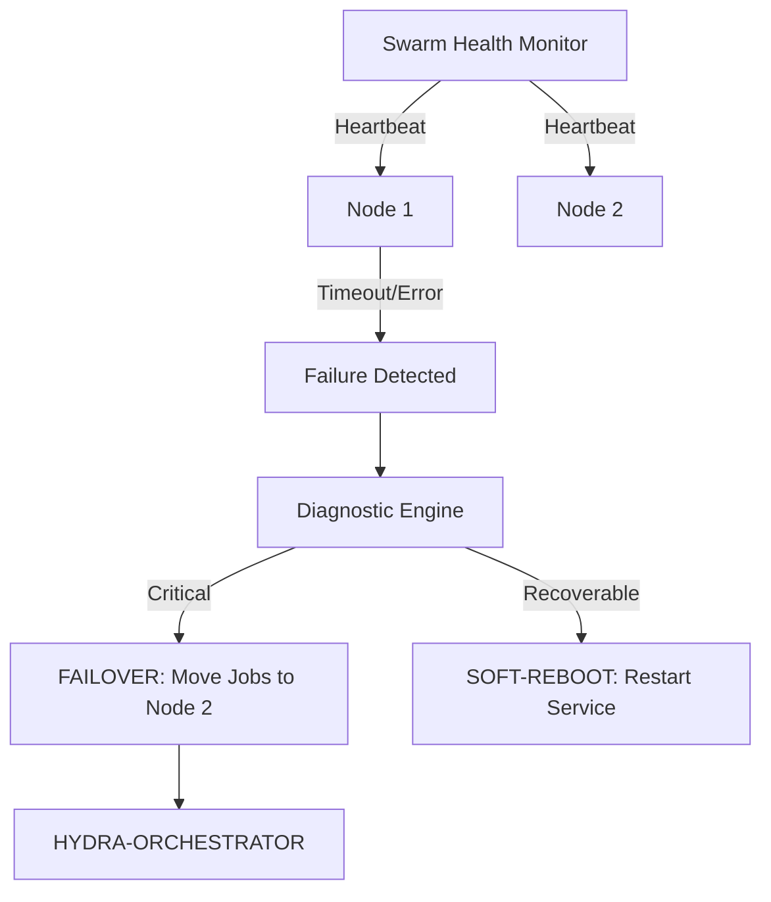

<p align="center">
  
</p>

# 💊 HYDRA-UMC-NODE-HEALING

<p align="center">🇺🇸 <b>English</b> | <a href="README_spa.md">🇪🇸 Español</a> | <a href="README_fra.md">🇫🇷 Français</a> | <a href="README_ita.md">🇮🇹 Italiano</a> | <a href="README_deu.md">🇩🇪 Deutsch</a> | <a href="README_zho.md">🇨🇳 简体中文</a> | <a href="README_jpn.md">🇯🇵 日本語</a></p>

### 🛡️ High-Availability Monitor & Failover Manager for HydraNodes

<p align="left">
  
  
  
</p>

---

## 1. 🛠️ TECHNICAL OVERVIEW

**HYDRA-UMC-NODE-HEALING** is the resilience layer of the swarm. It continuously monitors the health of all physical HydraNodes (Controllers) and logical services, ensuring zero downtime in the micro-factory.

If a node fails due to hardware malfunction or network outage, the Healing Manager automatically triggers a failover process, redirecting its active missions to other nodes and notifying the operator via the Orchestrator.

### Key Features:
* 💓 **Health Heartbeat:** Sub-10ms monitoring of node availability and thermal state.
* 🔄 **Automatic Failover:** Transparently reassigns missions from failed nodes to healthy ones.
* 🛡️ **Soft Reboot:** Attempts remote service recovery before triggering a full hardware reset.
* 📡 **Operator Alerts:** Real-time notification across all interfaces (Studios, Apps, Watch).
* 🔁 **Bounded Retry + Verified Node Identity (v0, real):** a transient network blip no longer flips a node to `UNREACHABLE` on the first miss - `checkNode` retries with a deterministic, capped exponential backoff before giving up; a node that answers but cannot correctly self-identify is classified `INVALID` and never trusted, retried, or reported healthy.

---

## 2. 🔄 HEALING WORKFLOW



---

## 3. 🧱 ARCHITECTURE & DESIGN DECISIONS

* **Why the real logic lives under `src/`, not at the repo root.** `src/healthpb` (generated gRPC stubs), `src/watchdog` (the polling engine) and `src/config` (the node registry loader) hold the actual implementation; `main.go`/`version.go` stay at the repo root as the entry point that wires them together.
* **Why detection is separate from the orchestrator it protects.** A node-healing watchdog that ran INSIDE the orchestrator process couldn't detect that same process hanging - running as an independent service is what makes 'detect an unresponsive node and reroute its work' actually possible, including when the unresponsive node is the orchestrator itself.
* **Why detection is real today but failover/soft-reboot are not.** `src/watchdog` polls every registered node's `HealthService.Check()` (the shared `hydra.common.v1` gRPC contract from `HYDRA-UMC-ORCHESTRATOR/proto/hydra_common.proto`) on a real interval over a real network connection, classifies HEALTHY/DEGRADED/UNHEALTHY/UNREACHABLE, and fires a `Reactor` callback on every state *change* (never every tick). It does not yet call HYDRA-UMC-ORCHESTRATOR to trigger an actual failover or soft-reboot, because ORCHESTRATOR has no API to call for that yet either - `watchdog.Reactor` is the seam where that plugs in once it does. Detection did not need to wait on that to be real.
* **Why the node registry is a static JSON file, not a live query to HYDRA-UMC-SWARM-SYNC.** SWARM-SYNC (the README's original stated source of truth for "every cell in the swarm") has no real API yet either - it's still andamiaje. A static `nodes.json` (see `nodes.example.json`) is the honest v0, not a placeholder pretending to be dynamic. Swap `src/config.LoadNodes` for a real SWARM-SYNC client once that project has one to call.
* **How this fits the rest of the ecosystem.** A sibling service under HYDRA-UMC-ORCHESTRATOR - watches every node in its registry and reports state changes; rerouting work away from one that stops responding is the next layer, built on top of this once ORCHESTRATOR exposes something to reroute work through.
* **Why a transport failure is retried (bounded) but an identity mismatch never is.** A connection refused or an RPC timeout can be a genuinely transient blip - a node mid-restart, a brief network hiccup - so `checkNode` retries it up to `RetryPolicy.MaxAttempts` times with exponential backoff before giving up. A node that answers but reports the wrong name (or none at all) is a different kind of problem entirely: no amount of waiting fixes a service bound to the wrong port, so that case is classified `StatusInvalid` immediately, with zero retries.
* **Why the backoff has no random jitter.** A real production fleet would want jitter to avoid a thundering herd of simultaneous reconnects, but this watchdog already polls each node from its own goroutine at its own pace - the only thing jitter would cost here is making `RetryPolicy.Backoff()` non-deterministic and harder to assert on in tests. Add jitter if/when this watchdog ever polls hundreds of nodes against a shared bottleneck resource.

For the full picture, see [`docs/ARCHITECTURE.md`](docs/ARCHITECTURE.md) for the architecture guide, [`docs/BUILD_AND_RUN.md`](docs/BUILD_AND_RUN.md) for the release-vs-test build flow, and [`docs/INTEGRATION_CONTRACT.md`](docs/INTEGRATION_CONTRACT.md) for the versioned health-snapshot contract a future adapter must honor.

---

## 📂 DIRECTORY STRUCTURE

```text
HYDRA-UMC-NODE-HEALING/
├── src/
│   ├── healthpb/      # Generated Go stubs for hydra.common.v1
│   │                  # (vendored from HYDRA-UMC-ORCHESTRATOR/proto/
│   │                  # hydra_common.proto - see that repo's proto/README.md
│   │                  # for the codegen command)
│   ├── watchdog/      # Real polling loop: dial, Check(), classify, react
│   │                  # on state change only, plus retry.go (RetryPolicy)
│   └── config/        # Static JSON node registry loader
├── build/             # Compiled binaries (build.sh/build.bat output)
├── images/            # Media and diagrams
├── systemd/
│   └── hydra-umc-node-healing.service # Local CM5 watchdog systemd unit
├── tools/
│   ├── build_test.py  # Non-versioning build/compile check
│   └── ci_validate.py # Manifest/CHANGELOG/docs validation used by CI
├── nodes.example.json # Example node registry (see src/config)
├── go.mod / go.sum    # Go module definition
├── version.go         # const Version = "X.Y.Z" (go.mod has no app version field)
├── main.go            # Entry point: loads the registry, runs the watchdog
├── bump_version.py    # Odometer-style version bump, run by build.sh/.bat
├── bump_manifest_version.py # Syncs hydra-umc.project.json's version to the native one (--sync)
├── build.sh/.bat      # Bumps version, then `go build`
├── build-test.sh/.bat # Non-versioning build check (no CHANGELOG/version bump)
├── run.sh/.bat        # Runs the compiled binary
├── docs/
│   ├── ARCHITECTURE.md
│   ├── BUILD_AND_RUN.md
│   └── INTEGRATION_CONTRACT.md
└── README.md
```

Pruned from the original template: `hardware/`, `firmware/`, `os/`, `docs/`,
`images/` and `scripts/` — this is a pure software service (Go binary)
with no dedicated hardware or firmware of its own, no operating system image
to maintain, and no documentation/media/utility-script content substantial
enough yet to warrant their own folders.

---

## 🔧 BUILD & RUN GUIDE

A real watchdog, not just a skeleton that compiles: it dials every node in
`nodes.example.json` (or `-nodes <path>` to point at your own registry)
over gRPC and reports state changes to stdout.

```bash
# Windows
build.bat
run.bat -nodes nodes.example.json

# Linux / macOS
./build.sh
./run.sh -nodes nodes.example.json
```

`build.sh`/`build.bat` bump the version in `version.go` (ecosystem-wide
odometer rule, see `bump_version.py` - `go.mod` has no native version field
for application binaries) and then run `go build`. `run.sh`/`run.bat`
execute the resulting binary directly.

Every entry in the registry needs something real listening on its
`address` and implementing `hydra.common.v1.HealthService` (see
`HYDRA-UMC-ORCHESTRATOR/proto/hydra_common.proto`) to ever report
healthy - with nothing running yet on any of the example ports, expect
every node to print `UNKNOWN -> UNREACHABLE` on the first tick (now only
after `RetryPolicy` exhausts its bounded attempts, not on the very first
dial - see the "Bounded Retry" feature above), which is the correct,
honest result today (every node in this ecosystem is still andamiaje
beyond this repo's own detection logic). A node that answers but cannot
correctly self-identify prints `UNKNOWN -> INVALID` instead, immediately.

```bash
go test ./...   # src/config + src/watchdog, real gRPC round-trips
                 # over real loopback sockets, no mocked client
```

---

## 🚀 ROADMAP
* **Phase 1:** Digital Twin synchronization with real-time hardware telemetry and sub-10ms latency.
* **Phase 2:** Physics Replica integration with industrial-grade simulators (Isaac Sim) and deformable body support.
* **Phase 3:** Node Healing automated recovery patterns for decentralized failover and early sensor degradation detection.
* **Phase 4:** AI-driven predictive healing based on early sensor degradation and HIL Bridge support for full-scale vehicle-in-the-loop.

---

## 🔗 Related Projects

This project is part of the HYDRA-UMC robotics ecosystem by the same author (JuanenRac / Electro Hobby 3D). Worth knowing about, since a request might actually be about one of these rather than this repository.

**Parent Project**
- **[HYDRA-UMC-ORCHESTRATOR](https://github.com/JuanenRac/HYDRA-UMC-ORCHESTRATOR)** — integration hub with a real gRPC/Protobuf health-report contract and mission state machine; the parent this repo is one specific orchestration service of, within its own swarm-coordination layer.

**Sibling Projects** — the other orchestration services of HYDRA-UMC-ORCHESTRATOR's own swarm-coordination layer
- **[HYDRA-UMC-SWARM-SYNC](https://github.com/JuanenRac/HYDRA-UMC-SWARM-SYNC)** — real CRDT LWW-Element-Map state sync, property-tested for multi-cell convergence.
- **[HYDRA-UMC-PATH-PLANNER-3D](https://github.com/JuanenRac/HYDRA-UMC-PATH-PLANNER-3D)** — real RRT-based 3D path planner with real obstacle/workspace collision validation.
- **[HYDRA-UMC-JOB-DISPATCHER](https://github.com/JuanenRac/HYDRA-UMC-JOB-DISPATCHER)** — real priority-based job queue with deduplication, over a real HTTP API.

**Directly Related**
- **[HYDRA-UMC-SERVER](https://github.com/JuanenRac/HYDRA-UMC-SERVER)** — the real headless backend (REST/WebSocket) every control client actually talks to — this healing service monitors live instances of this backend.

**Also Part of the Ecosystem**

*Core Hardware & Platform*
- **[HYDRA-UMC](https://github.com/JuanenRac/HYDRA-UMC)** — the physical robot-arm motherboard: CM5 host + dual-core STM32H745, orchestrating up to 8 tool arms over CAN-OTA/SPI-OTA.
- **[HYDRA-UMC-OS](https://github.com/JuanenRac/HYDRA-UMC-OS)** — reproducible Raspberry Pi OS product layer for the CM5: read-only agent, validated config/profiles, WiFi first-contact provisioning.
- **[HYDRA-UMC-SDK](https://github.com/JuanenRac/HYDRA-UMC-SDK)** — the shared JSON-Schema contract and safety-gate boundary every bridge validates its commands against.

*Core Backend & Clients*
- **[HYDRA-UMC-STUDIO](https://github.com/JuanenRac/HYDRA-UMC-STUDIO)** — web control dashboard with real-time multi-robot 3D visualization.
- **[HYDRA-UMC-SUITE](https://github.com/JuanenRac/HYDRA-UMC-SUITE)** — desktop (PySide6) swarm command center for multiple servers at once, packaged as a standalone executable.
- **[HYDRA-UMC-ANDROID-CONTROL](https://github.com/JuanenRac/HYDRA-UMC-ANDROID-CONTROL)** — native Android control app with biometric login and a paired Wear OS companion.
- **[HYDRA-UMC-IOS-CONTROL](https://github.com/JuanenRac/HYDRA-UMC-IOS-CONTROL)** — iOS/iPadOS control app (Flutter) with real-time WebSocket sync.
- **[HYDRA-UMC-DSI](https://github.com/JuanenRac/HYDRA-UMC-DSI)** — native touch UI for the onboard 7" DSI touchscreen, embedded on the CM5 itself.
- **[HYDRA-UMC-EDITOR-URDF](https://github.com/JuanenRac/HYDRA-UMC-EDITOR-URDF)** — desktop graphical URDF creator/editor that pushes finished models into STUDIO's own catalog.
- **[HYDRA-UMC-BRIDGE-AMR](https://github.com/JuanenRac/HYDRA-UMC-BRIDGE-AMR)** — coordination boundary for AGV/AMR fleets via a real VDA 5050 MQTT publisher.
- **[HYDRA-UMC-BRIDGE-CNC](https://github.com/JuanenRac/HYDRA-UMC-BRIDGE-CNC)** — high-level CNC-cell coordinator with real GRBL status/control-byte access.
- **[HYDRA-UMC-BRIDGE-DROIDS](https://github.com/JuanenRac/HYDRA-UMC-BRIDGE-DROIDS)** — coordination boundary for legged/humanoid droids, with a real Boston Dynamics Spot command sender.
- **[HYDRA-UMC-BRIDGE-LASER](https://github.com/JuanenRac/HYDRA-UMC-BRIDGE-LASER)** — laser-cell safety coordinator reading 3 real key/enclosure/interlock GPIO safeguards.
- **[HYDRA-UMC-BRIDGE-OPENPNP](https://github.com/JuanenRac/HYDRA-UMC-BRIDGE-OPENPNP)** — safe high-level board-flow coordinator for OpenPnP pick-and-place.
- **[HYDRA-UMC-BRIDGE-PRINTER3D](https://github.com/JuanenRac/HYDRA-UMC-BRIDGE-PRINTER3D)** — safe coordination boundary for Moonraker/Klipper 3D printers, with real gated job commands.
- **[HYDRA-UMC-BRIDGE-ROS2](https://github.com/JuanenRac/HYDRA-UMC-BRIDGE-ROS2)** — safety coordinator with a real, lazily-imported rclpy ROS 2 transport.
- **[HYDRA-UMC-BRIDGE-UAV](https://github.com/JuanenRac/HYDRA-UMC-BRIDGE-UAV)** — coordination boundary for camera-equipped UAVs, with a real MAVLink command sender.

*URTC Tool Platform*
- **[URTC](https://github.com/JuanenRac/URTC)** — firmware for the physical Universal Robot Tool Controller PCB, 25+ tool profiles over CAN bus.
- **[URTC-FLASHER](https://github.com/JuanenRac/URTC-FLASHER)** — desktop GUI flashing tool for URTC boards, CAN-OTA plus full-chip SWD/JTAG.
- **[URTC-TESTER](https://github.com/JuanenRac/URTC-TESTER)** — desktop live CAN-bus diagnostic tool for URTC boards, one panel per tool profile.
- **[URTC-WEB-STUDIO](https://github.com/JuanenRac/URTC-WEB-STUDIO)** — browser-based alternative to URTC-TESTER via the Web Serial API, no local install needed.

*Vision AI Node (Hailo-8)*
- **[HYDRA-UMC-VISION-NODE](https://github.com/JuanenRac/HYDRA-UMC-VISION-NODE)** — integration hub for the Hailo-8 vision pipeline, with a real per-stage hardware-readiness check.
- **[HYDRA-UMC-DETECTION-HEF](https://github.com/JuanenRac/HYDRA-UMC-DETECTION-HEF)** — real compiled-model registry with Hailo-architecture/checksum safe-load verification.
- **[HYDRA-UMC-VISION-STREAMER](https://github.com/JuanenRac/HYDRA-UMC-VISION-STREAMER)** — real GStreamer pipeline + MediaMTX config generator with a real HailoRT integration boundary.
- **[HYDRA-UMC-VISUAL-SERVOING-API](https://github.com/JuanenRac/HYDRA-UMC-VISUAL-SERVOING-API)** — real Position-Based Visual Servoing correction law, safety-gated on upstream zone state.
- **[HYDRA-UMC-SAFETY-ZONES](https://github.com/JuanenRac/HYDRA-UMC-SAFETY-ZONES)** — real zone-breach checking and E-STOP requesting, with calibration-freshness enforcement.

*Cognitive AI Node (Hailo-10)*
- **[HYDRA-UMC-COGNITIVE-NODE](https://github.com/JuanenRac/HYDRA-UMC-COGNITIVE-NODE)** — integration hub for the Hailo-10 cognitive pipeline (LLM/VLA/voice orchestration).
- **[HYDRA-UMC-VLA-ENGINE](https://github.com/JuanenRac/HYDRA-UMC-VLA-ENGINE)** — real action-token encoding/decoding and trajectory generation for a Vision-Language-Action model.
- **[HYDRA-UMC-VOICE-UI](https://github.com/JuanenRac/HYDRA-UMC-VOICE-UI)** — real voice front-end (VAD + intent parser) with a bounded, confirmation-gated Watch relay.
- **[HYDRA-UMC-SEMANTIC-PLANNER](https://github.com/JuanenRac/HYDRA-UMC-SEMANTIC-PLANNER)** — real rule-based task decomposition and semantic error recovery over MCU error codes.
- **[HYDRA-UMC-DOCS-QA](https://github.com/JuanenRac/HYDRA-UMC-DOCS-QA)** — real stdlib-only TF-IDF document search over this ecosystem's own Markdown docs.

*Digital Twin & Simulation*
- **[HYDRA-UMC-TWIN](https://github.com/JuanenRac/HYDRA-UMC-TWIN)** — integration hub for the digital-twin engine, with a real version-compatibility sync contract.
- **[HYDRA-UMC-HIL-BRIDGE](https://github.com/JuanenRac/HYDRA-UMC-HIL-BRIDGE)** — real hardware-in-the-loop safety interlock routing commands between simulation and real hardware.
- **[HYDRA-UMC-PHYSICS-REPLICA](https://github.com/JuanenRac/HYDRA-UMC-PHYSICS-REPLICA)** — real forward kinematics and joint-limit validation over a real URDF subset.
- **[HYDRA-UMC-SYNTHETIC-DATA-GEN](https://github.com/JuanenRac/HYDRA-UMC-SYNTHETIC-DATA-GEN)** — real procedural 2D scene generator with YOLO/COCO annotation export.

*Data & Analytics*
- **[HYDRA-UMC-DATALAKE](https://github.com/JuanenRac/HYDRA-UMC-DATALAKE)** — real sqlite3-backed time-series store with a real ingest/query HTTP API.
- **[HYDRA-UMC-ANOMALY-DETECTOR](https://github.com/JuanenRac/HYDRA-UMC-ANOMALY-DETECTOR)** — real FFT + statistical baseline anomaly detector with drift monitoring.
- **[HYDRA-UMC-PRODUCTION-REPORTS](https://github.com/JuanenRac/HYDRA-UMC-PRODUCTION-REPORTS)** — real OEE/availability calculation over DATALAKE history, with reproducible CSV export.
- **[HYDRA-UMC-TELEMETRY-COLLECTOR](https://github.com/JuanenRac/HYDRA-UMC-TELEMETRY-COLLECTOR)** — real CAN/WebSocket ingestion pipeline into DATALAKE, with sequence deduplication.

*Industrial Gateway*
- **[HYDRA-UMC-GATEWAY-INDUSTRIAL](https://github.com/JuanenRac/HYDRA-UMC-GATEWAY-INDUSTRIAL)** — integration hub relaying to industrial protocols, with a real command allowlist/backpressure layer.
- **[HYDRA-UMC-OPCUA-SERVER](https://github.com/JuanenRac/HYDRA-UMC-OPCUA-SERVER)** — real OPC-UA address space, verified with a real binary-protocol client session.
- **[HYDRA-UMC-MQTT-BROKER](https://github.com/JuanenRac/HYDRA-UMC-MQTT-BROKER)** — real MQTT broker with optional per-client authentication and topic ACLs.
- **[HYDRA-UMC-MTCONNECT-ADAPTER](https://github.com/JuanenRac/HYDRA-UMC-MTCONNECT-ADAPTER)** — real MTConnect `/probe` and `/current` XML endpoints with degraded-mode output.

*Complementary Tools & Ecosystem Operations*
- **[HYDRA-UMC-DASHBOARD-AI](https://github.com/JuanenRac/HYDRA-UMC-DASHBOARD-AI)** — Smart Summaries and Anomaly Highlighting panels over DATALAKE/ANOMALY-DETECTOR, with an honest statistical fallback.
- **[HYDRA-UMC-TOOL-CLI](https://github.com/JuanenRac/HYDRA-UMC-TOOL-CLI)** — fleet CLI with a real, stable exit-code contract, a genuine live client of HYDRA-UMC-SERVER's own API.
- **[HYDRA-UMC-WATCH](https://github.com/JuanenRac/HYDRA-UMC-WATCH)** — WearOS companion app with real haptic alerts and a paired-phone voice relay.
- **[URTC-SMART-RACK](https://github.com/JuanenRac/URTC-SMART-RACK)** — firmware for a board-mounting rack with real tool-ID decoding and Smart Idle pre-heating logic.
- **[URTC-VISION-TOOL](https://github.com/JuanenRac/URTC-VISION-TOOL)** — firmware plus a real Python vision companion for a thermal/RGB inspection tool head.
- **[HYDRA-UMC-UPDATER](https://github.com/JuanenRac/HYDRA-UMC-UPDATER)** — administrative desktop tool that discovers, clones and updates every repo in this ecosystem.


---

## 📚 Documentation & Community

- **[CONTRIBUTING.md](CONTRIBUTING.md)** — tech stack and coding guidelines for a pull request.
- **[CODE_OF_CONDUCT.md](CODE_OF_CONDUCT.md)** — the standards of behavior expected in this community.
- **[SECURITY.md](SECURITY.md)** — how to report a vulnerability, and this project's own real security focus areas.
- **[SUPPORT.md](SUPPORT.md)** — where to ask questions and report bugs.
- **[LICENSE.md](LICENSE.md)** — this project's own license.

## 👤 AUTHOR
**JuanenRac** (Electro Hobby 3D)
📧 electrohobby3d@gmail.com
📺 [youtube.com/@electrohobby3d](https://youtube.com/@electrohobby3d)

## 📜 LICENSE
GPL-3.0 - See LICENSE for details.
