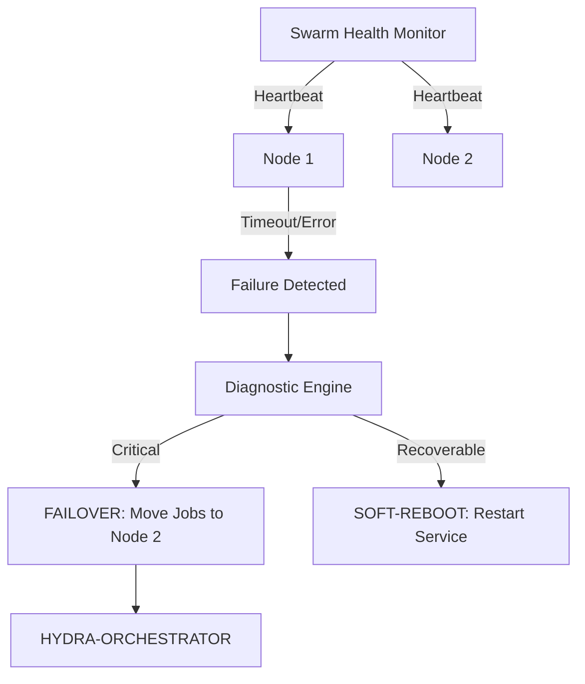

<p align="center">
  
</p>

# 💊 HYDRA-UMC-NODE-HEALING

<p align="center">🇺🇸 <b>English</b> | <a href="README_spa.md">🇪🇸 Español</a> | <a href="README_fra.md">🇫🇷 Français</a> | <a href="README_ita.md">🇮🇹 Italiano</a> | <a href="README_deu.md">🇩🇪 Deutsch</a> | <a href="README_zho.md">🇨🇳 简体中文</a> | <a href="README_jpn.md">🇯🇵 日本語</a></p>

### 🛡️ High-Availability Monitor & Failover Manager for HydraNodes

<p align="left">
  
  
  
</p>

---

## 1. 🛠️ TECHNICAL OVERVIEW

**HYDRA-UMC-NODE-HEALING** is the resilience layer of the swarm. It continuously monitors the health of all physical HydraNodes (Controllers) and logical services, ensuring zero downtime in the micro-factory.

If a node fails due to hardware malfunction or network outage, the Healing Manager automatically triggers a failover process, redirecting its active missions to other nodes and notifying the operator via the Orchestrator.

### Key Features:
* 💓 **Health Heartbeat:** Sub-10ms monitoring of node availability and thermal state.
* 🔄 **Automatic Failover:** Transparently reassigns missions from failed nodes to healthy ones.
* 🛡️ **Soft Reboot:** Attempts remote service recovery before triggering a full hardware reset.
* 📡 **Operator Alerts:** Real-time notification across all interfaces (Studios, Apps, Watch).
* 🔁 **Bounded Retry + Verified Node Identity (v0, real):** a transient network blip no longer flips a node to `UNREACHABLE` on the first miss - `checkNode` retries with a deterministic, capped exponential backoff before giving up; a node that answers but cannot correctly self-identify is classified `INVALID` and never trusted, retried, or reported healthy.

---

## 2. 🔄 HEALING WORKFLOW



---

## 3. 🧱 ARCHITECTURE & DESIGN DECISIONS

* **Why the real logic lives under `src/`, not at the repo root.** `src/healthpb` (generated gRPC stubs), `src/watchdog` (the polling engine) and `src/config` (the node registry loader) hold the actual implementation; `main.go`/`version.go` stay at the repo root as the entry point that wires them together.
* **Why detection is separate from the orchestrator it protects.** A node-healing watchdog that ran INSIDE the orchestrator process couldn't detect that same process hanging - running as an independent service is what makes 'detect an unresponsive node and reroute its work' actually possible, including when the unresponsive node is the orchestrator itself.
* **Why detection is real today but failover/soft-reboot are not.** `src/watchdog` polls every registered node's `HealthService.Check()` (the shared `hydra.common.v1` gRPC contract from `HYDRA-UMC-ORCHESTRATOR/proto/hydra_common.proto`) on a real interval over a real network connection, classifies HEALTHY/DEGRADED/UNHEALTHY/UNREACHABLE, and fires a `Reactor` callback on every state *change* (never every tick). It does not yet call HYDRA-UMC-ORCHESTRATOR to trigger an actual failover or soft-reboot, because ORCHESTRATOR has no API to call for that yet either - `watchdog.Reactor` is the seam where that plugs in once it does. Detection did not need to wait on that to be real.
* **Why the node registry is a static JSON file, not a live query to HYDRA-UMC-SWARM-SYNC.** SWARM-SYNC (the README's original stated source of truth for "every cell in the swarm") has no real API yet either - it's still andamiaje. A static `nodes.json` (see `nodes.example.json`) is the honest v0, not a placeholder pretending to be dynamic. Swap `src/config.LoadNodes` for a real SWARM-SYNC client once that project has one to call.
* **How this fits the rest of the ecosystem.** A sibling service under HYDRA-UMC-ORCHESTRATOR - watches every node in its registry and reports state changes; rerouting work away from one that stops responding is the next layer, built on top of this once ORCHESTRATOR exposes something to reroute work through.
* **Why a transport failure is retried (bounded) but an identity mismatch never is.** A connection refused or an RPC timeout can be a genuinely transient blip - a node mid-restart, a brief network hiccup - so `checkNode` retries it up to `RetryPolicy.MaxAttempts` times with exponential backoff before giving up. A node that answers but reports the wrong name (or none at all) is a different kind of problem entirely: no amount of waiting fixes a service bound to the wrong port, so that case is classified `StatusInvalid` immediately, with zero retries.
* **Why the backoff has no random jitter.** A real production fleet would want jitter to avoid a thundering herd of simultaneous reconnects, but this watchdog already polls each node from its own goroutine at its own pace - the only thing jitter would cost here is making `RetryPolicy.Backoff()` non-deterministic and harder to assert on in tests. Add jitter if/when this watchdog ever polls hundreds of nodes against a shared bottleneck resource.

---

## 📂 DIRECTORY STRUCTURE

```text
HYDRA-UMC-NODE-HEALING/
├── src/
│   ├── healthpb/      # Generated Go stubs for hydra.common.v1
│   │                  # (vendored from HYDRA-UMC-ORCHESTRATOR/proto/
│   │                  # hydra_common.proto - see that repo's proto/README.md
│   │                  # for the codegen command)
│   ├── watchdog/      # Real polling loop: dial, Check(), classify, react
│   │                  # on state change only, plus retry.go (RetryPolicy)
│   └── config/        # Static JSON node registry loader
├── build/             # Compiled binaries (build.sh/build.bat output)
├── tools/
│   ├── build_test.py  # Non-versioning build/compile check
│   └── ci_validate.py # Manifest/CHANGELOG/docs validation used by CI
├── nodes.example.json # Example node registry (see src/config)
├── go.mod / go.sum    # Go module definition
├── version.go         # const Version = "X.Y.Z" (go.mod has no app version field)
├── main.go            # Entry point: loads the registry, runs the watchdog
├── bump_version.py    # Odometer-style version bump, run by build.sh/.bat
├── build.sh/.bat      # Bumps version, then `go build`
├── build-test.sh/.bat # Non-versioning build check (no CHANGELOG/version bump)
├── run.sh/.bat        # Runs the compiled binary
└── README.md
```

Pruned from the original template: `hardware/`, `firmware/`, `os/`, `docs/`,
`images/` and `scripts/` — this is a pure software service (Go binary)
with no dedicated hardware or firmware of its own, no operating system image
to maintain, and no documentation/media/utility-script content substantial
enough yet to warrant their own folders.

---

## 🔧 BUILD & RUN

A real watchdog, not just a skeleton that compiles: it dials every node in
`nodes.example.json` (or `-nodes <path>` to point at your own registry)
over gRPC and reports state changes to stdout.

```bash
# Windows
build.bat
run.bat -nodes nodes.example.json

# Linux / macOS
./build.sh
./run.sh -nodes nodes.example.json
```

`build.sh`/`build.bat` bump the version in `version.go` (ecosystem-wide
odometer rule, see `bump_version.py` - `go.mod` has no native version field
for application binaries) and then run `go build`. `run.sh`/`run.bat`
execute the resulting binary directly.

Every entry in the registry needs something real listening on its
`address` and implementing `hydra.common.v1.HealthService` (see
`HYDRA-UMC-ORCHESTRATOR/proto/hydra_common.proto`) to ever report
healthy - with nothing running yet on any of the example ports, expect
every node to print `UNKNOWN -> UNREACHABLE` on the first tick (now only
after `RetryPolicy` exhausts its bounded attempts, not on the very first
dial - see the "Bounded Retry" feature above), which is the correct,
honest result today (every node in this ecosystem is still andamiaje
beyond this repo's own detection logic). A node that answers but cannot
correctly self-identify prints `UNKNOWN -> INVALID` instead, immediately.

```bash
go test ./...   # src/config + src/watchdog, real gRPC round-trips
                 # over real loopback sockets, no mocked client
```

---

## 🚀 ROADMAP
* **Phase 1:** Digital Twin synchronization with real-time hardware telemetry and sub-10ms latency.
* **Phase 2:** Physics Replica integration with industrial-grade simulators (Isaac Sim) and deformable body support.
* **Phase 3:** Node Healing automated recovery patterns for decentralized failover and early sensor degradation detection.
* **Phase 4:** AI-driven predictive healing based on early sensor degradation and HIL Bridge support for full-scale vehicle-in-the-loop.

---

## 🔗 Related Projects

This project is part of a larger robotics ecosystem by the same author (JuanenRac / Electro Hobby 3D), spanning firmware, control software, AI nodes, and fleet tooling. Worth knowing about, since a request might actually be about one of these rather than this repository.

### Family

**Parent:** **[HYDRA-UMC-ORCHESTRATOR](https://github.com/JuanenRac/HYDRA-UMC-ORCHESTRATOR)** — the integration parent this healing service protects.

**Siblings:**
- **[HYDRA-UMC-SWARM-SYNC](https://github.com/JuanenRac/HYDRA-UMC-SWARM-SYNC)** — sibling orchestration service, same parent.
- **[HYDRA-UMC-PATH-PLANNER-3D](https://github.com/JuanenRac/HYDRA-UMC-PATH-PLANNER-3D)** — sibling orchestration service, same parent.
- **[HYDRA-UMC-JOB-DISPATCHER](https://github.com/JuanenRac/HYDRA-UMC-JOB-DISPATCHER)** — sibling orchestration service, same parent.

### Directly Related (outside the family)

- **[HYDRA-UMC-SERVER](https://github.com/JuanenRac/HYDRA-UMC-SERVER)** — monitors instances of this backend.

### Rest of the Ecosystem

**HYDRA-UMC platform** — the multi-robot micro-factory cell
- **[HYDRA-UMC](https://github.com/JuanenRac/HYDRA-UMC)** — the CM5 + STM32H745 motherboard orchestrating up to 8 robot arms.
- **[HYDRA-UMC-SERVER](https://github.com/JuanenRac/HYDRA-UMC-SERVER)** — the Express/WebSocket backend every control client talks to.
- **[HYDRA-UMC-STUDIO](https://github.com/JuanenRac/HYDRA-UMC-STUDIO)** — web-based control dashboard, multi-robot 3D visualization.
- **[HYDRA-UMC-ANDROID-CONTROL](https://github.com/JuanenRac/HYDRA-UMC-ANDROID-CONTROL)** — Android control app over Wi-Fi/Bluetooth.
- **[HYDRA-UMC-IOS-CONTROL](https://github.com/JuanenRac/HYDRA-UMC-IOS-CONTROL)** — iOS/iPadOS control app built in Flutter.
- **[HYDRA-UMC-SUITE](https://github.com/JuanenRac/HYDRA-UMC-SUITE)** — desktop swarm command center (Python/PySide6).
- **[HYDRA-UMC-EDITOR-URDF](https://github.com/JuanenRac/HYDRA-UMC-EDITOR-URDF)** — desktop URDF model editor for the robot catalog.
- **[HYDRA-UMC-DSI](https://github.com/JuanenRac/HYDRA-UMC-DSI)** — native touch UI for the onboard DSI touchscreen.

**URTC platform** — the tool head controller every HYDRA-UMC robot arm carries
- **[URTC](https://github.com/JuanenRac/URTC)** — CAN bus tool head controller, 25 tool profiles.
- **[URTC-FLASHER](https://github.com/JuanenRac/URTC-FLASHER)** — desktop CAN-OTA + SWD/JTAG flashing tool.
- **[URTC-TESTER](https://github.com/JuanenRac/URTC-TESTER)** — desktop live CAN-bus diagnostic tool.
- **[URTC-WEB-STUDIO](https://github.com/JuanenRac/URTC-WEB-STUDIO)** — browser-based alternative via Web Serial API.

**🎥 Vision AI Node (Hailo-8)**
- [HYDRA-UMC-VISION-NODE](https://github.com/JuanenRac/HYDRA-UMC-VISION-NODE)
- [HYDRA-UMC-VISION-STREAMER](https://github.com/JuanenRac/HYDRA-UMC-VISION-STREAMER)
- [HYDRA-UMC-DETECTION-HEF](https://github.com/JuanenRac/HYDRA-UMC-DETECTION-HEF)
- [HYDRA-UMC-SAFETY-ZONES](https://github.com/JuanenRac/HYDRA-UMC-SAFETY-ZONES)
- [HYDRA-UMC-VISUAL-SERVOING-API](https://github.com/JuanenRac/HYDRA-UMC-VISUAL-SERVOING-API)

**🧠 Cognitive AI Node (Hailo-10)**
- [HYDRA-UMC-COGNITIVE-NODE](https://github.com/JuanenRac/HYDRA-UMC-COGNITIVE-NODE)
- [HYDRA-UMC-VLA-ENGINE](https://github.com/JuanenRac/HYDRA-UMC-VLA-ENGINE)
- [HYDRA-UMC-VOICE-UI](https://github.com/JuanenRac/HYDRA-UMC-VOICE-UI)
- [HYDRA-UMC-SEMANTIC-PLANNER](https://github.com/JuanenRac/HYDRA-UMC-SEMANTIC-PLANNER)
- [HYDRA-UMC-DOCS-QA](https://github.com/JuanenRac/HYDRA-UMC-DOCS-QA)

**🎮 Digital Twin & Simulation**
- [HYDRA-UMC-TWIN](https://github.com/JuanenRac/HYDRA-UMC-TWIN)
- [HYDRA-UMC-PHYSICS-REPLICA](https://github.com/JuanenRac/HYDRA-UMC-PHYSICS-REPLICA)
- [HYDRA-UMC-HIL-BRIDGE](https://github.com/JuanenRac/HYDRA-UMC-HIL-BRIDGE)
- [HYDRA-UMC-SYNTHETIC-DATA-GEN](https://github.com/JuanenRac/HYDRA-UMC-SYNTHETIC-DATA-GEN)

**📊 Data & Analytics**
- [HYDRA-UMC-DATALAKE](https://github.com/JuanenRac/HYDRA-UMC-DATALAKE)
- [HYDRA-UMC-TELEMETRY-COLLECTOR](https://github.com/JuanenRac/HYDRA-UMC-TELEMETRY-COLLECTOR)
- [HYDRA-UMC-ANOMALY-DETECTOR](https://github.com/JuanenRac/HYDRA-UMC-ANOMALY-DETECTOR)
- [HYDRA-UMC-PRODUCTION-REPORTS](https://github.com/JuanenRac/HYDRA-UMC-PRODUCTION-REPORTS)

**🏭 Industrial Gateway**
- [HYDRA-UMC-GATEWAY-INDUSTRIAL](https://github.com/JuanenRac/HYDRA-UMC-GATEWAY-INDUSTRIAL)
- [HYDRA-UMC-OPCUA-SERVER](https://github.com/JuanenRac/HYDRA-UMC-OPCUA-SERVER)
- [HYDRA-UMC-MQTT-BROKER](https://github.com/JuanenRac/HYDRA-UMC-MQTT-BROKER)
- [HYDRA-UMC-MTCONNECT-ADAPTER](https://github.com/JuanenRac/HYDRA-UMC-MTCONNECT-ADAPTER)

**🛠️ Complementary Tools**
- [URTC-SMART-RACK](https://github.com/JuanenRac/URTC-SMART-RACK)
- [URTC-VISION-TOOL](https://github.com/JuanenRac/URTC-VISION-TOOL)
- [HYDRA-UMC-WATCH](https://github.com/JuanenRac/HYDRA-UMC-WATCH)
- [HYDRA-UMC-TOOL-CLI](https://github.com/JuanenRac/HYDRA-UMC-TOOL-CLI)
- [HYDRA-UMC-DASHBOARD-AI](https://github.com/JuanenRac/HYDRA-UMC-DASHBOARD-AI)


## 👤 AUTHOR
**JuanenRac** (Electro Hobby 3D)
📧 electrohobby3d@gmail.com

## 📜 LICENSE
GPL-3.0 - See LICENSE for details.

## 🛠️ BUILD & RUN

Use the non-versioning build check before a release build:

| Action | Windows | Linux / macOS |
|---|---|---|
| Build check (no version or CHANGELOG change) | `build-test.bat` | `./build-test.sh` |
| Run / development (when provided) | `run*.bat` or `dev*.bat` | `./run*.sh` or `./dev*.sh` |

`build-test.bat` and `build-test.sh` compile or validate the project stack without incrementing `hydra-umc.project.json` or modifying `CHANGELOG.md`. They may create normal compiler output only. Existing `build*.bat`, `build*.sh`, `run*` and `dev*` scripts retain their project-specific, versioned or runtime behavior; use them when that behavior is required.