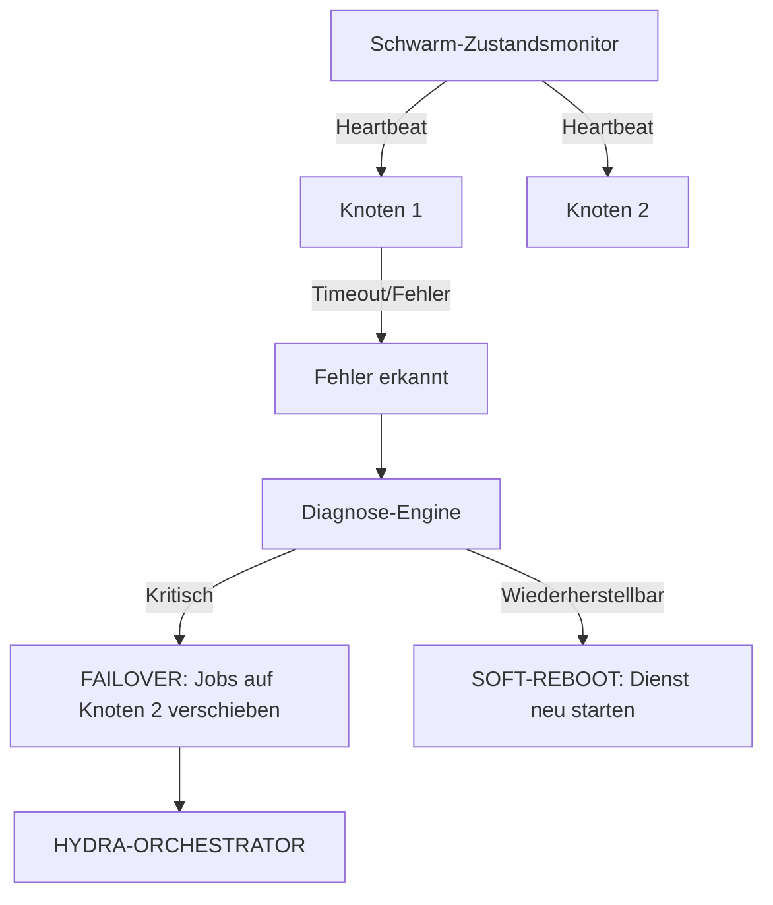

<p align="center">
  
</p>

# 💊 HYDRA-UMC-NODE-HEALING

<p align="center"><a href="README.md">🇺🇸 English</a> | <a href="README_spa.md">🇪🇸 Español</a> | <a href="README_fra.md">🇫🇷 Français</a> | <a href="README_ita.md">🇮🇹 Italiano</a> | 🇩🇪 <b>Deutsch</b> | <a href="README_zho.md">🇨🇳 简体中文</a> | <a href="README_jpn.md">🇯🇵 日本語</a></p>

### 🛡️ Hochverfügbarkeitsmonitor & Failover-Manager für HydraNodes

<p align="left">
  
  
  
</p>

---

## 1. 🛠️ TECHNISCHER ÜBERBLICK

**HYDRA-UMC-NODE-HEALING** ist die Resilienz-Schicht des Schwarms. Er überwacht kontinuierlich den Zustand aller physischen HydraNodes (Controller) und logischen Dienste und gewährleistet so eine Null-Ausfallzeit in der Micro-Factory.

Wenn ein Knoten aufgrund einer Hardware-Fehlfunktion oder eines Netzwerkausfalls ausfällt, löst der Healing-Manager automatisch einen Failover-Prozess aus, leitet seine aktiven Missionen an andere Knoten weiter und benachrichtigt den Bediener über den Orchestrator.

### Hauptmerkmale:
* 💓 **Health Heartbeat:** Überwachung der Knotenverfügbarkeit und des thermischen Zustands in weniger als 10 ms.
* 🔄 **Automatisches Failover:** Reassembliert Missionen von ausgefallenen Knoten transparent auf gesunde Knoten.
* 🛡️ **Soft Reboot:** Versucht eine Remote-Dienstwiederherstellung, bevor ein vollständiger Hardware-Reset ausgelöst wird.
* 📡 **Bediener-Alarme:** Echtzeit-Benachrichtigung über alle Schnittstellen (Studios, Apps, Watch).
* 🔁 **Begrenzte Retries + verifizierte Knotenidentität (v0, echt):** ein vorübergehender Netzwerkausfall kippt einen Knoten nicht mehr beim ersten Fehlschlag auf `UNREACHABLE` - `checkNode` wiederholt mit einem deterministischen, gedeckelten exponentiellen Backoff, bevor es aufgibt; ein Knoten, der antwortet, sich aber nicht korrekt selbst identifizieren kann, wird als `INVALID` klassifiziert und niemals vertraut, wiederholt oder als gesund gemeldet.

---

## 2. 🔄 HEALING-WORKFLOW



---

## 3. 🧱 ARCHITEKTUR & DESIGNENTSCHEIDUNGEN

* **Warum die echte Logik unter `src/` liegt, nicht im Repo-Root.** `src/healthpb` (generierte gRPC-Stubs), `src/watchdog` (die Polling-Engine) und `src/config` (der Knotenregister-Lader) enthalten die eigentliche Implementierung; `main.go`/`version.go` bleiben im Repo-Root als der Einstiegspunkt, der sie verbindet.
* **Warum die Erkennung vom Orchestrator getrennt ist, den sie schützt.** Ein Node-Healing-Watchdog, der INNERHALB des Orchestrator-Prozesses liefe, könnte nicht erkennen, dass genau dieser Prozess hängt - als unabhängiger Dienst zu laufen ist das, was 'einen nicht reagierenden Knoten erkennen und seine Arbeit umleiten' überhaupt erst möglich macht, auch wenn der nicht reagierende Knoten der Orchestrator selbst ist.
* **Warum die Erkennung heute schon echt ist, Failover/Soft-Reboot aber nicht.** `src/watchdog` fragt bei jedem registrierten Knoten `HealthService.Check()` ab (den geteilten `hydra.common.v1`-gRPC-Vertrag aus `HYDRA-UMC-ORCHESTRATOR/proto/hydra_common.proto`), in einem echten Intervall über eine echte Netzwerkverbindung, klassifiziert das Ergebnis als HEALTHY/DEGRADED/UNHEALTHY/UNREACHABLE und löst einen `Reactor`-Callback nur bei einer tatsächlichen Zustands*änderung* aus (nie bei jedem Zyklus). Es ruft noch nicht HYDRA-UMC-ORCHESTRATOR auf, um einen echten Failover oder Soft-Reboot auszulösen, weil ORCHESTRATOR dafür ebenfalls noch keine API hat - `watchdog.Reactor` ist die Nahtstelle für später. Die Erkennung musste darauf nicht warten, um echt zu sein.
* **Warum das Knotenregister eine statische JSON-Datei ist und keine Live-Abfrage an HYDRA-UMC-SWARM-SYNC.** SWARM-SYNC (die vom README ursprünglich genannte Quelle der Wahrheit für "jede Zelle des Schwarms") hat ebenfalls noch keine echte API - es befindet sich noch im Andamiaje-Stadium. Ein statisches `nodes.json` (siehe `nodes.example.json`) ist das ehrliche v0, kein Platzhalter, der dynamisch vorgibt zu sein. `src/config.LoadNodes` gegen einen echten SWARM-SYNC-Client austauschen, sobald dieses Projekt einen hat.
* **Wie sich das ins restliche Ökosystem einfügt.** Ein Geschwisterdienst unter HYDRA-UMC-ORCHESTRATOR - überwacht jeden Knoten in seinem Register und meldet Zustandsänderungen; Arbeit von einem nicht mehr reagierenden Knoten umzuleiten ist die nächste Schicht, aufgebaut hierauf, sobald ORCHESTRATOR etwas bereitstellt, worüber Arbeit umgeleitet werden kann.
* **Warum ein Transportfehler wiederholt wird (begrenzt), eine falsche Identität aber niemals.** Eine abgelehnte Verbindung oder ein RPC-Timeout kann ein wirklich vorübergehender Ausfall sein - ein neu startender Knoten, ein kurzer Netzwerk-Hänger - daher wiederholt `checkNode` bis zu `RetryPolicy.MaxAttempts` Mal mit exponentiellem Backoff, bevor es aufgibt. Ein Knoten, der antwortet, aber den falschen Namen (oder gar keinen) meldet, ist ein völlig anderes Problem: Kein Warten repariert einen Dienst, der am falschen Port hängt - daher wird dieser Fall sofort als `StatusInvalid` klassifiziert, ganz ohne Wiederholung.
* **Warum der Backoff keinen zufälligen Jitter hat.** Eine echte Produktionsflotte würde Jitter wollen, um einen Ansturm gleichzeitiger Neuverbindungen zu vermeiden, aber dieser Watchdog fragt bereits jeden Knoten aus seiner eigenen Goroutine in seinem eigenen Tempo ab - das Einzige, was Jitter hier kosten würde, ist `RetryPolicy.Backoff()` nicht-deterministisch und in Tests schwerer zu verifizieren zu machen. Jitter hinzufügen, falls/wenn dieser Watchdog jemals Hunderte von Knoten gegen eine gemeinsame Engpassressource abfragt.

Für mehr Details siehe [`docs/ARCHITECTURE.md`](docs/ARCHITECTURE.md) (Architekturleitfaden), [`docs/BUILD_AND_RUN.md`](docs/BUILD_AND_RUN.md) (Release- vs. Test-Build-Ablauf) und [`docs/INTEGRATION_CONTRACT.md`](docs/INTEGRATION_CONTRACT.md) (der versionierte Health-Snapshot-Vertrag, den ein künftiger Adapter einhalten muss).

---

## 📂 VERZEICHNISSTRUKTUR

```text
HYDRA-UMC-NODE-HEALING/
├── src/
│   ├── healthpb/      # Generierte Go-Stubs für hydra.common.v1
│   │                  # (übernommen aus HYDRA-UMC-ORCHESTRATOR/proto/
│   │                  # hydra_common.proto - siehe proto/README.md
│   │                  # dieses Repos für den Codegen-Befehl)
│   ├── watchdog/      # Echte Polling-Schleife: dial, Check(), klassifizieren,
│   │                  # nur bei Zustandsänderung reagieren, plus
│   │                  # retry.go (RetryPolicy)
│   └── config/        # Lader für das statische JSON-Knotenregister
├── build/             # Kompilierte Binärdateien (Ausgabe von build.sh/.bat)
├── images/            # Medien und Diagramme
├── systemd/
│   └── hydra-umc-node-healing.service # systemd-Unit des Watchdogs auf der lokalen CM5
├── tools/
│   ├── build_test.py  # Nicht-versionierender Build-Check
│   └── ci_validate.py # Manifest/CHANGELOG/Docs-Validierung, von CI genutzt
├── nodes.example.json # Beispiel-Knotenregister (siehe src/config)
├── go.mod / go.sum    # Go-Modul-Definition
├── version.go         # const Version = "X.Y.Z" (go.mod hat kein solches Feld)
├── main.go            # Einstiegspunkt: lädt das Register und startet den Watchdog
├── bump_version.py    # Versions-Bump nach Kilometerzähler-Prinzip
├── bump_manifest_version.py # Synchronisiert die Version von hydra-umc.project.json mit der nativen (--sync)
├── build.sh/.bat      # Erhöht die Version, dann `go build`
├── build-test.sh/.bat # Nicht-versionierender Build-Check
├── run.sh/.bat        # Führt die kompilierte Binärdatei aus
├── docs/
│   ├── ARCHITECTURE.md
│   ├── BUILD_AND_RUN.md
│   └── INTEGRATION_CONTRACT.md
└── README.md
```

Aus der ursprünglichen Vorlage entfernt: `hardware/`, `firmware/`, `os/`,
`docs/`, `images/` und `scripts/` — dies ist ein reiner Softwaredienst
(Go-Binärdatei) ohne eigene Hardware oder Firmware, ohne zu pflegendes
Betriebssystem-Image, und ohne Dokumentations-/Medien-/Utility-Skript-Inhalt,
der eigene Ordner bislang rechtfertigen würde.

---

## 🔧 BUILD UND AUSFÜHRUNG

Ein echter Watchdog, nicht nur ein Skelett, das kompiliert: er wählt jeden
Knoten aus `nodes.example.json` (oder `-nodes <Pfad>` für ein eigenes
Register) per gRPC an und meldet Zustandsänderungen auf stdout.

```bash
# Windows
build.bat
run.bat -nodes nodes.example.json

# Linux / macOS
./build.sh
./run.sh -nodes nodes.example.json
```

`build.sh`/`build.bat` erhöhen die Version in `version.go` (ökosystemweite
Kilometerzähler-Regel, siehe `bump_version.py` - `go.mod` hat kein
natives Versionsfeld für Anwendungsbinärdateien) und führen anschließend
`go build` aus. `run.sh`/`run.bat` führen die resultierende Binärdatei
direkt aus.

Jeder Registereintrag braucht etwas Echtes, das auf seiner `address`
lauscht und `hydra.common.v1.HealthService` implementiert (siehe
`HYDRA-UMC-ORCHESTRATOR/proto/hydra_common.proto`), um jemals als
gesund gemeldet zu werden - da auf den Beispiel-Ports noch nichts läuft,
ist beim ersten Zyklus für alle drei `UNKNOWN -> UNREACHABLE` zu
erwarten (jetzt erst nach Erschöpfung der begrenzten Versuche von
`RetryPolicy`, nicht schon beim ersten Dial - siehe die Funktion
"Begrenzte Retries" oben), was heute das korrekte, ehrliche Ergebnis ist
(jeder Knoten des Ökosystems ist über die eigene Erkennungslogik dieses
Repos hinaus noch im Andamiaje-Stadium). Ein Knoten, der antwortet, sich
aber nicht korrekt selbst identifizieren kann, gibt stattdessen sofort
`UNKNOWN -> INVALID` aus.

```bash
go test ./...   # src/config + src/watchdog, echte gRPC-Roundtrips
                 # über echte Loopback-Sockets, ohne simulierten Client
```

---

## 🚀 FAHRPLAN
* **Phase 1:** Digital-Twin-Synchronisation mit Echtzeit-Hardware-Telemetrie und Sub-10ms-Latenz.
* **Phase 2:** Physics Replica-Integration mit industriellen Simulatoren (Isaac Sim) und Unterstützung für verformbare Körper.
* **Phase 3:** Automatisierte Wiederherstellungsmuster von Node Healing für dezentrales Failover und frühzeitige Erkennung von Sensordegradation.
* **Phase 4:** KI-gestütztes prädiktives Healing basierend auf frühzeitiger Sensordegradation und HIL-Bridge-Unterstützung für Full-Scale Vehicle-in-the-Loop.

---

## 🔗 Verwandte Projekte

Dieses Projekt ist Teil des HYDRA-UMC-Robotik-Ökosystems desselben Autors (JuanenRac / Electro Hobby 3D). Gut zu wissen, da eine Anfrage eigentlich eines dieser Projekte betreffen könnte statt dieses Repositorys.

**Übergeordnetes Projekt**
- **[HYDRA-UMC-ORCHESTRATOR](https://github.com/JuanenRac/HYDRA-UMC-ORCHESTRATOR)** — Integrationsknoten mit einem echten gRPC/Protobuf-Health-Report-Vertrag und einer Missions-Zustandsmaschine; das übergeordnete Projekt, dessen spezifischer Orchestrierungsdienst dieses Repository innerhalb seiner eigenen Schwarmkoordinationsschicht ist.

**Geschwisterprojekte** — die übrigen Orchestrierungsdienste der eigenen Schwarmkoordinationsschicht von HYDRA-UMC-ORCHESTRATOR
- **[HYDRA-UMC-SWARM-SYNC](https://github.com/JuanenRac/HYDRA-UMC-SWARM-SYNC)** — echte CRDT-LWW-Element-Map-Zustandssynchronisation, eigenschaftsgetestet auf Multi-Zellen-Konvergenz.
- **[HYDRA-UMC-PATH-PLANNER-3D](https://github.com/JuanenRac/HYDRA-UMC-PATH-PLANNER-3D)** — echter RRT-basierter 3D-Pfadplaner mit echter Hindernis-/Arbeitsraum-Kollisionsvalidierung.
- **[HYDRA-UMC-JOB-DISPATCHER](https://github.com/JuanenRac/HYDRA-UMC-JOB-DISPATCHER)** — echte prioritätsbasierte Job-Queue mit Deduplizierung, über eine echte HTTP-API.

**Direkt verwandt**
- **[HYDRA-UMC-SERVER](https://github.com/JuanenRac/HYDRA-UMC-SERVER)** — das reale Headless-Backend (REST/WebSocket), mit dem jeder Steuerungsclient tatsächlich spricht — dieser Healing-Dienst überwacht Live-Instanzen dieses Backends.

**Ebenfalls Teil des Ökosystems**

*Kern-Hardware & Plattform*
- **[HYDRA-UMC](https://github.com/JuanenRac/HYDRA-UMC)** — das physische Motherboard des Roboterarms: CM5-Host + Dual-Core-STM32H745, koordiniert bis zu 8 Werkzeugarme über CAN-OTA/SPI-OTA.
- **[HYDRA-UMC-OS](https://github.com/JuanenRac/HYDRA-UMC-OS)** — reproduzierbare Raspberry-Pi-OS-Produktschicht für den CM5: schreibgeschützter Agent, validierte Konfiguration/Profile, WiFi-Ersteinrichtung.
- **[HYDRA-UMC-SDK](https://github.com/JuanenRac/HYDRA-UMC-SDK)** — der gemeinsame JSON-Schema-Vertrag und die Sicherheitsschranke, gegen die jede Bridge ihre Befehle validiert.

*Kern-Backend & Clients*
- **[HYDRA-UMC-STUDIO](https://github.com/JuanenRac/HYDRA-UMC-STUDIO)** — Web-Steuerungs-Dashboard mit Echtzeit-3D-Visualisierung mehrerer Roboter.
- **[HYDRA-UMC-SUITE](https://github.com/JuanenRac/HYDRA-UMC-SUITE)** — Desktop-Schwarmleitstand (PySide6) für mehrere Server gleichzeitig, verpackt als eigenständige ausführbare Datei.
- **[HYDRA-UMC-ANDROID-CONTROL](https://github.com/JuanenRac/HYDRA-UMC-ANDROID-CONTROL)** — native Android-Steuerungs-App mit biometrischem Login und einer gekoppelten Wear-OS-Begleit-App.
- **[HYDRA-UMC-IOS-CONTROL](https://github.com/JuanenRac/HYDRA-UMC-IOS-CONTROL)** — iOS/iPadOS-Steuerungs-App (Flutter) mit Echtzeit-WebSocket-Synchronisierung.
- **[HYDRA-UMC-DSI](https://github.com/JuanenRac/HYDRA-UMC-DSI)** — native Touch-UI für das eingebaute 7"-DSI-Touchscreen, direkt auf dem CM5 eingebettet.
- **[HYDRA-UMC-EDITOR-URDF](https://github.com/JuanenRac/HYDRA-UMC-EDITOR-URDF)** — grafischer Desktop-URDF-Ersteller/-Editor, der fertige Modelle in STUDIOs eigenen Katalog überträgt.
- **[HYDRA-UMC-BRIDGE-AMR](https://github.com/JuanenRac/HYDRA-UMC-BRIDGE-AMR)** — Koordinationsschranke für AGV-/AMR-Flotten über einen echten VDA-5050-MQTT-Publisher.
- **[HYDRA-UMC-BRIDGE-CNC](https://github.com/JuanenRac/HYDRA-UMC-BRIDGE-CNC)** — High-Level-Koordinator für CNC-Zellen mit echtem GRBL-Status-/Steuerbyte-Zugriff.
- **[HYDRA-UMC-BRIDGE-DROIDS](https://github.com/JuanenRac/HYDRA-UMC-BRIDGE-DROIDS)** — Koordinationsschranke für laufende/humanoide Droiden, mit einem echten Boston-Dynamics-Spot-Befehlssender.
- **[HYDRA-UMC-BRIDGE-LASER](https://github.com/JuanenRac/HYDRA-UMC-BRIDGE-LASER)** — Sicherheitskoordinator für Laserzellen, liest 3 echte Schlüssel-/Gehäuse-/Verriegelungs-GPIO-Sicherungen.
- **[HYDRA-UMC-BRIDGE-OPENPNP](https://github.com/JuanenRac/HYDRA-UMC-BRIDGE-OPENPNP)** — sicherer High-Level-Koordinator für den Leiterplattenfluss von OpenPnP Pick-and-Place.
- **[HYDRA-UMC-BRIDGE-PRINTER3D](https://github.com/JuanenRac/HYDRA-UMC-BRIDGE-PRINTER3D)** — sichere Koordinationsschranke für Moonraker/Klipper-3D-Drucker, mit echten gesicherten Job-Befehlen.
- **[HYDRA-UMC-BRIDGE-ROS2](https://github.com/JuanenRac/HYDRA-UMC-BRIDGE-ROS2)** — Sicherheitskoordinator mit einem echten, träge importierten rclpy-ROS-2-Transport.
- **[HYDRA-UMC-BRIDGE-UAV](https://github.com/JuanenRac/HYDRA-UMC-BRIDGE-UAV)** — Koordinationsschranke für kameraausgestattete UAVs, mit einem echten MAVLink-Befehlssender.

*URTC-Werkzeugplattform*
- **[URTC](https://github.com/JuanenRac/URTC)** — Firmware für die physische Universal-Robot-Tool-Controller-Platine, 25+ Werkzeugprofile über CAN-Bus.
- **[URTC-FLASHER](https://github.com/JuanenRac/URTC-FLASHER)** — Desktop-GUI-Flash-Tool für URTC-Platinen, CAN-OTA plus Full-Chip-SWD/JTAG.
- **[URTC-TESTER](https://github.com/JuanenRac/URTC-TESTER)** — Desktop-Live-CAN-Bus-Diagnosetool für URTC-Platinen, ein Panel pro Werkzeugprofil.
- **[URTC-WEB-STUDIO](https://github.com/JuanenRac/URTC-WEB-STUDIO)** — browserbasierte Alternative zu URTC-TESTER über die Web-Serial-API, ohne lokale Installation.

*Vision-KI-Knoten (Hailo-8)*
- **[HYDRA-UMC-VISION-NODE](https://github.com/JuanenRac/HYDRA-UMC-VISION-NODE)** — Integrationsknoten für die Hailo-8-Vision-Pipeline, mit einer echten stufenweisen Hardware-Bereitschaftsprüfung.
- **[HYDRA-UMC-DETECTION-HEF](https://github.com/JuanenRac/HYDRA-UMC-DETECTION-HEF)** — echte Registry für kompilierte Modelle mit Hailo-Architektur-/Prüfsummen-Safe-Load-Verifizierung.
- **[HYDRA-UMC-VISION-STREAMER](https://github.com/JuanenRac/HYDRA-UMC-VISION-STREAMER)** — echter GStreamer-Pipeline- + MediaMTX-Konfigurationsgenerator mit einer echten HailoRT-Integrationsschranke.
- **[HYDRA-UMC-VISUAL-SERVOING-API](https://github.com/JuanenRac/HYDRA-UMC-VISUAL-SERVOING-API)** — echtes Position-Based-Visual-Servoing-Korrekturgesetz, sicherheitsgesteuert nach vorgelagertem Zonenstatus.
- **[HYDRA-UMC-SAFETY-ZONES](https://github.com/JuanenRac/HYDRA-UMC-SAFETY-ZONES)** — echte Zonenverletzungsprüfung und E-STOP-Anforderung, mit erzwungener Kalibrierungsaktualität.

*Kognitiver KI-Knoten (Hailo-10)*
- **[HYDRA-UMC-COGNITIVE-NODE](https://github.com/JuanenRac/HYDRA-UMC-COGNITIVE-NODE)** — Integrationsknoten für die Hailo-10-Cognitive-Pipeline (LLM-/VLA-/Sprach-Orchestrierung).
- **[HYDRA-UMC-VLA-ENGINE](https://github.com/JuanenRac/HYDRA-UMC-VLA-ENGINE)** — echte Aktions-Token-Kodierung/-Dekodierung und Trajektoriengenerierung für ein Vision-Language-Action-Modell.
- **[HYDRA-UMC-VOICE-UI](https://github.com/JuanenRac/HYDRA-UMC-VOICE-UI)** — echtes Sprach-Frontend (VAD + Intent-Parser) mit einem begrenzten, bestätigungsgesicherten Watch-Relay.
- **[HYDRA-UMC-SEMANTIC-PLANNER](https://github.com/JuanenRac/HYDRA-UMC-SEMANTIC-PLANNER)** — echte regelbasierte Aufgabenzerlegung und semantische Fehlerbehebung über MCU-Fehlercodes.
- **[HYDRA-UMC-DOCS-QA](https://github.com/JuanenRac/HYDRA-UMC-DOCS-QA)** — echte, nur auf der Standardbibliothek basierende TF-IDF-Dokumentensuche über die eigenen Markdown-Dokumente dieses Ökosystems.

*Digitaler Zwilling & Simulation*
- **[HYDRA-UMC-TWIN](https://github.com/JuanenRac/HYDRA-UMC-TWIN)** — Integrationsknoten für die Digital-Twin-Engine, mit einem echten Versionskompatibilitäts-Sync-Vertrag.
- **[HYDRA-UMC-HIL-BRIDGE](https://github.com/JuanenRac/HYDRA-UMC-HIL-BRIDGE)** — echte Hardware-in-the-Loop-Sicherheitsverriegelung, die Befehle zwischen Simulation und echter Hardware routet.
- **[HYDRA-UMC-PHYSICS-REPLICA](https://github.com/JuanenRac/HYDRA-UMC-PHYSICS-REPLICA)** — echte Vorwärtskinematik und Gelenkgrenzenvalidierung über eine echte URDF-Teilmenge.
- **[HYDRA-UMC-SYNTHETIC-DATA-GEN](https://github.com/JuanenRac/HYDRA-UMC-SYNTHETIC-DATA-GEN)** — echter prozeduraler 2D-Szenengenerator mit YOLO/COCO-Annotationsexport.

*Daten & Analytik*
- **[HYDRA-UMC-DATALAKE](https://github.com/JuanenRac/HYDRA-UMC-DATALAKE)** — echter sqlite3-gestützter Zeitreihenspeicher mit einer echten Ingest-/Abfrage-HTTP-API.
- **[HYDRA-UMC-ANOMALY-DETECTOR](https://github.com/JuanenRac/HYDRA-UMC-ANOMALY-DETECTOR)** — echter FFT- + statistischer Basislinien-Anomaliedetektor mit Drift-Überwachung.
- **[HYDRA-UMC-PRODUCTION-REPORTS](https://github.com/JuanenRac/HYDRA-UMC-PRODUCTION-REPORTS)** — echte OEE-/Verfügbarkeitsberechnung über den DATALAKE-Verlauf, mit reproduzierbarem CSV-Export.
- **[HYDRA-UMC-TELEMETRY-COLLECTOR](https://github.com/JuanenRac/HYDRA-UMC-TELEMETRY-COLLECTOR)** — echte CAN/WebSocket-Ingestion-Pipeline in DATALAKE, mit Sequenz-Deduplizierung.

*Industrie-Gateway*
- **[HYDRA-UMC-GATEWAY-INDUSTRIAL](https://github.com/JuanenRac/HYDRA-UMC-GATEWAY-INDUSTRIAL)** — Integrationsknoten, der zu Industrieprotokollen weiterleitet, mit einer echten Befehls-Allowlist-/Backpressure-Schicht.
- **[HYDRA-UMC-OPCUA-SERVER](https://github.com/JuanenRac/HYDRA-UMC-OPCUA-SERVER)** — echter OPC-UA-Adressraum, verifiziert mit einer echten Binärprotokoll-Client-Session.
- **[HYDRA-UMC-MQTT-BROKER](https://github.com/JuanenRac/HYDRA-UMC-MQTT-BROKER)** — echter MQTT-Broker mit optionaler Pro-Client-Authentifizierung und Topic-ACLs.
- **[HYDRA-UMC-MTCONNECT-ADAPTER](https://github.com/JuanenRac/HYDRA-UMC-MTCONNECT-ADAPTER)** — echte MTConnect-`/probe`- und `/current`-XML-Endpunkte mit Degraded-Mode-Ausgabe.

*Ergänzende Tools & Ökosystembetrieb*
- **[HYDRA-UMC-DASHBOARD-AI](https://github.com/JuanenRac/HYDRA-UMC-DASHBOARD-AI)** — Smart-Summaries- und Anomaly-Highlighting-Panels über DATALAKE/ANOMALY-DETECTOR, mit einem ehrlichen statistischen Fallback.
- **[HYDRA-UMC-TOOL-CLI](https://github.com/JuanenRac/HYDRA-UMC-TOOL-CLI)** — Flotten-CLI mit einem echten, stabilen Exit-Code-Vertrag, ein echter Live-Client der eigenen API von HYDRA-UMC-SERVER.
- **[HYDRA-UMC-WATCH](https://github.com/JuanenRac/HYDRA-UMC-WATCH)** — WearOS-Begleit-App mit echten haptischen Alarmen und einem Sprach-Relay zum gekoppelten Telefon.
- **[URTC-SMART-RACK](https://github.com/JuanenRac/URTC-SMART-RACK)** — Firmware für ein Platinenmontagegestell mit echter Werkzeug-ID-Dekodierung und Smart-Idle-Vorheizlogik.
- **[URTC-VISION-TOOL](https://github.com/JuanenRac/URTC-VISION-TOOL)** — Firmware plus ein echter Python-Vision-Begleiter für einen Thermal-/RGB-Inspektionswerkzeugkopf.
- **[HYDRA-UMC-UPDATER](https://github.com/JuanenRac/HYDRA-UMC-UPDATER)** — administratives Desktop-Tool, das jedes Repository in diesem Ökosystem entdeckt, klont und aktualisiert.


---

## 📚 Dokumentation & Community

- **[CONTRIBUTING.md](CONTRIBUTING.md)** — Technologie-Stack und Coding-Richtlinien für einen Pull Request.
- **[CODE_OF_CONDUCT.md](CODE_OF_CONDUCT.md)** — die in dieser Community erwarteten Verhaltensstandards.
- **[SECURITY.md](SECURITY.md)** — wie man eine Schwachstelle meldet, und die echten Sicherheitsschwerpunkte dieses Projekts.
- **[SUPPORT.md](SUPPORT.md)** — wo man Fragen stellt und Fehler meldet.
- **[LICENSE.md](LICENSE.md)** — die eigene Lizenz dieses Projekts.

## 👤 AUTOR
**JuanenRac** (Electro Hobby 3D)
📧 electrohobby3d@gmail.com
📺 [youtube.com/@electrohobby3d](https://youtube.com/@electrohobby3d)

## 📜 LIZENZ
GPL-3.0 - Siehe LICENSE für Details.
