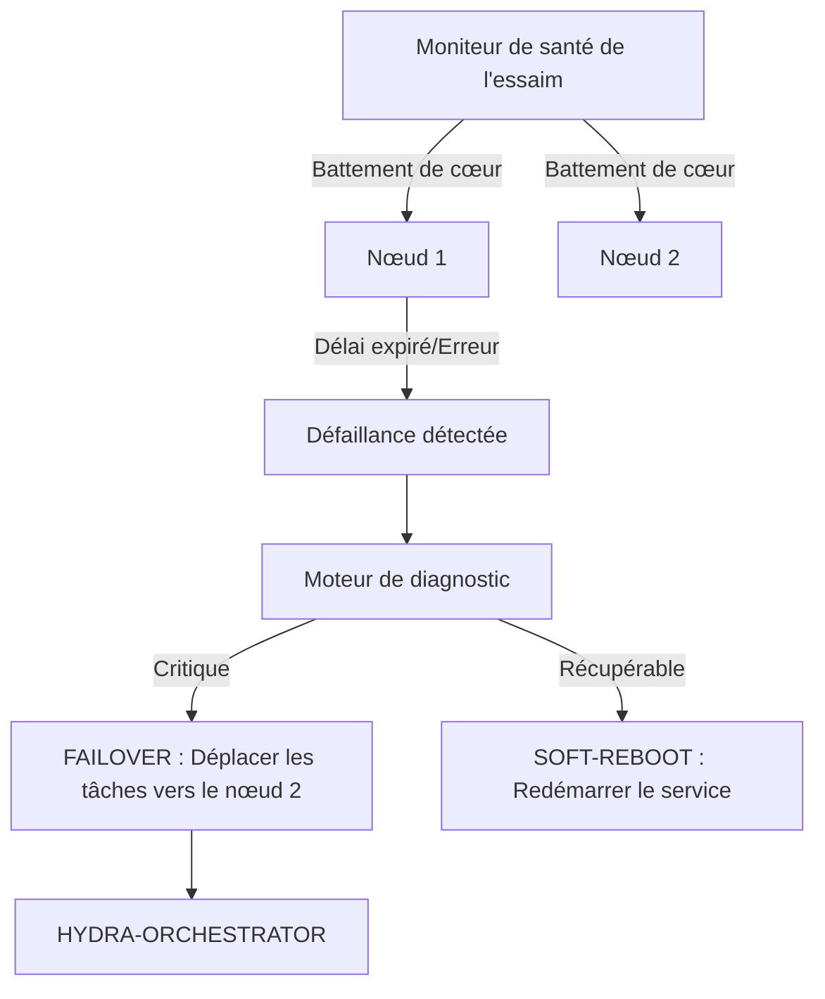

<p align="center">
  
</p>

# 💊 HYDRA-UMC-NODE-HEALING

<p align="center"><a href="README.md">🇺🇸 English</a> | <a href="README_spa.md">🇪🇸 Español</a> | 🇫🇷 <b>Français</b> | <a href="README_ita.md">🇮🇹 Italiano</a> | <a href="README_deu.md">🇩🇪 Deutsch</a> | <a href="README_zho.md">🇨🇳 简体中文</a> | <a href="README_jpn.md">🇯🇵 日本語</a></p>

### 🛡️ Moniteur de haute disponibilité et gestionnaire de basculement pour HydraNodes

<p align="left">
  
  
  
</p>

---

## 1. 🛠️ APERÇU TECHNIQUE

**HYDRA-UMC-NODE-HEALING** est la couche de résilience de l'essaim. Il surveille en permanence la santé de tous les HydraNodes physiques (contrôleurs) et des services logiques, garantissant un temps d'arrêt nul dans la micro-usine.

Si un nœud échoue en raison d'un dysfonctionnement matériel ou d'une panne de réseau, le gestionnaire de « Healing » déclenche automatiquement un processus de basculement (failover), redirigeant ses missions actives vers d'autres nœuds et avertissant l'opérateur via l'orchestrateur.

### Caractéristiques principales :
* 💓 **Health Heartbeat :** Surveillance en moins de 10 ms de la disponibilité des nœuds et de l'état thermique.
* 🔄 **Basculement automatique :** Réattribue de manière transparente les missions des nœuds défaillants vers des nœuds sains.
* 🛡️ **Redémarrage logiciel (Soft Reboot) :** Tente une récupération de service à distance avant de déclencher une réinitialisation matérielle complète.
* 📡 **Alertes opérateur :** Notification en temps réel sur toutes les interfaces (Studios, Apps, Watch).
* 🔁 **Réessais bornés + identité de nœud vérifiée (v0, réel) :** un incident réseau transitoire ne fait plus basculer un nœud vers `UNREACHABLE` dès le premier échec - `checkNode` réessaie avec un backoff exponentiel déterministe et plafonné avant d'abandonner ; un nœud qui répond mais ne peut pas s'auto-identifier correctement est classé `INVALID` et n'est jamais ni fait confiance, ni réessayé, ni rapporté comme sain.

---

## 2. 🔄 FLUX DE TRAVAIL DE « HEALING »



---

## 3. 🧱 ARCHITECTURE & DÉCISIONS DE CONCEPTION

* **Pourquoi la logique réelle vit sous `src/`, pas à la racine du dépôt.** `src/healthpb` (stubs gRPC générés), `src/watchdog` (le moteur de sondage) et `src/config` (le chargeur du registre de nœuds) contiennent l'implémentation réelle ; `main.go`/`version.go` restent à la racine comme point d'entrée qui les relie.
* **Pourquoi la détection est séparée de l'orchestrateur qu'elle protège.** Un chien de garde de guérison de nœud tournant À L'INTÉRIEUR du processus de l'orchestrateur ne pourrait pas détecter que ce même processus est bloqué - tourner comme service indépendant est ce qui rend réellement possible 'détecter un nœud sans réponse et rediriger son travail', y compris quand le nœud sans réponse est l'orchestrateur lui-même.
* **Pourquoi la détection est déjà réelle aujourd'hui, mais pas encore le basculement/redémarrage logiciel.** `src/watchdog` interroge le `HealthService.Check()` (le contrat gRPC partagé `hydra.common.v1` de `HYDRA-UMC-ORCHESTRATOR/proto/hydra_common.proto`) de chaque nœud enregistré, sur un intervalle réel via une vraie connexion réseau, classe le résultat en HEALTHY/DEGRADED/UNHEALTHY/UNREACHABLE, et déclenche un callback `Reactor` seulement lors d'un *changement* d'état (jamais à chaque cycle). Il n'appelle pas encore HYDRA-UMC-ORCHESTRATOR pour déclencher un vrai basculement ou redémarrage logiciel, car ORCHESTRATOR n'a pas non plus d'API pour cela pour l'instant - `watchdog.Reactor` est le point d'ancrage prévu pour quand elle existera. La détection n'avait pas besoin d'attendre cela pour être réelle.
* **Pourquoi le registre de nœuds est un fichier JSON statique et non une requête en direct vers HYDRA-UMC-SWARM-SYNC.** SWARM-SYNC (la source de vérité citée à l'origine par le README pour "chaque cellule de l'essaim") n'a pas non plus de vraie API pour l'instant - il en est encore au stade d'andamiaje. Un `nodes.json` statique (voir `nodes.example.json`) est le v0 honnête, pas un placeholder qui prétend être dynamique. Remplacer `src/config.LoadNodes` par un vrai client SWARM-SYNC dès que ce projet en aura un.
* **Comment cela s'intègre dans le reste de l'écosystème.** Un service frère sous HYDRA-UMC-ORCHESTRATOR - surveille chaque nœud de son registre et signale les changements d'état ; rediriger le travail loin de celui qui cesse de répondre est la couche suivante, construite par-dessus une fois qu'ORCHESTRATOR exposera quelque chose permettant de rediriger le travail.
* **Pourquoi un échec de transport est réessayé (borné) mais jamais une identité incohérente.** Une connexion refusée ou un timeout RPC peut être un incident vraiment transitoire - un nœud en cours de redémarrage, un bref accroc réseau - donc `checkNode` réessaie jusqu'à `RetryPolicy.MaxAttempts` fois avec un backoff exponentiel avant d'abandonner. Un nœud qui répond mais rapporte le mauvais nom (ou aucun) est un problème d'une tout autre nature : aucune attente ne répare un service branché sur le mauvais port, donc ce cas est classé `StatusInvalid` immédiatement, sans aucun réessai.
* **Pourquoi le backoff n'a pas de gigue (jitter) aléatoire.** Une vraie flotte de production voudrait de la gigue pour éviter une ruée de reconnexions simultanées, mais ce chien de garde interroge déjà chaque nœud depuis sa propre goroutine à son propre rythme - le seul coût de la gigue ici serait de rendre `RetryPolicy.Backoff()` non déterministe et plus difficile à vérifier dans les tests. À ajouter si/quand ce chien de garde interroge un jour des centaines de nœuds contre une ressource partagée goulot d'étranglement.

Pour plus de détails, voir [`docs/ARCHITECTURE.md`](docs/ARCHITECTURE.md) (guide d'architecture), [`docs/BUILD_AND_RUN.md`](docs/BUILD_AND_RUN.md) (flux de build release vs test) et [`docs/INTEGRATION_CONTRACT.md`](docs/INTEGRATION_CONTRACT.md) (le contrat de snapshot de santé versionné qu'un futur adaptateur doit respecter).

---

## 📂 STRUCTURE DES RÉPERTOIRES

```text
HYDRA-UMC-NODE-HEALING/
├── src/
│   ├── healthpb/      # Stubs Go générés pour hydra.common.v1
│   │                  # (issus de HYDRA-UMC-ORCHESTRATOR/proto/
│   │                  # hydra_common.proto - voir le proto/README.md de
│   │                  # ce dépôt pour la commande de génération)
│   ├── watchdog/      # Boucle de sondage réelle : dial, Check(), classer,
│   │                  # réagir uniquement lors d'un changement d'état,
│   │                  # plus retry.go (RetryPolicy)
│   └── config/        # Chargeur du registre statique de nœuds (JSON)
├── build/             # Binaires compilés (sortie de build.sh/build.bat)
├── images/            # Médias et diagrammes
├── systemd/
│   └── hydra-umc-node-healing.service # Unité systemd du watchdog sur la CM5 locale
├── tools/
│   ├── build_test.py  # Vérification de build sans versionnage
│   └── ci_validate.py # Validation manifeste/CHANGELOG/docs utilisée par CI
├── nodes.example.json # Registre de nœuds d'exemple (voir src/config)
├── go.mod / go.sum    # Définition du module Go
├── version.go         # const Version = "X.Y.Z" (go.mod n'a pas ce champ)
├── main.go            # Point d'entrée : charge le registre et lance le watchdog
├── bump_version.py    # Incrément de version type compteur kilométrique
├── bump_manifest_version.py # Synchronise la version de hydra-umc.project.json avec la version native (--sync)
├── build.sh/.bat      # Incrémente la version puis `go build`
├── build-test.sh/.bat # Vérification de build sans versionnage
├── run.sh/.bat        # Exécute le binaire compilé
├── docs/
│   ├── ARCHITECTURE.md
│   ├── BUILD_AND_RUN.md
│   └── INTEGRATION_CONTRACT.md
└── README.md
```

Élagué du modèle original : `hardware/`, `firmware/`, `os/`, `docs/`,
`images/` et `scripts/` — il s'agit d'un service purement logiciel
(binaire Go) sans matériel ni firmware propres, sans image de système
d'exploitation à maintenir, et sans contenu de documentation/médias/scripts
utilitaires encore suffisant pour justifier leurs propres dossiers.

---

## 🔧 BUILD ET EXÉCUTION

Un vrai watchdog, pas seulement un squelette qui compile : il contacte
chaque nœud de `nodes.example.json` (ou `-nodes <chemin>` pour pointer
vers votre propre registre) par gRPC et signale les changements d'état
sur stdout.

```bash
# Windows
build.bat
run.bat -nodes nodes.example.json

# Linux / macOS
./build.sh
./run.sh -nodes nodes.example.json
```

`build.sh`/`build.bat` incrémentent la version dans `version.go` (règle du
compteur kilométrique de l'écosystème, voir `bump_version.py` - `go.mod`
n'a pas de champ de version natif pour les binaires d'application) puis
exécutent `go build`. `run.sh`/`run.bat` exécutent directement le binaire
résultant.

Chaque entrée du registre a besoin de quelque chose de réel à l'écoute
sur son `address` et implémentant `hydra.common.v1.HealthService` (voir
`HYDRA-UMC-ORCHESTRATOR/proto/hydra_common.proto`) pour un jour se
signaler en bonne santé - rien ne tournant encore sur les ports
d'exemple, on s'attend à voir `UNKNOWN -> UNREACHABLE` dès le premier
cycle pour les trois (désormais seulement après épuisement des tentatives
bornées de `RetryPolicy`, pas dès le premier dial - voir la
caractéristique « Réessais bornés » ci-dessus), ce qui est le résultat
correct et honnête aujourd'hui (chaque nœud de l'écosystème en est encore
au stade d'andamiaje au-delà de la propre logique de détection de ce
dépôt). Un nœud qui répond mais ne peut pas s'auto-identifier
correctement affiche plutôt `UNKNOWN -> INVALID`, immédiatement.

```bash
go test ./...   # src/config + src/watchdog, allers-retours gRPC
                 # réels sur de vraies sockets loopback, sans client simulé
```

---

## 🚀 FEUILLE DE ROUTE
* **Phase 1 :** Synchronisation du jumeau numérique avec la télémétrie matérielle en temps réel et latence inférieure à 10 ms.
* **Phase 2 :** Intégration de Physics Replica avec des simulateurs de classe industrielle (Isaac Sim) et prise en charge des corps déformables.
* **Phase 3 :** Modèles de récupération automatisés de Node Healing pour un basculement décentralisé et détection précoce de la dégradation des capteurs.
* **Phase 4 :** « Healing » prédictif piloté par l'IA basé sur la dégradation précoce des capteurs et prise en charge de HIL Bridge pour le véhicule en boucle à grande échelle.

---

## 🔗 Projets Liés

Ce projet fait partie de l'écosystème robotique HYDRA-UMC du même auteur (JuanenRac / Electro Hobby 3D). Bon à savoir, car une demande pourrait en réalité concerner l'un de ceux-ci plutôt que ce dépôt.

**Projet Parent**
- **[HYDRA-UMC-ORCHESTRATOR](https://github.com/JuanenRac/HYDRA-UMC-ORCHESTRATOR)** — hub d'intégration avec un vrai contrat de rapport de santé gRPC/Protobuf et une machine à états de mission ; le parent dont ce dépôt est un service d'orchestration spécifique, au sein de sa propre couche de coordination d'essaim.

**Projets Frères** — les autres services d'orchestration de la propre couche de coordination d'essaim de HYDRA-UMC-ORCHESTRATOR
- **[HYDRA-UMC-SWARM-SYNC](https://github.com/JuanenRac/HYDRA-UMC-SWARM-SYNC)** — vraie synchronisation d'état CRDT LWW-Element-Map, testée par propriétés pour la convergence multi-cellule.
- **[HYDRA-UMC-PATH-PLANNER-3D](https://github.com/JuanenRac/HYDRA-UMC-PATH-PLANNER-3D)** — vrai planificateur de trajectoire 3D basé sur RRT, avec vraie validation des collisions obstacle/espace de travail.
- **[HYDRA-UMC-JOB-DISPATCHER](https://github.com/JuanenRac/HYDRA-UMC-JOB-DISPATCHER)** — vraie file de tâches basée sur la priorité avec déduplication, via une vraie API HTTP.

**Directement Liés**
- **[HYDRA-UMC-SERVER](https://github.com/JuanenRac/HYDRA-UMC-SERVER)** — le vrai backend headless (REST/WebSocket) auquel parle réellement chaque client de contrôle — ce service de guérison surveille les instances en direct de ce backend.

**Fait Également Partie de l'Écosystème**

*Matériel & Plateforme de Base*
- **[HYDRA-UMC](https://github.com/JuanenRac/HYDRA-UMC)** — la carte mère physique du bras robotique : hôte CM5 + coprocesseur STM32H745 double cœur, coordonnant jusqu'à 8 bras-outils via CAN-OTA/SPI-OTA.
- **[HYDRA-UMC-OS](https://github.com/JuanenRac/HYDRA-UMC-OS)** — couche produit reproductible sur Raspberry Pi OS pour le CM5 : agent en lecture seule, config/profils validés, provisionnement WiFi de premier contact.
- **[HYDRA-UMC-SDK](https://github.com/JuanenRac/HYDRA-UMC-SDK)** — le contrat JSON-Schema partagé et la barrière de sécurité contre laquelle chaque bridge valide ses commandes.

*Backend Central & Clients*
- **[HYDRA-UMC-STUDIO](https://github.com/JuanenRac/HYDRA-UMC-STUDIO)** — tableau de bord de contrôle web avec visualisation 3D multi-robot en temps réel.
- **[HYDRA-UMC-SUITE](https://github.com/JuanenRac/HYDRA-UMC-SUITE)** — centre de commande d'essaim de bureau (PySide6) pour plusieurs serveurs à la fois, empaqueté en exécutable autonome.
- **[HYDRA-UMC-ANDROID-CONTROL](https://github.com/JuanenRac/HYDRA-UMC-ANDROID-CONTROL)** — application de contrôle Android native avec connexion biométrique et un compagnon Wear OS jumelé.
- **[HYDRA-UMC-IOS-CONTROL](https://github.com/JuanenRac/HYDRA-UMC-IOS-CONTROL)** — application de contrôle iOS/iPadOS (Flutter) avec synchronisation WebSocket en temps réel.
- **[HYDRA-UMC-DSI](https://github.com/JuanenRac/HYDRA-UMC-DSI)** — interface tactile native pour l'écran tactile DSI 7" embarqué, intégrée directement sur le CM5.
- **[HYDRA-UMC-EDITOR-URDF](https://github.com/JuanenRac/HYDRA-UMC-EDITOR-URDF)** — créateur/éditeur graphique de bureau pour URDF qui envoie les modèles terminés vers le propre catalogue de STUDIO.
- **[HYDRA-UMC-BRIDGE-AMR](https://github.com/JuanenRac/HYDRA-UMC-BRIDGE-AMR)** — frontière de coordination pour les flottes AGV/AMR via un éditeur MQTT VDA 5050 réel.
- **[HYDRA-UMC-BRIDGE-CNC](https://github.com/JuanenRac/HYDRA-UMC-BRIDGE-CNC)** — coordinateur haut niveau pour cellules CNC avec accès réel au statut/octets de contrôle GRBL.
- **[HYDRA-UMC-BRIDGE-DROIDS](https://github.com/JuanenRac/HYDRA-UMC-BRIDGE-DROIDS)** — frontière de coordination pour droïdes à pattes/humanoïdes, avec un véritable émetteur de commandes Boston Dynamics Spot.
- **[HYDRA-UMC-BRIDGE-LASER](https://github.com/JuanenRac/HYDRA-UMC-BRIDGE-LASER)** — coordinateur de sécurité pour cellules laser lisant 3 vraies sécurités GPIO de clé/enceinte/verrouillage.
- **[HYDRA-UMC-BRIDGE-OPENPNP](https://github.com/JuanenRac/HYDRA-UMC-BRIDGE-OPENPNP)** — coordinateur haut niveau sûr pour le flux de cartes du pick-and-place OpenPnP.
- **[HYDRA-UMC-BRIDGE-PRINTER3D](https://github.com/JuanenRac/HYDRA-UMC-BRIDGE-PRINTER3D)** — frontière de coordination sûre pour imprimantes 3D Moonraker/Klipper, avec de vraies commandes de tâche contrôlées.
- **[HYDRA-UMC-BRIDGE-ROS2](https://github.com/JuanenRac/HYDRA-UMC-BRIDGE-ROS2)** — coordinateur de sécurité avec un vrai transport ROS 2 rclpy à importation paresseuse.
- **[HYDRA-UMC-BRIDGE-UAV](https://github.com/JuanenRac/HYDRA-UMC-BRIDGE-UAV)** — frontière de coordination pour UAV équipés de caméra, avec un véritable émetteur de commandes MAVLink.

*Plateforme d'Outils URTC*
- **[URTC](https://github.com/JuanenRac/URTC)** — firmware pour la carte physique Universal Robot Tool Controller, plus de 25 profils d'outil sur bus CAN.
- **[URTC-FLASHER](https://github.com/JuanenRac/URTC-FLASHER)** — outil de bureau à interface graphique pour flasher les cartes URTC, CAN-OTA plus SWD/JTAG puce complète.
- **[URTC-TESTER](https://github.com/JuanenRac/URTC-TESTER)** — outil de bureau de diagnostic CAN-bus en direct pour cartes URTC, un panneau par profil d'outil.
- **[URTC-WEB-STUDIO](https://github.com/JuanenRac/URTC-WEB-STUDIO)** — alternative basée navigateur à URTC-TESTER via la Web Serial API, sans installation locale.

*Nœud IA de Vision (Hailo-8)*
- **[HYDRA-UMC-VISION-NODE](https://github.com/JuanenRac/HYDRA-UMC-VISION-NODE)** — hub d'intégration pour le pipeline de vision Hailo-8, avec une vraie vérification de disponibilité matérielle par étape.
- **[HYDRA-UMC-DETECTION-HEF](https://github.com/JuanenRac/HYDRA-UMC-DETECTION-HEF)** — registre réel de modèles compilés avec vérification de chargement sécurisé par architecture Hailo/checksum.
- **[HYDRA-UMC-VISION-STREAMER](https://github.com/JuanenRac/HYDRA-UMC-VISION-STREAMER)** — générateur réel de pipeline GStreamer + config MediaMTX, avec une vraie frontière d'intégration HailoRT.
- **[HYDRA-UMC-VISUAL-SERVOING-API](https://github.com/JuanenRac/HYDRA-UMC-VISUAL-SERVOING-API)** — vraie loi de correction Position-Based Visual Servoing, verrouillée sur l'état de zone en amont.
- **[HYDRA-UMC-SAFETY-ZONES](https://github.com/JuanenRac/HYDRA-UMC-SAFETY-ZONES)** — vraie vérification de violation de zone et demande d'E-STOP, avec application de la fraîcheur de calibration.

*Nœud IA Cognitif (Hailo-10)*
- **[HYDRA-UMC-COGNITIVE-NODE](https://github.com/JuanenRac/HYDRA-UMC-COGNITIVE-NODE)** — hub d'intégration pour le pipeline cognitif Hailo-10 (orchestration LLM/VLA/voix).
- **[HYDRA-UMC-VLA-ENGINE](https://github.com/JuanenRac/HYDRA-UMC-VLA-ENGINE)** — vrai encodage/décodage de jetons d'action et génération de trajectoire pour un modèle Vision-Language-Action.
- **[HYDRA-UMC-VOICE-UI](https://github.com/JuanenRac/HYDRA-UMC-VOICE-UI)** — vrai front-end vocal (VAD + analyseur d'intention) avec un relais Watch borné et soumis à confirmation.
- **[HYDRA-UMC-SEMANTIC-PLANNER](https://github.com/JuanenRac/HYDRA-UMC-SEMANTIC-PLANNER)** — vraie décomposition de tâches basée sur des règles et récupération sémantique d'erreurs sur les codes d'erreur MCU.
- **[HYDRA-UMC-DOCS-QA](https://github.com/JuanenRac/HYDRA-UMC-DOCS-QA)** — vraie recherche documentaire TF-IDF (bibliothèque standard uniquement) sur les propres documents Markdown de cet écosystème.

*Jumeau Numérique & Simulation*
- **[HYDRA-UMC-TWIN](https://github.com/JuanenRac/HYDRA-UMC-TWIN)** — hub d'intégration pour le moteur de jumeau numérique, avec un vrai contrat de synchronisation par compatibilité de version.
- **[HYDRA-UMC-HIL-BRIDGE](https://github.com/JuanenRac/HYDRA-UMC-HIL-BRIDGE)** — vrai verrouillage de sécurité hardware-in-the-loop routant les commandes entre simulation et matériel réel.
- **[HYDRA-UMC-PHYSICS-REPLICA](https://github.com/JuanenRac/HYDRA-UMC-PHYSICS-REPLICA)** — vraie cinématique directe et validation des limites articulaires sur un vrai sous-ensemble URDF.
- **[HYDRA-UMC-SYNTHETIC-DATA-GEN](https://github.com/JuanenRac/HYDRA-UMC-SYNTHETIC-DATA-GEN)** — vrai générateur procédural de scènes 2D avec export d'annotations YOLO/COCO.

*Données & Analytique*
- **[HYDRA-UMC-DATALAKE](https://github.com/JuanenRac/HYDRA-UMC-DATALAKE)** — vrai magasin de séries temporelles basé sur sqlite3, avec une vraie API HTTP d'ingestion/requête.
- **[HYDRA-UMC-ANOMALY-DETECTOR](https://github.com/JuanenRac/HYDRA-UMC-ANOMALY-DETECTOR)** — vrai détecteur d'anomalies FFT + ligne de base statistique, avec surveillance de dérive.
- **[HYDRA-UMC-PRODUCTION-REPORTS](https://github.com/JuanenRac/HYDRA-UMC-PRODUCTION-REPORTS)** — vrai calcul OEE/disponibilité sur l'historique de DATALAKE, avec export CSV reproductible.
- **[HYDRA-UMC-TELEMETRY-COLLECTOR](https://github.com/JuanenRac/HYDRA-UMC-TELEMETRY-COLLECTOR)** — vrai pipeline d'ingestion CAN/WebSocket vers DATALAKE, avec déduplication par séquence.

*Passerelle Industrielle*
- **[HYDRA-UMC-GATEWAY-INDUSTRIAL](https://github.com/JuanenRac/HYDRA-UMC-GATEWAY-INDUSTRIAL)** — hub d'intégration relayant vers les protocoles industriels, avec une vraie couche de liste blanche de commandes/contre-pression.
- **[HYDRA-UMC-OPCUA-SERVER](https://github.com/JuanenRac/HYDRA-UMC-OPCUA-SERVER)** — vrai espace d'adressage OPC-UA, vérifié avec une vraie session client du protocole binaire.
- **[HYDRA-UMC-MQTT-BROKER](https://github.com/JuanenRac/HYDRA-UMC-MQTT-BROKER)** — vrai broker MQTT avec authentification par client optionnelle et ACL de sujets.
- **[HYDRA-UMC-MTCONNECT-ADAPTER](https://github.com/JuanenRac/HYDRA-UMC-MTCONNECT-ADAPTER)** — vrais points de terminaison XML MTConnect `/probe` et `/current`, avec sortie en mode dégradé.

*Outils Complémentaires & Opérations de l'Écosystème*
- **[HYDRA-UMC-DASHBOARD-AI](https://github.com/JuanenRac/HYDRA-UMC-DASHBOARD-AI)** — panneaux Smart Summaries et Anomaly Highlighting sur DATALAKE/ANOMALY-DETECTOR, avec un repli statistique honnête.
- **[HYDRA-UMC-TOOL-CLI](https://github.com/JuanenRac/HYDRA-UMC-TOOL-CLI)** — CLI de flotte avec un vrai contrat de codes de sortie stable, un vrai client en direct de la propre API de HYDRA-UMC-SERVER.
- **[HYDRA-UMC-WATCH](https://github.com/JuanenRac/HYDRA-UMC-WATCH)** — application compagnon WearOS avec de vraies alertes haptiques et un relais vocal vers le téléphone jumelé.
- **[URTC-SMART-RACK](https://github.com/JuanenRac/URTC-SMART-RACK)** — firmware pour un rack de montage de cartes avec décodage réel d'ID d'outil et logique de préchauffage Smart Idle.
- **[URTC-VISION-TOOL](https://github.com/JuanenRac/URTC-VISION-TOOL)** — firmware plus un vrai compagnon de vision Python pour une tête d'outil d'inspection thermique/RGB.
- **[HYDRA-UMC-UPDATER](https://github.com/JuanenRac/HYDRA-UMC-UPDATER)** — outil administratif de bureau qui découvre, clone et met à jour chaque dépôt de cet écosystème.
- **[HYDRA-UMC-OS-REBUILDER](https://github.com/JuanenRac/HYDRA-UMC-OS-REBUILDER)** — outil de bureau Windows/Linux qui construit une image de la CM5 prête à graver, préchargée avec les versions les plus actuelles de l'écosystème, avec une configuration de premier démarrage Wi-Fi/utilisateur/SSH façon Raspberry Pi Imager.


---

## 📚 Documentation & Communauté

- **[CONTRIBUTING.md](CONTRIBUTING.md)** — pile technologique et lignes directrices de codage pour une pull request.
- **[CODE_OF_CONDUCT.md](CODE_OF_CONDUCT.md)** — les normes de comportement attendues dans cette communauté.
- **[SECURITY.md](SECURITY.md)** — comment signaler une vulnérabilité, et les véritables axes de sécurité de ce projet.
- **[SUPPORT.md](SUPPORT.md)** — où poser des questions et signaler des bugs.
- **[LICENSE.md](LICENSE.md)** — la licence propre de ce projet.

## 👤 AUTEUR
**JuanenRac** (Electro Hobby 3D)
📧 electrohobby3d@gmail.com
📺 [youtube.com/@electrohobby3d](https://youtube.com/@electrohobby3d)

## 📜 LICENCE
GPL-3.0 - Voir le fichier LICENSE pour plus de détails.
