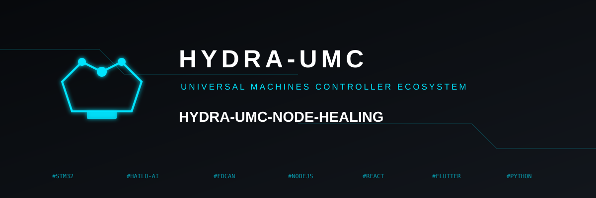
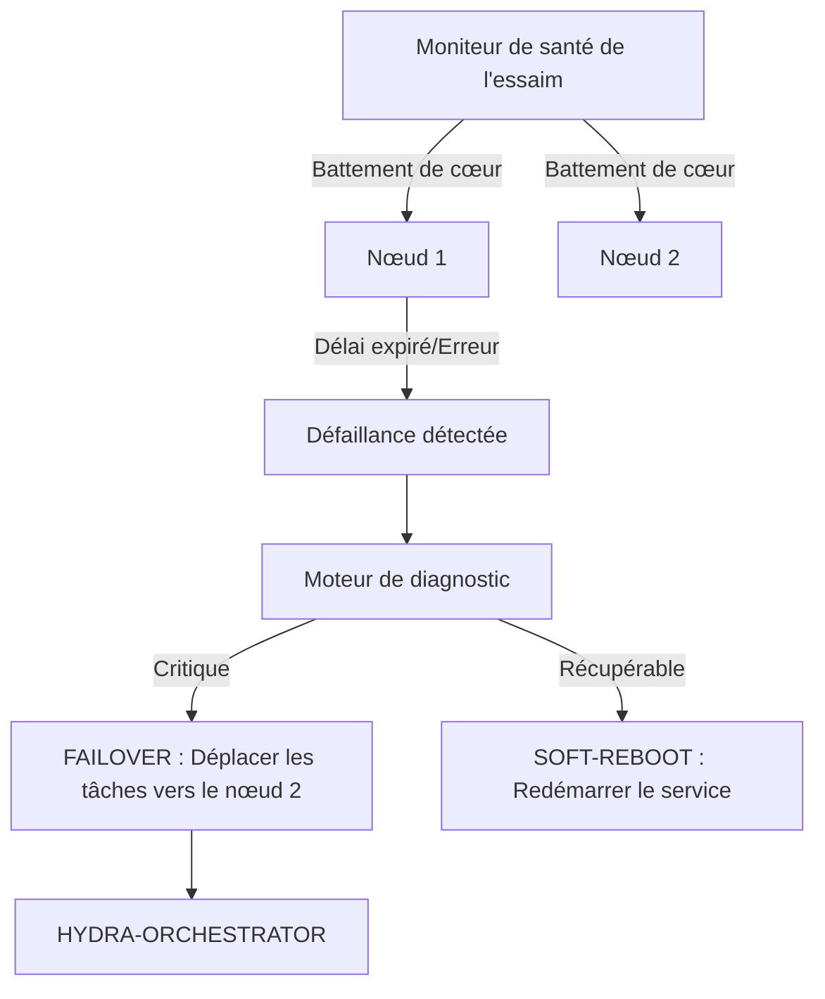

<p align="center">
  
</p>

# 💊 HYDRA-UMC-NODE-HEALING

<p align="center"><a href="README.md">🇺🇸 English</a> | <a href="README_spa.md">🇪🇸 Español</a> | 🇫🇷 <b>Français</b> | <a href="README_ita.md">🇮🇹 Italiano</a> | <a href="README_deu.md">🇩🇪 Deutsch</a> | <a href="README_zho.md">🇨🇳 简体中文</a> | <a href="README_jpn.md">🇯🇵 日本語</a></p>

### 🛡️ Moniteur de haute disponibilité et gestionnaire de basculement pour HydraNodes

<p align="left">
  
  
  
</p>

---

## 1. 🛠️ APERÇU TECHNIQUE

**HYDRA-UMC-NODE-HEALING** est la couche de résilience de l'essaim. Il surveille en permanence la santé de tous les HydraNodes physiques (contrôleurs) et des services logiques, garantissant un temps d'arrêt nul dans la micro-usine.

Si un nœud échoue en raison d'un dysfonctionnement matériel ou d'une panne de réseau, le gestionnaire de « Healing » déclenche automatiquement un processus de basculement (failover), redirigeant ses missions actives vers d'autres nœuds et avertissant l'opérateur via l'orchestrateur.

### Caractéristiques principales :
* 💓 **Health Heartbeat :** Surveillance en moins de 10 ms de la disponibilité des nœuds et de l'état thermique.
* 🔄 **Basculement automatique :** Réattribue de manière transparente les missions des nœuds défaillants vers des nœuds sains.
* 🛡️ **Redémarrage logiciel (Soft Reboot) :** Tente une récupération de service à distance avant de déclencher une réinitialisation matérielle complète.
* 📡 **Alertes opérateur :** Notification en temps réel sur toutes les interfaces (Studios, Apps, Watch).

---

## 2. 🔄 FLUX DE TRAVAIL DE « HEALING »



---

## 3. 🧱 ARCHITECTURE & DÉCISIONS DE CONCEPTION

* **Pourquoi la logique réelle vit sous `src/`, pas à la racine du dépôt.** `src/healthpb` (stubs gRPC générés), `src/watchdog` (le moteur de sondage) et `src/config` (le chargeur du registre de nœuds) contiennent l'implémentation réelle ; `main.go`/`version.go` restent à la racine comme point d'entrée qui les relie.
* **Pourquoi la détection est séparée de l'orchestrateur qu'elle protège.** Un chien de garde de guérison de nœud tournant À L'INTÉRIEUR du processus de l'orchestrateur ne pourrait pas détecter que ce même processus est bloqué - tourner comme service indépendant est ce qui rend réellement possible 'détecter un nœud sans réponse et rediriger son travail', y compris quand le nœud sans réponse est l'orchestrateur lui-même.
* **Pourquoi la détection est déjà réelle aujourd'hui, mais pas encore le basculement/redémarrage logiciel.** `src/watchdog` interroge le `HealthService.Check()` (le contrat gRPC partagé `hydra.common.v1` de `HYDRA-UMC-ORCHESTRATOR/proto/hydra_common.proto`) de chaque nœud enregistré, sur un intervalle réel via une vraie connexion réseau, classe le résultat en HEALTHY/DEGRADED/UNHEALTHY/UNREACHABLE, et déclenche un callback `Reactor` seulement lors d'un *changement* d'état (jamais à chaque cycle). Il n'appelle pas encore HYDRA-UMC-ORCHESTRATOR pour déclencher un vrai basculement ou redémarrage logiciel, car ORCHESTRATOR n'a pas non plus d'API pour cela pour l'instant - `watchdog.Reactor` est le point d'ancrage prévu pour quand elle existera. La détection n'avait pas besoin d'attendre cela pour être réelle.
* **Pourquoi le registre de nœuds est un fichier JSON statique et non une requête en direct vers HYDRA-UMC-SWARM-SYNC.** SWARM-SYNC (la source de vérité citée à l'origine par le README pour "chaque cellule de l'essaim") n'a pas non plus de vraie API pour l'instant - il en est encore au stade d'andamiaje. Un `nodes.json` statique (voir `nodes.example.json`) est le v0 honnête, pas un placeholder qui prétend être dynamique. Remplacer `src/config.LoadNodes` par un vrai client SWARM-SYNC dès que ce projet en aura un.
* **Comment cela s'intègre dans le reste de l'écosystème.** Un service frère sous HYDRA-UMC-ORCHESTRATOR - surveille chaque nœud de son registre et signale les changements d'état ; rediriger le travail loin de celui qui cesse de répondre est la couche suivante, construite par-dessus une fois qu'ORCHESTRATOR exposera quelque chose permettant de rediriger le travail.

---

## 📂 STRUCTURE DES RÉPERTOIRES

```text
HYDRA-UMC-NODE-HEALING/
├── src/
│   ├── healthpb/      # Stubs Go générés pour hydra.common.v1
│   │                  # (issus de HYDRA-UMC-ORCHESTRATOR/proto/
│   │                  # hydra_common.proto - voir le proto/README.md de
│   │                  # ce dépôt pour la commande de génération)
│   ├── watchdog/      # Boucle de sondage réelle : dial, Check(), classer,
│   │                  # réagir uniquement lors d'un changement d'état
│   └── config/        # Chargeur du registre statique de nœuds (JSON)
├── build/             # Binaires compilés (sortie de build.sh/build.bat)
├── nodes.example.json # Registre de nœuds d'exemple (voir src/config)
├── go.mod / go.sum    # Définition du module Go
├── version.go         # const Version = "X.Y.Z" (go.mod n'a pas ce champ)
├── main.go            # Point d'entrée : charge le registre et lance le watchdog
├── bump_version.py    # Incrément de version type compteur kilométrique
├── build.sh/.bat      # Incrémente la version puis `go build`
├── run.sh/.bat        # Exécute le binaire compilé
└── README.md
```

Élagué du modèle original : `hardware/`, `firmware/`, `os/`, `docs/`,
`images/` et `scripts/` — il s'agit d'un service purement logiciel
(binaire Go) sans matériel ni firmware propres, sans image de système
d'exploitation à maintenir, et sans contenu de documentation/médias/scripts
utilitaires encore suffisant pour justifier leurs propres dossiers.

---

## 🔧 BUILD & RUN

Un vrai watchdog, pas seulement un squelette qui compile : il contacte
chaque nœud de `nodes.example.json` (ou `-nodes <chemin>` pour pointer
vers votre propre registre) par gRPC et signale les changements d'état
sur stdout.

```bash
# Windows
build.bat
run.bat -nodes nodes.example.json

# Linux / macOS
./build.sh
./run.sh -nodes nodes.example.json
```

`build.sh`/`build.bat` incrémentent la version dans `version.go` (règle du
compteur kilométrique de l'écosystème, voir `bump_version.py` - `go.mod`
n'a pas de champ de version natif pour les binaires d'application) puis
exécutent `go build`. `run.sh`/`run.bat` exécutent directement le binaire
résultant.

Chaque entrée du registre a besoin de quelque chose de réel à l'écoute
sur son `address` et implémentant `hydra.common.v1.HealthService` (voir
`HYDRA-UMC-ORCHESTRATOR/proto/hydra_common.proto`) pour un jour se
signaler en bonne santé - rien ne tournant encore sur les ports
d'exemple, on s'attend à voir `UNKNOWN -> UNREACHABLE` dès le premier
cycle pour les trois, ce qui est le résultat correct et honnête
aujourd'hui (chaque nœud de l'écosystème en est encore au stade
d'andamiaje au-delà de la propre logique de détection de ce dépôt).

```bash
go test ./...   # src/config + src/watchdog, allers-retours gRPC
                 # réels sur de vraies sockets loopback, sans client simulé
```

---

## 🚀 ROADMAP
* **Phase 1 :** Synchronisation du jumeau numérique avec la télémétrie matérielle en temps réel et latence inférieure à 10 ms.
* **Phase 2 :** Intégration de Physics Replica avec des simulateurs de classe industrielle (Isaac Sim) et prise en charge des corps déformables.
* **Phase 3 :** Modèles de récupération automatisés de Node Healing pour un basculement décentralisé et détection précoce de la dégradation des capteurs.
* **Phase 4 :** « Healing » prédictif piloté par l'IA basé sur la dégradation précoce des capteurs et prise en charge de HIL Bridge pour le véhicule en boucle à grande échelle.

---

## 🔗 Projets Liés

Ce projet fait partie d'un écosystème robotique plus large du même auteur (JuanenRac / Electro Hobby 3D), couvrant firmware, logiciel de contrôle, nœuds IA et outillage de flotte. Bon à savoir, car une demande pourrait en réalité concerner l'un de ces projets plutôt que ce dépôt.

### Famille

**Parent :** **[HYDRA-UMC-ORCHESTRATOR](https://github.com/JuanenRac/HYDRA-UMC-ORCHESTRATOR)** — le parent d'intégration que protège ce service d'auto-guérison.

**Frères et sœurs :**
- **[HYDRA-UMC-SWARM-SYNC](https://github.com/JuanenRac/HYDRA-UMC-SWARM-SYNC)** — service d'orchestration frère, même parent.
- **[HYDRA-UMC-PATH-PLANNER-3D](https://github.com/JuanenRac/HYDRA-UMC-PATH-PLANNER-3D)** — service d'orchestration frère, même parent.
- **[HYDRA-UMC-JOB-DISPATCHER](https://github.com/JuanenRac/HYDRA-UMC-JOB-DISPATCHER)** — service d'orchestration frère, même parent.

### Relation Directe (hors de la famille)

- **[HYDRA-UMC-SERVER](https://github.com/JuanenRac/HYDRA-UMC-SERVER)** — surveille les instances de ce backend.

### Reste de l'Écosystème

**Plateforme HYDRA-UMC** — la cellule de micro-usine multi-robot
- **[HYDRA-UMC](https://github.com/JuanenRac/HYDRA-UMC)** — la carte mère CM5 + STM32H745 orchestrant jusqu'à 8 bras robotiques.
- **[HYDRA-UMC-SERVER](https://github.com/JuanenRac/HYDRA-UMC-SERVER)** — le backend Express/WebSocket auquel parle chaque client de contrôle.
- **[HYDRA-UMC-STUDIO](https://github.com/JuanenRac/HYDRA-UMC-STUDIO)** — tableau de bord de contrôle web, visualisation 3D multi-robot.
- **[HYDRA-UMC-ANDROID-CONTROL](https://github.com/JuanenRac/HYDRA-UMC-ANDROID-CONTROL)** — application de contrôle Android via Wi-Fi/Bluetooth.
- **[HYDRA-UMC-IOS-CONTROL](https://github.com/JuanenRac/HYDRA-UMC-IOS-CONTROL)** — application de contrôle iOS/iPadOS construite en Flutter.
- **[HYDRA-UMC-SUITE](https://github.com/JuanenRac/HYDRA-UMC-SUITE)** — centre de commande d'essaim de bureau (Python/PySide6).
- **[HYDRA-UMC-EDITOR-URDF](https://github.com/JuanenRac/HYDRA-UMC-EDITOR-URDF)** — éditeur de modèles URDF de bureau pour le catalogue de robots.
- **[HYDRA-UMC-DSI](https://github.com/JuanenRac/HYDRA-UMC-DSI)** — interface tactile native pour l'écran DSI embarqué.

**Plateforme URTC** — le contrôleur de tête d'outil que porte chaque bras HYDRA-UMC
- **[URTC](https://github.com/JuanenRac/URTC)** — contrôleur de tête d'outil sur bus CAN, 25 profils d'outil.
- **[URTC-FLASHER](https://github.com/JuanenRac/URTC-FLASHER)** — outil de bureau de flashage CAN-OTA + SWD/JTAG.
- **[URTC-TESTER](https://github.com/JuanenRac/URTC-TESTER)** — outil de bureau de diagnostic CAN en direct.
- **[URTC-WEB-STUDIO](https://github.com/JuanenRac/URTC-WEB-STUDIO)** — alternative basée navigateur via l'API Web Serial.

**🎥 Vision AI Node (Hailo-8)**
- [HYDRA-UMC-VISION-NODE](https://github.com/JuanenRac/HYDRA-UMC-VISION-NODE)
- [HYDRA-UMC-VISION-STREAMER](https://github.com/JuanenRac/HYDRA-UMC-VISION-STREAMER)
- [HYDRA-UMC-DETECTION-HEF](https://github.com/JuanenRac/HYDRA-UMC-DETECTION-HEF)
- [HYDRA-UMC-SAFETY-ZONES](https://github.com/JuanenRac/HYDRA-UMC-SAFETY-ZONES)
- [HYDRA-UMC-VISUAL-SERVOING-API](https://github.com/JuanenRac/HYDRA-UMC-VISUAL-SERVOING-API)

**🧠 Cognitive AI Node (Hailo-10)**
- [HYDRA-UMC-COGNITIVE-NODE](https://github.com/JuanenRac/HYDRA-UMC-COGNITIVE-NODE)
- [HYDRA-UMC-VLA-ENGINE](https://github.com/JuanenRac/HYDRA-UMC-VLA-ENGINE)
- [HYDRA-UMC-VOICE-UI](https://github.com/JuanenRac/HYDRA-UMC-VOICE-UI)
- [HYDRA-UMC-SEMANTIC-PLANNER](https://github.com/JuanenRac/HYDRA-UMC-SEMANTIC-PLANNER)
- [HYDRA-UMC-DOCS-QA](https://github.com/JuanenRac/HYDRA-UMC-DOCS-QA)

**🎮 Digital Twin & Simulation**
- [HYDRA-UMC-TWIN](https://github.com/JuanenRac/HYDRA-UMC-TWIN)
- [HYDRA-UMC-PHYSICS-REPLICA](https://github.com/JuanenRac/HYDRA-UMC-PHYSICS-REPLICA)
- [HYDRA-UMC-HIL-BRIDGE](https://github.com/JuanenRac/HYDRA-UMC-HIL-BRIDGE)
- [HYDRA-UMC-SYNTHETIC-DATA-GEN](https://github.com/JuanenRac/HYDRA-UMC-SYNTHETIC-DATA-GEN)

**📊 Data & Analytics**
- [HYDRA-UMC-DATALAKE](https://github.com/JuanenRac/HYDRA-UMC-DATALAKE)
- [HYDRA-UMC-TELEMETRY-COLLECTOR](https://github.com/JuanenRac/HYDRA-UMC-TELEMETRY-COLLECTOR)
- [HYDRA-UMC-ANOMALY-DETECTOR](https://github.com/JuanenRac/HYDRA-UMC-ANOMALY-DETECTOR)
- [HYDRA-UMC-PRODUCTION-REPORTS](https://github.com/JuanenRac/HYDRA-UMC-PRODUCTION-REPORTS)

**🏭 Industrial Gateway**
- [HYDRA-UMC-GATEWAY-INDUSTRIAL](https://github.com/JuanenRac/HYDRA-UMC-GATEWAY-INDUSTRIAL)
- [HYDRA-UMC-OPCUA-SERVER](https://github.com/JuanenRac/HYDRA-UMC-OPCUA-SERVER)
- [HYDRA-UMC-MQTT-BROKER](https://github.com/JuanenRac/HYDRA-UMC-MQTT-BROKER)
- [HYDRA-UMC-MTCONNECT-ADAPTER](https://github.com/JuanenRac/HYDRA-UMC-MTCONNECT-ADAPTER)

**🛠️ Complementary Tools**
- [URTC-SMART-RACK](https://github.com/JuanenRac/URTC-SMART-RACK)
- [URTC-VISION-TOOL](https://github.com/JuanenRac/URTC-VISION-TOOL)
- [HYDRA-UMC-WATCH](https://github.com/JuanenRac/HYDRA-UMC-WATCH)
- [HYDRA-UMC-TOOL-CLI](https://github.com/JuanenRac/HYDRA-UMC-TOOL-CLI)
- [HYDRA-UMC-DASHBOARD-AI](https://github.com/JuanenRac/HYDRA-UMC-DASHBOARD-AI)


## 👤 AUTEUR
**JuanenRac** (Electro Hobby 3D)
📧 electrohobby3d@gmail.com

## 📜 LICENCE
GPL-3.0 - Voir le fichier LICENSE pour plus de détails.

## 🛠️ BUILD & RUN

Utilisez la vérification de compilation sans versionnement avant une compilation de publication :

| Action | Windows | Linux / macOS |
|---|---|---|
| Vérification de compilation (sans modifier la version ni le CHANGELOG) | `build-test.bat` | `./build-test.sh` |
| Exécution / développement (si disponible) | `run*.bat` ou `dev*.bat` | `./run*.sh` ou `./dev*.sh` |

`build-test.bat` et `build-test.sh` compilent ou valident la pile du projet sans incrémenter `hydra-umc.project.json` ni modifier `CHANGELOG.md`. Ils peuvent uniquement créer les sorties normales du compilateur. Les scripts existants `build*.bat`, `build*.sh`, `run*` et `dev*` conservent leur comportement spécifique de versionnement ou d'exécution ; utilisez-les lorsque ce comportement est requis.