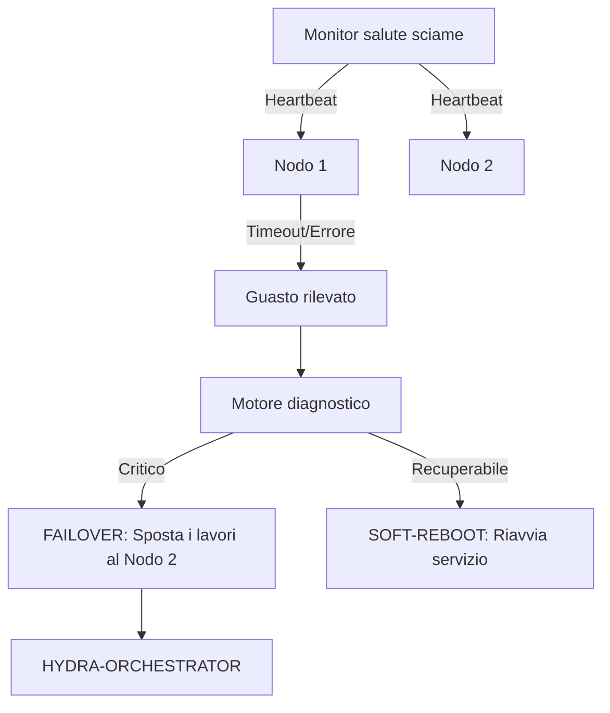

<p align="center">
  
</p>

# 💊 HYDRA-UMC-NODE-HEALING

<p align="center"><a href="README.md">🇺🇸 English</a> | <a href="README_spa.md">🇪🇸 Español</a> | <a href="README_fra.md">🇫🇷 Français</a> | 🇮🇹 <b>Italiano</b> | <a href="README_deu.md">🇩🇪 Deutsch</a> | <a href="README_zho.md">🇨🇳 简体中文</a> | <a href="README_jpn.md">🇯🇵 日本語</a></p>

### 🛡️ Monitor di alta disponibilità e gestore failover per HydraNode

<p align="left">
  
  
  
</p>

---

## 1. 🛠️ PANORAMICA TECNICA

**HYDRA-UMC-NODE-HEALING** è lo strato di resilienza dello sciame. Monitora continuamente lo stato di salute di tutti gli HydraNode fisici (controller) e dei servizi logici, garantendo tempi di inattività zero nella micro-fabbrica.

Se un nodo fallisce a causa di un malfunzionamento dell'hardware o di un'interruzione della rete, l'Healing Manager attiva automaticamente un processo di failover, reindirizzando le sue missioni attive ad altri nodi e notificando l'operatore tramite l'Orchestratore.

### Caratteristiche principali:
* 💓 **Health Heartbeat:** Monitoraggio in meno di 10 ms della disponibilità dei nodi e dello stato termico.
* 🔄 **Failover automatico:** Riassegna in modo trasparente le missioni dai nodi falliti a quelli sani.
* 🛡️ **Soft Reboot:** Tenta il ripristino del servizio remoto prima di attivare un ripristino hardware completo.
* 📡 **Avvisi operatore:** Notifica in tempo reale su tutte le interfacce (Studio, App, Watch).
* 🔁 **Retry limitati + identità del nodo verificata (v0, reale):** un guasto di rete transitorio non fa più passare un nodo a `UNREACHABLE` al primo fallimento - `checkNode` riprova con un backoff esponenziale deterministico e limitato prima di arrendersi; un nodo che risponde ma non riesce ad autoidentificarsi correttamente viene classificato `INVALID` e non viene mai considerato affidabile, ritentato, o riportato come sano.

---

## 2. 🔄 WORKFLOW DI HEALING



---

## 3. 🧱 ARCHITETTURA E DECISIONI DI PROGETTAZIONE

* **Perché la logica reale vive sotto `src/` e non nella radice del repo.** `src/healthpb` (stub gRPC generati), `src/watchdog` (il motore di polling) e `src/config` (il caricatore del registro nodi) contengono l'implementazione reale; `main.go`/`version.go` restano nella radice come punto di ingresso che li collega.
* **Perché il rilevamento è separato dall'orchestratore che protegge.** Un watchdog di guarigione dei nodi eseguito DENTRO il processo dell'orchestratore non potrebbe rilevare che quello stesso processo si è bloccato - girare come servizio indipendente è ciò che rende realmente possibile 'rilevare un nodo non rispondente e reindirizzare il suo lavoro', anche quando il nodo non rispondente è l'orchestratore stesso.
* **Rilevamento E vero failover sono ora entrambi collegati.** `src/watchdog` interroga `HealthService.Check()` (il contratto gRPC condiviso `hydra.common.v1` di `HYDRA-UMC-ORCHESTRATOR/proto/hydra_common.proto`) di ogni nodo registrato, su un intervallo reale e una connessione di rete reale, classifica il risultato in HEALTHY/DEGRADED/UNHEALTHY/UNREACHABLE, e attiva un callback `Reactor` solo quando lo stato *cambia* (mai a ogni ciclo). `OrchestratorReactor` (`src/watchdog/orchestrator_reactor.go`) è la vera implementazione di `Reactor` usata in produzione: chiama il vero `POST /nodes/:node/recover` di HYDRA-UMC-ORCHESTRATOR a ogni transizione verso uno stato non sano, richiedendo una vera azione di recupero invece di limitarsi a registrare il rilevamento.
* **Perché il registro dei nodi è un JSON statico e non una query live a HYDRA-UMC-SWARM-SYNC.** SWARM-SYNC (la fonte di verità originariamente citata dal README per "ogni cella dello sciame") non ha ancora nemmeno lei un'API reale - è ancora in fase di andamiaje. Un `nodes.json` statico (vedi `nodes.example.json`) è il v0 onesto, non un placeholder che finge di essere dinamico. Sostituire `src/config.LoadNodes` con un vero client SWARM-SYNC non appena quel progetto ne avrà uno.
* **Come si inserisce nel resto dell'ecosistema.** Un servizio fratello sotto HYDRA-UMC-ORCHESTRATOR - sorveglia ogni nodo del suo registro, segnala i cambi di stato, e ora richiede un vero recupero tramite `OrchestratorReactor` quando uno di essi diventa non sano; reindirizzare il lavoro effettivamente in corso lontano da quel nodo è il livello successivo sopra questo.
* **Perché un fallimento di trasporto viene ritentato (in modo limitato) ma un'identità non corrispondente mai.** Una connessione rifiutata o un timeout RPC può essere un guasto genuinamente transitorio - un nodo in fase di riavvio, un breve intoppo di rete - quindi `checkNode` lo ritenta fino a `RetryPolicy.MaxAttempts` volte con backoff esponenziale prima di arrendersi. Un nodo che risponde ma segnala il nome sbagliato (o nessuno) è un problema di natura completamente diversa: nessuna attesa risolve un servizio collegato alla porta sbagliata, quindi quel caso viene classificato `StatusInvalid` immediatamente, senza alcun retry.
* **Perché il backoff non ha jitter casuale.** Una vera flotta di produzione vorrebbe jitter per evitare un'ondata di riconnessioni simultanee, ma questo watchdog interroga già ogni nodo dalla propria goroutine al proprio ritmo - l'unico costo del jitter qui sarebbe rendere `RetryPolicy.Backoff()` non deterministico e più difficile da verificare nei test. Da aggiungere se/quando questo watchdog dovesse interrogare centinaia di nodi contro una risorsa condivisa che fa da collo di bottiglia.

Per maggiori dettagli, vedere [`docs/ARCHITECTURE.md`](docs/ARCHITECTURE.md) (guida all'architettura), [`docs/BUILD_AND_RUN.md`](docs/BUILD_AND_RUN.md) (flusso di build release vs test) e [`docs/INTEGRATION_CONTRACT.md`](docs/INTEGRATION_CONTRACT.md) (il contratto di snapshot di salute versionato che un futuro adattatore deve rispettare).

---

## 📂 STRUTTURA DELLE CARTELLE

```text
HYDRA-UMC-NODE-HEALING/
├── src/
│   ├── healthpb/      # Stub Go generati per hydra.common.v1
│   │                  # (ottenuti da HYDRA-UMC-ORCHESTRATOR/proto/
│   │                  # hydra_common.proto - vedi il proto/README.md di
│   │                  # quel repo per il comando di generazione)
│   ├── watchdog/      # Ciclo di polling reale: dial, Check(), classificare,
│   │                  # reagire solo a un cambio di stato, più
│   │                  # retry.go (RetryPolicy)
│   └── config/        # Caricatore del registro statico dei nodi (JSON)
├── build/             # Binari compilati (output di build.sh/build.bat)
├── images/            # Media e diagrammi
├── systemd/
│   └── hydra-umc-node-healing.service # Unità systemd del watchdog sulla CM5 locale
├── tools/
│   ├── build_test.py  # Controllo build senza versionamento
│   └── ci_validate.py # Validazione manifest/CHANGELOG/docs usata dalla CI
├── nodes.example.json # Registro nodi di esempio (vedi src/config)
├── go.mod / go.sum    # Definizione del modulo Go
├── version.go         # const Version = "X.Y.Z" (go.mod non ha questo campo)
├── main.go            # Punto di ingresso: carica il registro e avvia il watchdog
├── bump_version.py    # Bump di versione stile contachilometri
├── bump_manifest_version.py # Sincronizza la versione di hydra-umc.project.json con quella nativa (--sync)
├── build.sh/.bat      # Aggiorna la versione, poi `go build`
├── build-test.sh/.bat # Controllo build senza versionamento
├── run.sh/.bat        # Esegue il binario compilato
├── docs/
│   ├── ARCHITECTURE.md
│   ├── BUILD_AND_RUN.md
│   └── INTEGRATION_CONTRACT.md
└── README.md
```

Rimossi dal template originale: `hardware/`, `firmware/`, `os/`, `docs/`,
`images/` e `scripts/` — è un servizio puramente software (binario Go)
senza hardware o firmware propri, senza un'immagine del sistema operativo
da mantenere, e senza contenuto di documentazione/media/script di utilità
ancora sufficiente da giustificare cartelle proprie.

---

## 🔧 BUILD ED ESECUZIONE

Un watchdog reale, non solo uno scheletro che compila: contatta ogni nodo
in `nodes.example.json` (o `-nodes <percorso>` per puntare a un proprio
registro) via gRPC e riporta i cambi di stato su stdout.

```bash
# Windows
build.bat
run.bat -nodes nodes.example.json

# Linux / macOS
./build.sh
./run.sh -nodes nodes.example.json
```

`build.sh`/`build.bat` aggiornano la versione in `version.go` (regola
contachilometri dell'ecosistema, vedi `bump_version.py` - `go.mod` non ha
un campo di versione nativo per i binari applicativi) e poi eseguono
`go build`. `run.sh`/`run.bat` eseguono direttamente il binario risultante.

Ogni voce del registro ha bisogno di qualcosa di reale in ascolto sul suo
`address` che implementi `hydra.common.v1.HealthService` (vedi
`HYDRA-UMC-ORCHESTRATOR/proto/hydra_common.proto`) per poter mai
risultare in salute - non essendoci ancora nulla in esecuzione sulle porte
di esempio, ci si aspetta `UNKNOWN -> UNREACHABLE` al primo ciclo per
tutti e tre (ora solo dopo l'esaurimento dei tentativi limitati di
`RetryPolicy`, non al primo dial - vedi la funzionalità "Retry limitati"
sopra), che è il risultato corretto e onesto oggi (ogni nodo
dell'ecosistema è ancora in fase di andamiaje al di là della logica di
rilevamento di questo stesso repo). Un nodo che risponde ma non riesce ad
autoidentificarsi correttamente stampa invece `UNKNOWN -> INVALID`,
immediatamente.

```bash
go test ./...   # src/config + src/watchdog, round-trip gRPC
                 # reali su socket loopback reali, senza client simulato
```

---

## 🚀 TABELLA DI MARCIA
* **Fase 1:** Sincronizzazione del Digital Twin con telemetria hardware in tempo reale e latenza inferiore a 10 ms.
* **Fase 2:** Integrazione di Physics Replica con simulatori di livello industriale (Isaac Sim) e supporto per corpi deformabili.
* **Fase 3:** Modelli di ripristino automatizzati di Node Healing per failover decentralizzato e rilevamento precoce del degrado dei sensori.
* **Fase 4:** Healing predittivo guidato dall'IA basato sulla degradazione precoce dei sensori e supporto HIL Bridge per test vehicle-in-the-loop su scala reale.

---

## 🔗 Progetti Correlati

Questo progetto fa parte dell'ecosistema robotico HYDRA-UMC dello stesso autore (JuanenRac / Electro Hobby 3D). Vale la pena conoscerlo, poiché una richiesta potrebbe in realtà riguardare uno di questi invece di questo repository.

**Progetto Padre**
- **[HYDRA-UMC-ORCHESTRATOR](https://github.com/JuanenRac/HYDRA-UMC-ORCHESTRATOR)** — hub di integrazione con un vero contratto di health-report gRPC/Protobuf e una macchina a stati di missione; il genitore di cui questo repository è un servizio di orchestrazione specifico, all'interno del proprio livello di coordinamento dello sciame.

**Progetti Fratelli** — gli altri servizi di orchestrazione del livello di coordinamento dello sciame proprio di HYDRA-UMC-ORCHESTRATOR
- **[HYDRA-UMC-SWARM-SYNC](https://github.com/JuanenRac/HYDRA-UMC-SWARM-SYNC)** — vera sincronizzazione di stato CRDT LWW-Element-Map, con property test per la convergenza multi-cella.
- **[HYDRA-UMC-PATH-PLANNER-3D](https://github.com/JuanenRac/HYDRA-UMC-PATH-PLANNER-3D)** — vero pianificatore di percorsi 3D basato su RRT, con vera validazione delle collisioni ostacolo/spazio di lavoro.
- **[HYDRA-UMC-JOB-DISPATCHER](https://github.com/JuanenRac/HYDRA-UMC-JOB-DISPATCHER)** — vera coda di lavori basata su priorità con deduplicazione, su una vera API HTTP.

**Direttamente Correlati**
- **[HYDRA-UMC-SERVER](https://github.com/JuanenRac/HYDRA-UMC-SERVER)** — il vero backend headless (REST/WebSocket) con cui parla davvero ogni client di controllo — questo servizio di guarigione monitora istanze live di questo backend.

**Fa Anche Parte dell'Ecosistema**

*Hardware e Piattaforma di Base*
- **[HYDRA-UMC](https://github.com/JuanenRac/HYDRA-UMC)** — la scheda madre fisica del braccio robotico: host CM5 + coprocessore STM32H745 dual-core, che coordina fino a 8 bracci utensile via CAN-OTA/SPI-OTA.
- **[HYDRA-UMC-OS](https://github.com/JuanenRac/HYDRA-UMC-OS)** — livello prodotto riproducibile su Raspberry Pi OS per il CM5: agente in sola lettura, config/profili validati, provisioning WiFi al primo contatto.
- **[HYDRA-UMC-SDK](https://github.com/JuanenRac/HYDRA-UMC-SDK)** — il contratto JSON-Schema condiviso e la barriera di sicurezza contro cui ogni bridge valida i propri comandi.

*Backend Centrale e Client*
- **[HYDRA-UMC-STUDIO](https://github.com/JuanenRac/HYDRA-UMC-STUDIO)** — dashboard di controllo web con visualizzazione 3D multi-robot in tempo reale.
- **[HYDRA-UMC-SUITE](https://github.com/JuanenRac/HYDRA-UMC-SUITE)** — centro di comando sciame desktop (PySide6) per più server contemporaneamente, pacchettizzato come eseguibile standalone.
- **[HYDRA-UMC-ANDROID-CONTROL](https://github.com/JuanenRac/HYDRA-UMC-ANDROID-CONTROL)** — app di controllo nativa per Android con login biometrico e un companion Wear OS abbinato.
- **[HYDRA-UMC-IOS-CONTROL](https://github.com/JuanenRac/HYDRA-UMC-IOS-CONTROL)** — app di controllo per iOS/iPadOS (Flutter) con sincronizzazione WebSocket in tempo reale.
- **[HYDRA-UMC-DSI](https://github.com/JuanenRac/HYDRA-UMC-DSI)** — interfaccia touch nativa per il touchscreen DSI da 7" a bordo, incorporata direttamente nel CM5.
- **[HYDRA-UMC-EDITOR-URDF](https://github.com/JuanenRac/HYDRA-UMC-EDITOR-URDF)** — creatore/editor grafico desktop di URDF che invia i modelli finiti al catalogo di STUDIO.
- **[HYDRA-UMC-BRIDGE-AMR](https://github.com/JuanenRac/HYDRA-UMC-BRIDGE-AMR)** — barriera di coordinamento per flotte AGV/AMR tramite un publisher MQTT VDA 5050 reale.
- **[HYDRA-UMC-BRIDGE-CNC](https://github.com/JuanenRac/HYDRA-UMC-BRIDGE-CNC)** — coordinatore ad alto livello per celle CNC con accesso reale a stato/byte di controllo GRBL.
- **[HYDRA-UMC-BRIDGE-DROIDS](https://github.com/JuanenRac/HYDRA-UMC-BRIDGE-DROIDS)** — barriera di coordinamento per droidi con zampe/umanoidi, con un vero mittente di comandi per Boston Dynamics Spot.
- **[HYDRA-UMC-BRIDGE-LASER](https://github.com/JuanenRac/HYDRA-UMC-BRIDGE-LASER)** — coordinatore di sicurezza per celle laser che legge 3 salvaguardie GPIO reali di chiave/involucro/interblocco.
- **[HYDRA-UMC-BRIDGE-OPENPNP](https://github.com/JuanenRac/HYDRA-UMC-BRIDGE-OPENPNP)** — coordinatore ad alto livello sicuro per il flusso schede del pick-and-place OpenPnP.
- **[HYDRA-UMC-BRIDGE-PRINTER3D](https://github.com/JuanenRac/HYDRA-UMC-BRIDGE-PRINTER3D)** — barriera di coordinamento sicura per stampanti 3D Moonraker/Klipper, con comandi di lavoro reali e controllati.
- **[HYDRA-UMC-BRIDGE-ROS2](https://github.com/JuanenRac/HYDRA-UMC-BRIDGE-ROS2)** — coordinatore di sicurezza con un vero trasporto ROS 2 rclpy, importato in modo lazy.
- **[HYDRA-UMC-BRIDGE-UAV](https://github.com/JuanenRac/HYDRA-UMC-BRIDGE-UAV)** — barriera di coordinamento per UAV dotati di fotocamera, con un vero mittente di comandi MAVLink.

*Piattaforma Strumenti URTC*
- **[URTC](https://github.com/JuanenRac/URTC)** — firmware per la scheda fisica dell'Universal Robot Tool Controller, oltre 25 profili utensile su bus CAN.
- **[URTC-FLASHER](https://github.com/JuanenRac/URTC-FLASHER)** — strumento desktop con GUI per il flashing delle schede URTC, CAN-OTA più SWD/JTAG a chip intero.
- **[URTC-TESTER](https://github.com/JuanenRac/URTC-TESTER)** — strumento desktop di diagnostica CAN-bus dal vivo per schede URTC, un pannello per profilo utensile.
- **[URTC-WEB-STUDIO](https://github.com/JuanenRac/URTC-WEB-STUDIO)** — alternativa basata su browser a URTC-TESTER tramite la Web Serial API, senza installazione locale.

*Nodo IA Visione (Hailo-8)*
- **[HYDRA-UMC-VISION-NODE](https://github.com/JuanenRac/HYDRA-UMC-VISION-NODE)** — hub di integrazione per la pipeline di visione Hailo-8, con un vero controllo di prontezza hardware per fase.
- **[HYDRA-UMC-DETECTION-HEF](https://github.com/JuanenRac/HYDRA-UMC-DETECTION-HEF)** — registro reale di modelli compilati con verifica di caricamento sicuro per architettura Hailo/checksum.
- **[HYDRA-UMC-VISION-STREAMER](https://github.com/JuanenRac/HYDRA-UMC-VISION-STREAMER)** — generatore reale di pipeline GStreamer + config MediaMTX, con una vera barriera di integrazione HailoRT.
- **[HYDRA-UMC-VISUAL-SERVOING-API](https://github.com/JuanenRac/HYDRA-UMC-VISUAL-SERVOING-API)** — vera legge di correzione Position-Based Visual Servoing, con cancello di sicurezza sullo stato di zona a monte.
- **[HYDRA-UMC-SAFETY-ZONES](https://github.com/JuanenRac/HYDRA-UMC-SAFETY-ZONES)** — vero controllo di violazione zona e richiesta E-STOP, con imposizione della freschezza di calibrazione.

*Nodo IA Cognitivo (Hailo-10)*
- **[HYDRA-UMC-COGNITIVE-NODE](https://github.com/JuanenRac/HYDRA-UMC-COGNITIVE-NODE)** — hub di integrazione per la pipeline cognitiva Hailo-10 (orchestrazione LLM/VLA/voce).
- **[HYDRA-UMC-VLA-ENGINE](https://github.com/JuanenRac/HYDRA-UMC-VLA-ENGINE)** — vera codifica/decodifica di token d'azione e generazione di traiettoria per un modello Vision-Language-Action.
- **[HYDRA-UMC-VOICE-UI](https://github.com/JuanenRac/HYDRA-UMC-VOICE-UI)** — vero front-end vocale (VAD + parser di intenti) con un relay verso Watch limitato e soggetto a conferma.
- **[HYDRA-UMC-SEMANTIC-PLANNER](https://github.com/JuanenRac/HYDRA-UMC-SEMANTIC-PLANNER)** — vera scomposizione dei task basata su regole e recupero semantico degli errori sui codici errore MCU.
- **[HYDRA-UMC-DOCS-QA](https://github.com/JuanenRac/HYDRA-UMC-DOCS-QA)** — vera ricerca documentale TF-IDF (solo libreria standard) sui documenti Markdown di questo ecosistema.

*Gemello Digitale e Simulazione*
- **[HYDRA-UMC-TWIN](https://github.com/JuanenRac/HYDRA-UMC-TWIN)** — hub di integrazione per il motore di gemello digitale, con un vero contratto di sincronizzazione per compatibilità di versione.
- **[HYDRA-UMC-HIL-BRIDGE](https://github.com/JuanenRac/HYDRA-UMC-HIL-BRIDGE)** — vero interblocco di sicurezza hardware-in-the-loop che instrada i comandi tra simulazione e hardware reale.
- **[HYDRA-UMC-PHYSICS-REPLICA](https://github.com/JuanenRac/HYDRA-UMC-PHYSICS-REPLICA)** — vera cinematica diretta e validazione dei limiti articolari su un vero sottoinsieme URDF.
- **[HYDRA-UMC-SYNTHETIC-DATA-GEN](https://github.com/JuanenRac/HYDRA-UMC-SYNTHETIC-DATA-GEN)** — vero generatore procedurale di scene 2D con esportazione di annotazioni YOLO/COCO.

*Dati e Analisi*
- **[HYDRA-UMC-DATALAKE](https://github.com/JuanenRac/HYDRA-UMC-DATALAKE)** — vero archivio di serie temporali basato su sqlite3, con una vera API HTTP di ingestione/query.
- **[HYDRA-UMC-ANOMALY-DETECTOR](https://github.com/JuanenRac/HYDRA-UMC-ANOMALY-DETECTOR)** — vero rilevatore di anomalie FFT + baseline statistica, con monitoraggio della deriva.
- **[HYDRA-UMC-PRODUCTION-REPORTS](https://github.com/JuanenRac/HYDRA-UMC-PRODUCTION-REPORTS)** — vero calcolo OEE/disponibilità sullo storico di DATALAKE, con esportazione CSV riproducibile.
- **[HYDRA-UMC-TELEMETRY-COLLECTOR](https://github.com/JuanenRac/HYDRA-UMC-TELEMETRY-COLLECTOR)** — vera pipeline di ingestione CAN/WebSocket verso DATALAKE, con deduplicazione per sequenza.

*Gateway Industriale*
- **[HYDRA-UMC-GATEWAY-INDUSTRIAL](https://github.com/JuanenRac/HYDRA-UMC-GATEWAY-INDUSTRIAL)** — hub di integrazione che inoltra ai protocolli industriali, con un vero livello di allowlist dei comandi/backpressure.
- **[HYDRA-UMC-OPCUA-SERVER](https://github.com/JuanenRac/HYDRA-UMC-OPCUA-SERVER)** — vero spazio di indirizzi OPC-UA, verificato con una vera sessione client del protocollo binario.
- **[HYDRA-UMC-MQTT-BROKER](https://github.com/JuanenRac/HYDRA-UMC-MQTT-BROKER)** — vero broker MQTT con autenticazione opzionale per client e ACL sui topic.
- **[HYDRA-UMC-MTCONNECT-ADAPTER](https://github.com/JuanenRac/HYDRA-UMC-MTCONNECT-ADAPTER)** — veri endpoint XML `/probe` e `/current` di MTConnect, con output in modalità degradata.

*Strumenti Complementari e Operazioni dell'Ecosistema*
- **[HYDRA-UMC-DASHBOARD-AI](https://github.com/JuanenRac/HYDRA-UMC-DASHBOARD-AI)** — pannelli Smart Summaries e Anomaly Highlighting su DATALAKE/ANOMALY-DETECTOR, con un fallback statistico onesto.
- **[HYDRA-UMC-TOOL-CLI](https://github.com/JuanenRac/HYDRA-UMC-TOOL-CLI)** — CLI di flotta con un vero e stabile contratto di exit-code, un client live reale della stessa API di HYDRA-UMC-SERVER.
- **[HYDRA-UMC-WATCH](https://github.com/JuanenRac/HYDRA-UMC-WATCH)** — app companion WearOS con avvisi aptici reali e un relay vocale verso il telefono abbinato.
- **[URTC-SMART-RACK](https://github.com/JuanenRac/URTC-SMART-RACK)** — firmware per un rack di montaggio schede con decodifica reale dell'ID utensile e logica di preriscaldamento Smart Idle.
- **[URTC-VISION-TOOL](https://github.com/JuanenRac/URTC-VISION-TOOL)** — firmware più un vero companion di visione Python per una testa utensile di ispezione termica/RGB.
- **[HYDRA-UMC-UPDATER](https://github.com/JuanenRac/HYDRA-UMC-UPDATER)** — strumento amministrativo desktop che scopre, clona e aggiorna ogni repository di questo ecosistema.
- **[HYDRA-UMC-OS-REBUILDER](https://github.com/JuanenRac/HYDRA-UMC-OS-REBUILDER)** — strumento desktop Windows/Linux che costruisce un'immagine della CM5 pronta da scrivere, precaricata con le versioni più aggiornate dell'ecosistema, con configurazione di primo avvio Wi-Fi/utente/SSH in stile Raspberry Pi Imager.


---

## 📚 Documentazione e Comunità

- **[CONTRIBUTING.md](CONTRIBUTING.md)** — stack tecnologico e linee guida di codifica per una pull request.
- **[CODE_OF_CONDUCT.md](CODE_OF_CONDUCT.md)** — gli standard di comportamento attesi in questa comunità.
- **[SECURITY.md](SECURITY.md)** — come segnalare una vulnerabilità, e le reali aree di attenzione sulla sicurezza di questo progetto.
- **[SUPPORT.md](SUPPORT.md)** — dove porre domande e segnalare bug.
- **[LICENSE.md](LICENSE.md)** — la licenza propria di questo progetto.

## 👤 AUTORE
**JuanenRac** (Electro Hobby 3D)
📧 electrohobby3d@gmail.com
📺 [youtube.com/@electrohobby3d](https://youtube.com/@electrohobby3d)

## 📜 LICENZA
GPL-3.0 - Vedere LICENSE per i dettagli.
