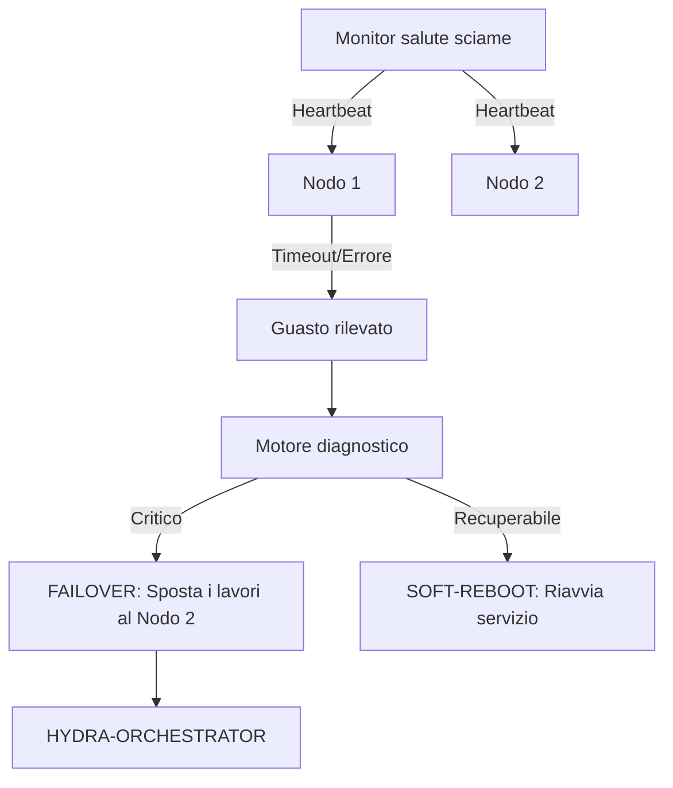

<p align="center">
  
</p>

# 💊 HYDRA-UMC-NODE-HEALING

<p align="center"><a href="README.md">🇺🇸 English</a> | <a href="README_spa.md">🇪🇸 Español</a> | <a href="README_fra.md">🇫🇷 Français</a> | 🇮🇹 <b>Italiano</b> | <a href="README_deu.md">🇩🇪 Deutsch</a> | <a href="README_zho.md">🇨🇳 简体中文</a> | <a href="README_jpn.md">🇯🇵 日本語</a></p>

### 🛡️ Monitor di alta disponibilità e gestore failover per HydraNode

<p align="left">
  
  
  
</p>

---

## 1. 🛠️ PANORAMICA TECNICA

**HYDRA-UMC-NODE-HEALING** è lo strato di resilienza dello sciame. Monitora continuamente lo stato di salute di tutti gli HydraNode fisici (controller) e dei servizi logici, garantendo tempi di inattività zero nella micro-fabbrica.

Se un nodo fallisce a causa di un malfunzionamento dell'hardware o di un'interruzione della rete, l'Healing Manager attiva automaticamente un processo di failover, reindirizzando le sue missioni attive ad altri nodi e notificando l'operatore tramite l'Orchestratore.

### Caratteristiche principali:
* 💓 **Health Heartbeat:** Monitoraggio in meno di 10 ms della disponibilità dei nodi e dello stato termico.
* 🔄 **Failover automatico:** Riassegna in modo trasparente le missioni dai nodi falliti a quelli sani.
* 🛡️ **Soft Reboot:** Tenta il ripristino del servizio remoto prima di attivare un ripristino hardware completo.
* 📡 **Avvisi operatore:** Notifica in tempo reale su tutte le interfacce (Studio, App, Watch).
* 🔁 **Retry limitati + identità del nodo verificata (v0, reale):** un guasto di rete transitorio non fa più passare un nodo a `UNREACHABLE` al primo fallimento - `checkNode` riprova con un backoff esponenziale deterministico e limitato prima di arrendersi; un nodo che risponde ma non riesce ad autoidentificarsi correttamente viene classificato `INVALID` e non viene mai considerato affidabile, ritentato, o riportato come sano.

---

## 2. 🔄 WORKFLOW DI HEALING



---

## 3. 🧱 ARCHITETTURA E DECISIONI DI PROGETTAZIONE

* **Perché la logica reale vive sotto `src/` e non nella radice del repo.** `src/healthpb` (stub gRPC generati), `src/watchdog` (il motore di polling) e `src/config` (il caricatore del registro nodi) contengono l'implementazione reale; `main.go`/`version.go` restano nella radice come punto di ingresso che li collega.
* **Perché il rilevamento è separato dall'orchestratore che protegge.** Un watchdog di guarigione dei nodi eseguito DENTRO il processo dell'orchestratore non potrebbe rilevare che quello stesso processo si è bloccato - girare come servizio indipendente è ciò che rende realmente possibile 'rilevare un nodo non rispondente e reindirizzare il suo lavoro', anche quando il nodo non rispondente è l'orchestratore stesso.
* **Perché il rilevamento è già reale oggi, ma failover/soft-reboot no.** `src/watchdog` interroga `HealthService.Check()` (il contratto gRPC condiviso `hydra.common.v1` di `HYDRA-UMC-ORCHESTRATOR/proto/hydra_common.proto`) di ogni nodo registrato, su un intervallo reale e una connessione di rete reale, classifica il risultato in HEALTHY/DEGRADED/UNHEALTHY/UNREACHABLE, e attiva un callback `Reactor` solo quando lo stato *cambia* (mai a ogni ciclo). Non chiama ancora HYDRA-UMC-ORCHESTRATOR per innescare un vero failover o soft-reboot, perché nemmeno ORCHESTRATOR ha ancora un'API per questo - `watchdog.Reactor` è il punto di innesto per quando ce l'avrà. Il rilevamento non doveva aspettare quello per essere reale.
* **Perché il registro dei nodi è un JSON statico e non una query live a HYDRA-UMC-SWARM-SYNC.** SWARM-SYNC (la fonte di verità originariamente citata dal README per "ogni cella dello sciame") non ha ancora nemmeno lei un'API reale - è ancora in fase di andamiaje. Un `nodes.json` statico (vedi `nodes.example.json`) è il v0 onesto, non un placeholder che finge di essere dinamico. Sostituire `src/config.LoadNodes` con un vero client SWARM-SYNC non appena quel progetto ne avrà uno.
* **Come si inserisce nel resto dell'ecosistema.** Un servizio fratello sotto HYDRA-UMC-ORCHESTRATOR - sorveglia ogni nodo del suo registro e segnala i cambi di stato; reindirizzare il lavoro lontano da quello che smette di rispondere è il livello successivo, costruito sopra questo non appena ORCHESTRATOR esporrà qualcosa attraverso cui reindirizzare il lavoro.
* **Perché un fallimento di trasporto viene ritentato (in modo limitato) ma un'identità non corrispondente mai.** Una connessione rifiutata o un timeout RPC può essere un guasto genuinamente transitorio - un nodo in fase di riavvio, un breve intoppo di rete - quindi `checkNode` lo ritenta fino a `RetryPolicy.MaxAttempts` volte con backoff esponenziale prima di arrendersi. Un nodo che risponde ma segnala il nome sbagliato (o nessuno) è un problema di natura completamente diversa: nessuna attesa risolve un servizio collegato alla porta sbagliata, quindi quel caso viene classificato `StatusInvalid` immediatamente, senza alcun retry.
* **Perché il backoff non ha jitter casuale.** Una vera flotta di produzione vorrebbe jitter per evitare un'ondata di riconnessioni simultanee, ma questo watchdog interroga già ogni nodo dalla propria goroutine al proprio ritmo - l'unico costo del jitter qui sarebbe rendere `RetryPolicy.Backoff()` non deterministico e più difficile da verificare nei test. Da aggiungere se/quando questo watchdog dovesse interrogare centinaia di nodi contro una risorsa condivisa che fa da collo di bottiglia.

---

## 📂 STRUTTURA DELLE CARTELLE

```text
HYDRA-UMC-NODE-HEALING/
├── src/
│   ├── healthpb/      # Stub Go generati per hydra.common.v1
│   │                  # (ottenuti da HYDRA-UMC-ORCHESTRATOR/proto/
│   │                  # hydra_common.proto - vedi il proto/README.md di
│   │                  # quel repo per il comando di generazione)
│   ├── watchdog/      # Ciclo di polling reale: dial, Check(), classificare,
│   │                  # reagire solo a un cambio di stato, più
│   │                  # retry.go (RetryPolicy)
│   └── config/        # Caricatore del registro statico dei nodi (JSON)
├── build/             # Binari compilati (output di build.sh/build.bat)
├── images/            # Media e diagrammi
├── systemd/
│   └── hydra-umc-node-healing.service # Unità systemd del watchdog sulla CM5 locale
├── tools/
│   ├── build_test.py  # Controllo build senza versionamento
│   └── ci_validate.py # Validazione manifest/CHANGELOG/docs usata dalla CI
├── nodes.example.json # Registro nodi di esempio (vedi src/config)
├── go.mod / go.sum    # Definizione del modulo Go
├── version.go         # const Version = "X.Y.Z" (go.mod non ha questo campo)
├── main.go            # Punto di ingresso: carica il registro e avvia il watchdog
├── bump_version.py    # Bump di versione stile contachilometri
├── bump_manifest_version.py # Sincronizza la versione di hydra-umc.project.json con quella nativa (--sync)
├── build.sh/.bat      # Aggiorna la versione, poi `go build`
├── build-test.sh/.bat # Controllo build senza versionamento
├── run.sh/.bat        # Esegue il binario compilato
├── docs/
│   ├── ARCHITECTURE.md
│   ├── BUILD_AND_RUN.md
│   └── INTEGRATION_CONTRACT.md
└── README.md
```

Rimossi dal template originale: `hardware/`, `firmware/`, `os/`, `docs/`,
`images/` e `scripts/` — è un servizio puramente software (binario Go)
senza hardware o firmware propri, senza un'immagine del sistema operativo
da mantenere, e senza contenuto di documentazione/media/script di utilità
ancora sufficiente da giustificare cartelle proprie.

---

## 🔧 BUILD ED ESECUZIONE

Un watchdog reale, non solo uno scheletro che compila: contatta ogni nodo
in `nodes.example.json` (o `-nodes <percorso>` per puntare a un proprio
registro) via gRPC e riporta i cambi di stato su stdout.

```bash
# Windows
build.bat
run.bat -nodes nodes.example.json

# Linux / macOS
./build.sh
./run.sh -nodes nodes.example.json
```

`build.sh`/`build.bat` aggiornano la versione in `version.go` (regola
contachilometri dell'ecosistema, vedi `bump_version.py` - `go.mod` non ha
un campo di versione nativo per i binari applicativi) e poi eseguono
`go build`. `run.sh`/`run.bat` eseguono direttamente il binario risultante.

Ogni voce del registro ha bisogno di qualcosa di reale in ascolto sul suo
`address` che implementi `hydra.common.v1.HealthService` (vedi
`HYDRA-UMC-ORCHESTRATOR/proto/hydra_common.proto`) per poter mai
risultare in salute - non essendoci ancora nulla in esecuzione sulle porte
di esempio, ci si aspetta `UNKNOWN -> UNREACHABLE` al primo ciclo per
tutti e tre (ora solo dopo l'esaurimento dei tentativi limitati di
`RetryPolicy`, non al primo dial - vedi la funzionalità "Retry limitati"
sopra), che è il risultato corretto e onesto oggi (ogni nodo
dell'ecosistema è ancora in fase di andamiaje al di là della logica di
rilevamento di questo stesso repo). Un nodo che risponde ma non riesce ad
autoidentificarsi correttamente stampa invece `UNKNOWN -> INVALID`,
immediatamente.

```bash
go test ./...   # src/config + src/watchdog, round-trip gRPC
                 # reali su socket loopback reali, senza client simulato
```

---

## 🚀 TABELLA DI MARCIA
* **Fase 1:** Sincronizzazione del Digital Twin con telemetria hardware in tempo reale e latenza inferiore a 10 ms.
* **Fase 2:** Integrazione di Physics Replica con simulatori di livello industriale (Isaac Sim) e supporto per corpi deformabili.
* **Fase 3:** Modelli di ripristino automatizzati di Node Healing per failover decentralizzato e rilevamento precoce del degrado dei sensori.
* **Fase 4:** Healing predittivo guidato dall'IA basato sulla degradazione precoce dei sensori e supporto HIL Bridge per test vehicle-in-the-loop su scala reale.

---

## 🔗 Progetti Correlati

Questo progetto fa parte di un ecosistema robotico più ampio dello stesso autore (JuanenRac / Electro Hobby 3D), che copre firmware, software di controllo, nodi IA e strumenti di flotta. Utile saperlo, perché una richiesta potrebbe in realtà riguardare uno di questi progetti anziché questo repository.

### Famiglia

**Genitore:** **[HYDRA-UMC-ORCHESTRATOR](https://github.com/JuanenRac/HYDRA-UMC-ORCHESTRATOR)** — il genitore di integrazione protetto da questo servizio di auto-guarigione.

**Fratelli:**
- **[HYDRA-UMC-SWARM-SYNC](https://github.com/JuanenRac/HYDRA-UMC-SWARM-SYNC)** — servizio di orchestrazione fratello, stesso genitore.
- **[HYDRA-UMC-PATH-PLANNER-3D](https://github.com/JuanenRac/HYDRA-UMC-PATH-PLANNER-3D)** — servizio di orchestrazione fratello, stesso genitore.
- **[HYDRA-UMC-JOB-DISPATCHER](https://github.com/JuanenRac/HYDRA-UMC-JOB-DISPATCHER)** — servizio di orchestrazione fratello, stesso genitore.

### Relazione Diretta (fuori dalla famiglia)

- **[HYDRA-UMC-SERVER](https://github.com/JuanenRac/HYDRA-UMC-SERVER)** — monitora le istanze di questo backend.

### Resto dell'Ecosistema

**Piattaforma HYDRA-UMC** — la cella di micro-fabbrica multi-robot
- **[HYDRA-UMC](https://github.com/JuanenRac/HYDRA-UMC)** — la scheda madre CM5 + STM32H745 che orchestra fino a 8 bracci robotici.
- **[HYDRA-UMC-SERVER](https://github.com/JuanenRac/HYDRA-UMC-SERVER)** — il backend Express/WebSocket con cui parla ogni client di controllo.
- **[HYDRA-UMC-STUDIO](https://github.com/JuanenRac/HYDRA-UMC-STUDIO)** — dashboard di controllo web, visualizzazione 3D multi-robot.
- **[HYDRA-UMC-ANDROID-CONTROL](https://github.com/JuanenRac/HYDRA-UMC-ANDROID-CONTROL)** — app di controllo Android via Wi-Fi/Bluetooth.
- **[HYDRA-UMC-IOS-CONTROL](https://github.com/JuanenRac/HYDRA-UMC-IOS-CONTROL)** — app di controllo iOS/iPadOS costruita in Flutter.
- **[HYDRA-UMC-SUITE](https://github.com/JuanenRac/HYDRA-UMC-SUITE)** — centro di comando sciame desktop (Python/PySide6).
- **[HYDRA-UMC-EDITOR-URDF](https://github.com/JuanenRac/HYDRA-UMC-EDITOR-URDF)** — editor desktop di modelli URDF per il catalogo robot.
- **[HYDRA-UMC-DSI](https://github.com/JuanenRac/HYDRA-UMC-DSI)** — interfaccia touch nativa per lo schermo DSI a bordo.

**Piattaforma URTC** — il controller della testa utensile che ogni braccio HYDRA-UMC porta con sé
- **[URTC](https://github.com/JuanenRac/URTC)** — controller testa utensile su bus CAN, 25 profili utensile.
- **[URTC-FLASHER](https://github.com/JuanenRac/URTC-FLASHER)** — strumento desktop di flashing CAN-OTA + SWD/JTAG.
- **[URTC-TESTER](https://github.com/JuanenRac/URTC-TESTER)** — strumento desktop di diagnostica CAN live.
- **[URTC-WEB-STUDIO](https://github.com/JuanenRac/URTC-WEB-STUDIO)** — alternativa basata su browser via Web Serial API.

**🎥 Nodo di Visione IA (Hailo-8)**
- [HYDRA-UMC-VISION-NODE](https://github.com/JuanenRac/HYDRA-UMC-VISION-NODE)
- [HYDRA-UMC-VISION-STREAMER](https://github.com/JuanenRac/HYDRA-UMC-VISION-STREAMER)
- [HYDRA-UMC-DETECTION-HEF](https://github.com/JuanenRac/HYDRA-UMC-DETECTION-HEF)
- [HYDRA-UMC-SAFETY-ZONES](https://github.com/JuanenRac/HYDRA-UMC-SAFETY-ZONES)
- [HYDRA-UMC-VISUAL-SERVOING-API](https://github.com/JuanenRac/HYDRA-UMC-VISUAL-SERVOING-API)

**🧠 Nodo IA Cognitiva (Hailo-10)**
- [HYDRA-UMC-COGNITIVE-NODE](https://github.com/JuanenRac/HYDRA-UMC-COGNITIVE-NODE)
- [HYDRA-UMC-VLA-ENGINE](https://github.com/JuanenRac/HYDRA-UMC-VLA-ENGINE)
- [HYDRA-UMC-VOICE-UI](https://github.com/JuanenRac/HYDRA-UMC-VOICE-UI)
- [HYDRA-UMC-SEMANTIC-PLANNER](https://github.com/JuanenRac/HYDRA-UMC-SEMANTIC-PLANNER)
- [HYDRA-UMC-DOCS-QA](https://github.com/JuanenRac/HYDRA-UMC-DOCS-QA)

**🎮 Gemello Digitale e Simulazione**
- [HYDRA-UMC-TWIN](https://github.com/JuanenRac/HYDRA-UMC-TWIN)
- [HYDRA-UMC-PHYSICS-REPLICA](https://github.com/JuanenRac/HYDRA-UMC-PHYSICS-REPLICA)
- [HYDRA-UMC-HIL-BRIDGE](https://github.com/JuanenRac/HYDRA-UMC-HIL-BRIDGE)
- [HYDRA-UMC-SYNTHETIC-DATA-GEN](https://github.com/JuanenRac/HYDRA-UMC-SYNTHETIC-DATA-GEN)

**📊 Dati e Analisi**
- [HYDRA-UMC-DATALAKE](https://github.com/JuanenRac/HYDRA-UMC-DATALAKE)
- [HYDRA-UMC-TELEMETRY-COLLECTOR](https://github.com/JuanenRac/HYDRA-UMC-TELEMETRY-COLLECTOR)
- [HYDRA-UMC-ANOMALY-DETECTOR](https://github.com/JuanenRac/HYDRA-UMC-ANOMALY-DETECTOR)
- [HYDRA-UMC-PRODUCTION-REPORTS](https://github.com/JuanenRac/HYDRA-UMC-PRODUCTION-REPORTS)

**🏭 Gateway Industriale**
- [HYDRA-UMC-GATEWAY-INDUSTRIAL](https://github.com/JuanenRac/HYDRA-UMC-GATEWAY-INDUSTRIAL)
- [HYDRA-UMC-OPCUA-SERVER](https://github.com/JuanenRac/HYDRA-UMC-OPCUA-SERVER)
- [HYDRA-UMC-MQTT-BROKER](https://github.com/JuanenRac/HYDRA-UMC-MQTT-BROKER)
- [HYDRA-UMC-MTCONNECT-ADAPTER](https://github.com/JuanenRac/HYDRA-UMC-MTCONNECT-ADAPTER)

**🛠️ Strumenti Complementari**
- [URTC-SMART-RACK](https://github.com/JuanenRac/URTC-SMART-RACK)
- [URTC-VISION-TOOL](https://github.com/JuanenRac/URTC-VISION-TOOL)
- [HYDRA-UMC-WATCH](https://github.com/JuanenRac/HYDRA-UMC-WATCH)
- [HYDRA-UMC-TOOL-CLI](https://github.com/JuanenRac/HYDRA-UMC-TOOL-CLI)
- [HYDRA-UMC-DASHBOARD-AI](https://github.com/JuanenRac/HYDRA-UMC-DASHBOARD-AI)


## 👤 AUTORE
**JuanenRac** (Electro Hobby 3D)
📧 electrohobby3d@gmail.com
📺 [youtube.com/@electrohobby3d](https://youtube.com/@electrohobby3d)

## 📜 LICENZA
GPL-3.0 - Vedere LICENSE per i dettagli.
