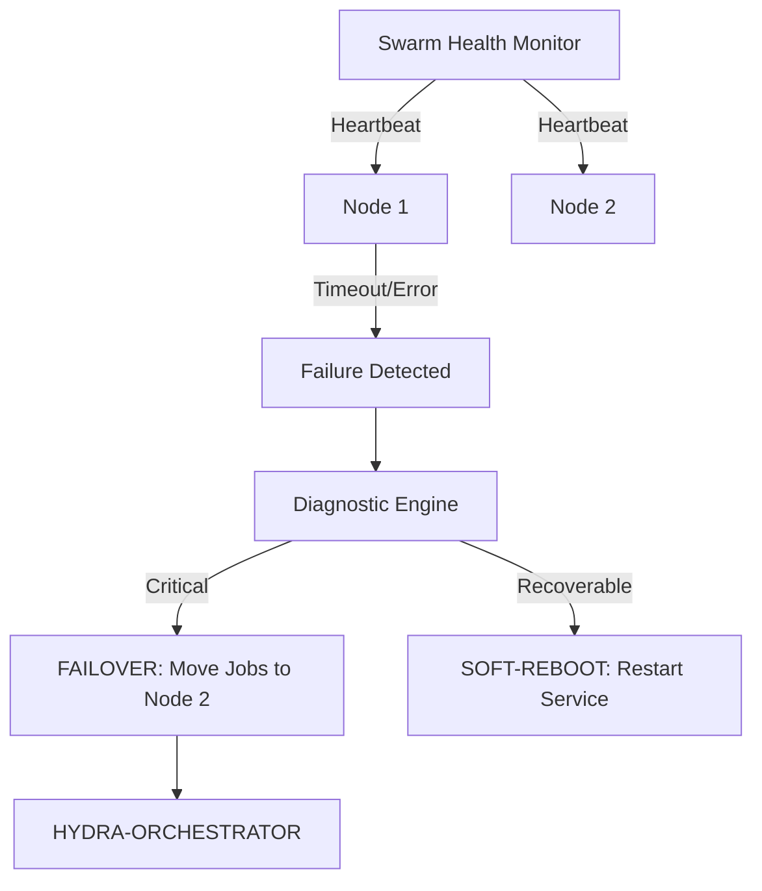

<p align="center">
  
</p>

# 💊 HYDRA-UMC-NODE-HEALING

<p align="center"><a href="README.md">🇺🇸 English</a> | <a href="README_spa.md">🇪🇸 Español</a> | <a href="README_fra.md">🇫🇷 Français</a> | <a href="README_ita.md">🇮🇹 Italiano</a> | <a href="README_deu.md">🇩🇪 Deutsch</a> | <a href="README_zho.md">🇨🇳 简体中文</a> | 🇯🇵 <b>日本語</b></p>

### 🛡️ HydraNode 向け高可用性モニター & フェイルオーバーマネージャー

<p align="left">
  
  
  
</p>

---

## 1. 🛠️ 技術概要

**HYDRA-UMC-NODE-HEALING** は、スウォームのレジリエンス層です。すべての
物理的な HydraNode（コントローラー）と論理サービスの健全性を継続的に
監視し、マイクロファクトリーにおけるダウンタイムをゼロに保ちます。

ハードウェアの故障やネットワーク障害によりノードが機能しなくなった場合、
自己修復マネージャーは自動的にフェイルオーバープロセスをトリガーし、
そのアクティブなミッションを他のノードにリダイレクトし、オーケストレー
ター経由でオペレーターに通知します。

### 主な機能：
* 💓 **健全性ハートビート：** サブ 10ms 単位でのノード可用性と温度状態の監視。
* 🔄 **自動フェイルオーバー：** 障害が発生したノードから健全なノードへ、ミッションを透過的に再割り当てします。
* 🛡️ **ソフトリブート：** 完全なハードウェアリセットをトリガーする前に、リモートでのサービス復旧を試みます。
* 📡 **オペレーターへのアラート：** すべてのインターフェース（Studio、アプリ、Watch）にわたるリアルタイム通知。

---

## 2. 🔄 自己修復ワークフロー



---

## 3. 🧱 アーキテクチャと設計上の決定

* **実際のロジックがリポジトリのルートではなく `src/` の下にある理由。** `src/healthpb`(生成された gRPC スタブ)、`src/watchdog`(ポーリングエンジン)、`src/config`(ノードレジストリのローダー)が実際の実装を保持しています。`main.go`/`version.go` はそれらを結びつけるエントリポイントとしてリポジトリのルートに残ります。
* **検知機能が、それが保護しているオーケストレーターから独立している理由。** オーケストレータープロセスの*内部*で実行されるノード自己修復ウォッチドッグは、そのプロセス自体がハングしたことを検知できません——独立したサービスとして実行することで、「応答しないノードを検知しその作業を再ルーティングする」ことが、応答しないノードがオーケストレーター自身である場合も含めて、実際に可能になります。
* **検知機能は今日すでに本物だが、フェイルオーバー/ソフトリブートはまだ本物ではない理由。** `src/watchdog` は、登録済みの各ノードに対して実際の間隔・実際のネットワーク接続で `HealthService.Check()`(`HYDRA-UMC-ORCHESTRATOR/proto/hydra_common.proto` の共有 `hydra.common.v1` gRPC 契約)を呼び出し、結果を HEALTHY/DEGRADED/UNHEALTHY/UNREACHABLE のいずれかに分類し、状態が実際に*変化した*ときにのみ `Reactor` コールバックを発火します(毎ポーリング周期ではありません)。まだ HYDRA-UMC-ORCHESTRATOR を呼び出して実際のフェイルオーバーやソフトリブートを発動することはしていません——ORCHESTRATOR 側にもそのためのAPIがまだ存在しないためです。`watchdog.Reactor` は、それが実装された際の接続点として用意されています。検知機能が本物であるために、そこまで待つ必要はありませんでした。
* **ノードレジストリが HYDRA-UMC-SWARM-SYNC へのライブクエリではなく静的な JSON である理由。** SWARM-SYNC(README がもともと「群れの全セル」の情報源として挙げていたもの)にも実際の API はまだありません——依然として足場(アンダミアヘ)段階です。静的な `nodes.json`(`nodes.example.json` を参照)は、動的であるふりをするプレースホルダーではなく、正直な v0 です。SWARM-SYNC プロジェクトに実際のクライアントができ次第、`src/config.LoadNodes` を置き換えてください。
* **エコシステムの他の部分との関係。** HYDRA-UMC-ORCHESTRATOR の下の兄弟サービスです——自身のレジストリ内の各ノードを監視し、状態変化を報告します。応答しないノードから作業を再ルーティングする機能は、ORCHESTRATOR が作業を再ルーティングできる仕組みを提供した後に、この上に構築される次の層です。

---

## 📂 リポジトリ構成

```text
HYDRA-UMC-NODE-HEALING/
├── src/
│   ├── healthpb/      # hydra.common.v1 向けに生成された Go スタブ
│   │                  # (HYDRA-UMC-ORCHESTRATOR/proto/hydra_common.proto
│   │                  # から取得——生成コマンドは同リポジトリの
│   │                  # proto/README.md を参照)
│   ├── watchdog/      # 実際のポーリングループ：dial、Check()、分類、
│   │                  # 状態変化時のみ反応
│   └── config/        # 静的 JSON ノードレジストリのローダー
├── build/             # コンパイル済みバイナリ(build.sh/build.bat の出力)
├── nodes.example.json # サンプルノードレジストリ(src/config を参照)
├── go.mod / go.sum    # Go モジュール定義
├── version.go         # const Version = "X.Y.Z"(go.mod にはアプリバージョンフィールドがありません)
├── main.go            # エントリポイント：レジストリを読み込みウォッチドッグを起動
├── bump_version.py    # オドメーター式バージョンインクリメント、build.sh/.bat が実行
├── build.sh/.bat      # バージョンを増加させ、その後 `go build` を実行
├── run.sh/.bat        # コンパイル済みバイナリを実行
└── README.md
```

元のテンプレートから省略：`hardware/`、`firmware/`、
`os/`、`docs/`、`images/`、`scripts/` —— これは純粋な
ソフトウェアサービス(Go バイナリ)であり、専用の
ハードウェアやファームウェア、維持すべき
オペレーティングシステムイメージもなく、
専用フォルダを正当化するほどのドキュメント/
メディア/ユーティリティスクリプトの内容も
まだありません。

---

## 🔧 ビルドと実行

コンパイルできるだけの骨組みではなく、本物のウォッチドッグです：
`nodes.example.json`（または独自のレジストリを指す `-nodes <パス>`）
に列挙された各ノードに gRPC で接続し、状態変化を標準出力に報告します。

```bash
# Windows
build.bat
run.bat -nodes nodes.example.json

# Linux / macOS
./build.sh
./run.sh -nodes nodes.example.json
```

`build.sh`/`build.bat` は `version.go` のバージョンを増加させ（エコ
システム全体で統一されたオドメーター規則、`bump_version.py` を参照——
`go.mod` にはアプリケーションバイナリ向けのネイティブなバージョン
フィールドがありません）、その後 `go build` を実行します。
`run.sh`/`run.bat` は生成されたバイナリを直接実行します。

レジストリの各エントリは、その `address` で実際に待ち受け、
`hydra.common.v1.HealthService`（`HYDRA-UMC-ORCHESTRATOR/proto/
hydra_common.proto` 参照）を実装する本物のサービスを必要とします——
サンプルのポートではまだ何も稼働していないため、最初のポーリング
周期では3つとも `UNKNOWN -> UNREACHABLE` と表示されるのが予想され、
これは今日時点で正しく誠実な結果です（このリポジトリ自身の検知ロジック
を除けば、エコシステムのすべてのノードはまだ足場段階にあります）。

```bash
go test ./...   # src/config + src/watchdog、実際のループバック
                 # ソケット上での本物の gRPC 往復テスト、モッククライアント不使用
```

---

## 🚀 ロードマップ
* **フェーズ 1：** リアルタイムハードウェアテレメトリとのデジタルツイン同期、サブ 10ms の遅延。
* **フェーズ 2：** 産業グレードのシミュレーター（Isaac Sim）との Physics Replica 統合、変形体サポート。
* **フェーズ 3：** 分散型フェイルオーバーと早期センサー劣化検知のためのノード自己修復自動化パターン。
* **フェーズ 4：** 早期センサー劣化検知に基づく AI 駆動の予測的自己修復、フルスケール車両インザループ向けの HIL Bridge サポート。

---

## 🔗 関連プロジェクト

本プロジェクトは、同一著者（JuanenRac / Electro Hobby 3D）による、
ファームウェア、制御ソフトウェア、AI ノード、フリート管理ツールにまたがる、
より大きなロボティクスエコシステムの一部です。ご要望が実際にはこれらの
プロジェクトのいずれかに関するものであり、本リポジトリのものではない
可能性もあるため、知っておく価値があります。

### プロジェクトファミリー

**親プロジェクト：** **[HYDRA-UMC-ORCHESTRATOR](https://github.com/JuanenRac/HYDRA-UMC-ORCHESTRATOR)** —— 本自己修復サービスが保護する統合親プロジェクト。

**兄弟プロジェクト：**
- **[HYDRA-UMC-SWARM-SYNC](https://github.com/JuanenRac/HYDRA-UMC-SWARM-SYNC)** —— 同じ親プロジェクトを持つ兄弟オーケストレーションサービス。
- **[HYDRA-UMC-PATH-PLANNER-3D](https://github.com/JuanenRac/HYDRA-UMC-PATH-PLANNER-3D)** —— 同じ親プロジェクトを持つ兄弟オーケストレーションサービス。
- **[HYDRA-UMC-JOB-DISPATCHER](https://github.com/JuanenRac/HYDRA-UMC-JOB-DISPATCHER)** —— 同じ親プロジェクトを持つ兄弟オーケストレーションサービス。

### 直接関連（ファミリー外）

- **[HYDRA-UMC-SERVER](https://github.com/JuanenRac/HYDRA-UMC-SERVER)** —— このバックエンドの各インスタンスを監視します。

### エコシステムのその他のプロジェクト

**HYDRA-UMC プラットフォーム** — マルチロボット・マイクロファクトリーセル
- **[HYDRA-UMC](https://github.com/JuanenRac/HYDRA-UMC)** — 最大 8 台のロボットアームを統括する CM5 + STM32H745 マザーボード。
- **[HYDRA-UMC-SERVER](https://github.com/JuanenRac/HYDRA-UMC-SERVER)** — すべての制御クライアントが接続する Express/WebSocket バックエンド。
- **[HYDRA-UMC-STUDIO](https://github.com/JuanenRac/HYDRA-UMC-STUDIO)** — Web ベースの制御ダッシュボード、マルチロボット 3D 可視化。
- **[HYDRA-UMC-ANDROID-CONTROL](https://github.com/JuanenRac/HYDRA-UMC-ANDROID-CONTROL)** — Wi-Fi/Bluetooth 経由の Android 制御アプリ。
- **[HYDRA-UMC-IOS-CONTROL](https://github.com/JuanenRac/HYDRA-UMC-IOS-CONTROL)** — Flutter で構築された iOS/iPadOS 制御アプリ。
- **[HYDRA-UMC-SUITE](https://github.com/JuanenRac/HYDRA-UMC-SUITE)** — デスクトップ版群制御コマンドセンター（Python/PySide6）。
- **[HYDRA-UMC-EDITOR-URDF](https://github.com/JuanenRac/HYDRA-UMC-EDITOR-URDF)** — ロボットカタログ向けのデスクトップ版 URDF モデルエディター。
- **[HYDRA-UMC-DSI](https://github.com/JuanenRac/HYDRA-UMC-DSI)** — 機載 DSI タッチスクリーン用のネイティブタッチ UI。

**URTC プラットフォーム** — すべての HYDRA-UMC ロボットアームが搭載するツールヘッドコントローラー
- **[URTC](https://github.com/JuanenRac/URTC)** — CAN バスツールヘッドコントローラー、25 種類のツールプロファイル。
- **[URTC-FLASHER](https://github.com/JuanenRac/URTC-FLASHER)** — デスクトップ版 CAN-OTA + SWD/JTAG フラッシュツール。
- **[URTC-TESTER](https://github.com/JuanenRac/URTC-TESTER)** — デスクトップ版ライブ CAN バス診断ツール。
- **[URTC-WEB-STUDIO](https://github.com/JuanenRac/URTC-WEB-STUDIO)** — Web Serial API によるブラウザベースの代替版。

**🎥 ビジョン AI ノード（Hailo-8）**
- [HYDRA-UMC-VISION-NODE](https://github.com/JuanenRac/HYDRA-UMC-VISION-NODE)
- [HYDRA-UMC-VISION-STREAMER](https://github.com/JuanenRac/HYDRA-UMC-VISION-STREAMER)
- [HYDRA-UMC-DETECTION-HEF](https://github.com/JuanenRac/HYDRA-UMC-DETECTION-HEF)
- [HYDRA-UMC-SAFETY-ZONES](https://github.com/JuanenRac/HYDRA-UMC-SAFETY-ZONES)
- [HYDRA-UMC-VISUAL-SERVOING-API](https://github.com/JuanenRac/HYDRA-UMC-VISUAL-SERVOING-API)

**🧠 認知 AI ノード（Hailo-10）**
- [HYDRA-UMC-COGNITIVE-NODE](https://github.com/JuanenRac/HYDRA-UMC-COGNITIVE-NODE)
- [HYDRA-UMC-VLA-ENGINE](https://github.com/JuanenRac/HYDRA-UMC-VLA-ENGINE)
- [HYDRA-UMC-VOICE-UI](https://github.com/JuanenRac/HYDRA-UMC-VOICE-UI)
- [HYDRA-UMC-SEMANTIC-PLANNER](https://github.com/JuanenRac/HYDRA-UMC-SEMANTIC-PLANNER)
- [HYDRA-UMC-DOCS-QA](https://github.com/JuanenRac/HYDRA-UMC-DOCS-QA)

**🎮 デジタルツインとシミュレーション**
- [HYDRA-UMC-TWIN](https://github.com/JuanenRac/HYDRA-UMC-TWIN)
- [HYDRA-UMC-PHYSICS-REPLICA](https://github.com/JuanenRac/HYDRA-UMC-PHYSICS-REPLICA)
- [HYDRA-UMC-HIL-BRIDGE](https://github.com/JuanenRac/HYDRA-UMC-HIL-BRIDGE)
- [HYDRA-UMC-SYNTHETIC-DATA-GEN](https://github.com/JuanenRac/HYDRA-UMC-SYNTHETIC-DATA-GEN)

**📊 データと分析**
- [HYDRA-UMC-DATALAKE](https://github.com/JuanenRac/HYDRA-UMC-DATALAKE)
- [HYDRA-UMC-TELEMETRY-COLLECTOR](https://github.com/JuanenRac/HYDRA-UMC-TELEMETRY-COLLECTOR)
- [HYDRA-UMC-ANOMALY-DETECTOR](https://github.com/JuanenRac/HYDRA-UMC-ANOMALY-DETECTOR)
- [HYDRA-UMC-PRODUCTION-REPORTS](https://github.com/JuanenRac/HYDRA-UMC-PRODUCTION-REPORTS)

**🏭 産業用ゲートウェイ**
- [HYDRA-UMC-GATEWAY-INDUSTRIAL](https://github.com/JuanenRac/HYDRA-UMC-GATEWAY-INDUSTRIAL)
- [HYDRA-UMC-OPCUA-SERVER](https://github.com/JuanenRac/HYDRA-UMC-OPCUA-SERVER)
- [HYDRA-UMC-MQTT-BROKER](https://github.com/JuanenRac/HYDRA-UMC-MQTT-BROKER)
- [HYDRA-UMC-MTCONNECT-ADAPTER](https://github.com/JuanenRac/HYDRA-UMC-MTCONNECT-ADAPTER)

**🛠️ 補完ツール**
- [URTC-SMART-RACK](https://github.com/JuanenRac/URTC-SMART-RACK)
- [URTC-VISION-TOOL](https://github.com/JuanenRac/URTC-VISION-TOOL)
- [HYDRA-UMC-WATCH](https://github.com/JuanenRac/HYDRA-UMC-WATCH)
- [HYDRA-UMC-TOOL-CLI](https://github.com/JuanenRac/HYDRA-UMC-TOOL-CLI)
- [HYDRA-UMC-DASHBOARD-AI](https://github.com/JuanenRac/HYDRA-UMC-DASHBOARD-AI)


## 👤 作者
**JuanenRac**（Electro Hobby 3D）
📧 electrohobby3d@gmail.com

## 📜 ライセンス
GPL-3.0 —— 詳細は LICENSE を参照してください。

## 関連プロジェクト

> Canonical public ecosystem relationship map.

**Direct integrations:**
[HYDRA-UMC-OS](https://github.com/JuanenRac/HYDRA-UMC-OS) · [HYDRA-UMC-SDK](https://github.com/JuanenRac/HYDRA-UMC-SDK) · [HYDRA-UMC-SERVER](https://github.com/JuanenRac/HYDRA-UMC-SERVER) · [URTC](https://github.com/JuanenRac/URTC) · [HYDRA-UMC-ORCHESTRATOR](https://github.com/JuanenRac/HYDRA-UMC-ORCHESTRATOR) · [HYDRA-UMC-JOB-DISPATCHER](https://github.com/JuanenRac/HYDRA-UMC-JOB-DISPATCHER) · [HYDRA-UMC-SWARM-SYNC](https://github.com/JuanenRac/HYDRA-UMC-SWARM-SYNC) · [HYDRA-UMC-UPDATER](https://github.com/JuanenRac/HYDRA-UMC-UPDATER)

**Platform and contracts:**
[HYDRA-UMC-OS](https://github.com/JuanenRac/HYDRA-UMC-OS) · [HYDRA-UMC-SDK](https://github.com/JuanenRac/HYDRA-UMC-SDK)

**Rest of the ecosystem:**
All remaining public repositories are grouped by the seven ecosystem layers in the [JuanenRac ecosystem dashboard](https://juanenrac.github.io/JuanenRac/).
