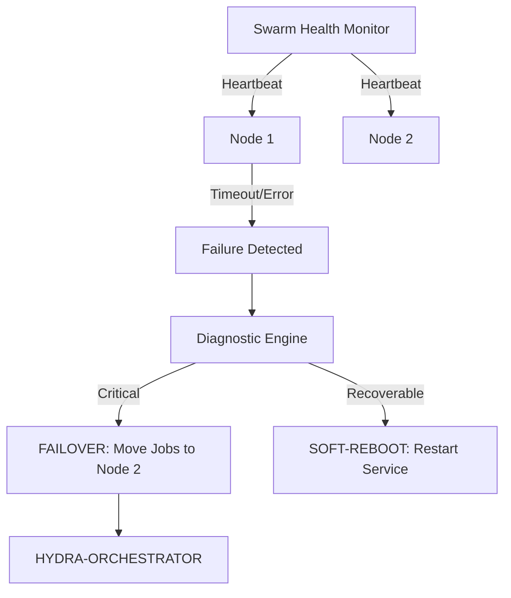

<p align="center">
  
</p>

# 💊 HYDRA-UMC-NODE-HEALING

<p align="center"><a href="README.md">🇺🇸 English</a> | <a href="README_spa.md">🇪🇸 Español</a> | <a href="README_fra.md">🇫🇷 Français</a> | <a href="README_ita.md">🇮🇹 Italiano</a> | <a href="README_deu.md">🇩🇪 Deutsch</a> | <a href="README_zho.md">🇨🇳 简体中文</a> | 🇯🇵 <b>日本語</b></p>

### 🛡️ HydraNode 向け高可用性モニター & フェイルオーバーマネージャー

<p align="left">
  
  
  
</p>

---

## 1. 🛠️ 技術概要

**HYDRA-UMC-NODE-HEALING** は、スウォームのレジリエンス層です。すべての
物理的な HydraNode（コントローラー）と論理サービスの健全性を継続的に
監視し、マイクロファクトリーにおけるダウンタイムをゼロに保ちます。

ハードウェアの故障やネットワーク障害によりノードが機能しなくなった場合、
自己修復マネージャーは自動的にフェイルオーバープロセスをトリガーし、
そのアクティブなミッションを他のノードにリダイレクトし、オーケストレー
ター経由でオペレーターに通知します。

### 主な機能：
* 💓 **健全性ハートビート：** サブ 10ms 単位でのノード可用性と温度状態の監視。
* 🔄 **自動フェイルオーバー：** 障害が発生したノードから健全なノードへ、ミッションを透過的に再割り当てします。
* 🛡️ **ソフトリブート：** 完全なハードウェアリセットをトリガーする前に、リモートでのサービス復旧を試みます。
* 📡 **オペレーターへのアラート：** すべてのインターフェース（Studio、アプリ、Watch）にわたるリアルタイム通知。
* 🔁 **上限付きリトライ + 検証済みノード識別情報（v0、実装済み）：** 一時的なネットワーク障害が発生しても、最初の失敗だけでノードが `UNREACHABLE` になることはもうありません——`checkNode` は決定的で上限のある指数バックオフでリトライしてから諦めます。応答はするが自身を正しく識別できないノードは `INVALID` に分類され、決して信頼されず、リトライもされず、健全と報告されることもありません。

---

## 2. 🔄 自己修復ワークフロー



---

## 3. 🧱 アーキテクチャと設計上の決定

* **実際のロジックがリポジトリのルートではなく `src/` の下にある理由。** `src/healthpb`(生成された gRPC スタブ)、`src/watchdog`(ポーリングエンジン)、`src/config`(ノードレジストリのローダー)が実際の実装を保持しています。`main.go`/`version.go` はそれらを結びつけるエントリポイントとしてリポジトリのルートに残ります。
* **検知機能が、それが保護しているオーケストレーターから独立している理由。** オーケストレータープロセスの*内部*で実行されるノード自己修復ウォッチドッグは、そのプロセス自体がハングしたことを検知できません——独立したサービスとして実行することで、「応答しないノードを検知しその作業を再ルーティングする」ことが、応答しないノードがオーケストレーター自身である場合も含めて、実際に可能になります。
* **検知機能は今日すでに本物だが、フェイルオーバー/ソフトリブートはまだ本物ではない理由。** `src/watchdog` は、登録済みの各ノードに対して実際の間隔・実際のネットワーク接続で `HealthService.Check()`(`HYDRA-UMC-ORCHESTRATOR/proto/hydra_common.proto` の共有 `hydra.common.v1` gRPC 契約)を呼び出し、結果を HEALTHY/DEGRADED/UNHEALTHY/UNREACHABLE のいずれかに分類し、状態が実際に*変化した*ときにのみ `Reactor` コールバックを発火します(毎ポーリング周期ではありません)。まだ HYDRA-UMC-ORCHESTRATOR を呼び出して実際のフェイルオーバーやソフトリブートを発動することはしていません——ORCHESTRATOR 側にもそのためのAPIがまだ存在しないためです。`watchdog.Reactor` は、それが実装された際の接続点として用意されています。検知機能が本物であるために、そこまで待つ必要はありませんでした。
* **ノードレジストリが HYDRA-UMC-SWARM-SYNC へのライブクエリではなく静的な JSON である理由。** SWARM-SYNC(README がもともと「群れの全セル」の情報源として挙げていたもの)にも実際の API はまだありません——依然として足場(アンダミアヘ)段階です。静的な `nodes.json`(`nodes.example.json` を参照)は、動的であるふりをするプレースホルダーではなく、正直な v0 です。SWARM-SYNC プロジェクトに実際のクライアントができ次第、`src/config.LoadNodes` を置き換えてください。
* **エコシステムの他の部分との関係。** HYDRA-UMC-ORCHESTRATOR の下の兄弟サービスです——自身のレジストリ内の各ノードを監視し、状態変化を報告します。応答しないノードから作業を再ルーティングする機能は、ORCHESTRATOR が作業を再ルーティングできる仕組みを提供した後に、この上に構築される次の層です。
* **トランスポート障害はリトライされる（上限付きで）が、識別情報の不一致は決してリトライされない理由。** 接続拒否や RPC タイムアウトは、再起動中のノードや一時的なネットワークの不調のような、本当に一過性の障害であることがあります——そのため `checkNode` は諦める前に `RetryPolicy.MaxAttempts` 回まで指数バックオフでリトライします。応答はするが誤った名前(またはまったく名前がない)を報告するノードはまったく別種の問題です——どれだけ待っても間違ったポートに束縛されたサービスは直りません。そのためこのケースは即座に、一切リトライすることなく `StatusInvalid` に分類されます。
* **バックオフにランダムなジッターがない理由。** 実際の本番フリートであれば、同時再接続の「サンダリングハード」を避けるためにジッターが欲しくなるでしょうが、このウォッチドッグはすでに各ノードを独自の goroutine から独自のペースでポーリングしています——ここでジッターを追加すると唯一犠牲になるのは `RetryPolicy.Backoff()` が非決定的になり、テストでの検証が難しくなることです。このウォッチドッグがいつか共有のボトルネックリソースに対して数百のノードをポーリングするようになったら、ジッターを追加してください。

詳細は [`docs/ARCHITECTURE.md`](docs/ARCHITECTURE.md)(アーキテクチャガイド)、[`docs/BUILD_AND_RUN.md`](docs/BUILD_AND_RUN.md)(リリースビルドとテストビルドの流れ)、[`docs/INTEGRATION_CONTRACT.md`](docs/INTEGRATION_CONTRACT.md)(将来のアダプターが従うべきバージョン管理されたヘルススナップショット契約)を参照してください。

---

## 📂 リポジトリ構成

```text
HYDRA-UMC-NODE-HEALING/
├── src/
│   ├── healthpb/      # hydra.common.v1 向けに生成された Go スタブ
│   │                  # (HYDRA-UMC-ORCHESTRATOR/proto/hydra_common.proto
│   │                  # から取得——生成コマンドは同リポジトリの
│   │                  # proto/README.md を参照)
│   ├── watchdog/      # 実際のポーリングループ：dial、Check()、分類、
│   │                  # 状態変化時のみ反応、および retry.go
│   │                  # (RetryPolicy)
│   └── config/        # 静的 JSON ノードレジストリのローダー
├── build/             # コンパイル済みバイナリ(build.sh/build.bat の出力)
├── images/            # メディアと図版
├── systemd/
│   └── hydra-umc-node-healing.service # CM5 上のローカルウォッチドッグ用 systemd ユニット
├── tools/
│   ├── build_test.py  # バージョンを増やさないビルドチェック
│   └── ci_validate.py # CI が使用するマニフェスト/CHANGELOG/ドキュメント検証
├── nodes.example.json # サンプルノードレジストリ(src/config を参照)
├── go.mod / go.sum    # Go モジュール定義
├── version.go         # const Version = "X.Y.Z"(go.mod にはアプリバージョンフィールドがありません)
├── main.go            # エントリポイント：レジストリを読み込みウォッチドッグを起動
├── bump_version.py    # オドメーター式バージョンインクリメント、build.sh/.bat が実行
├── bump_manifest_version.py # hydra-umc.project.json のバージョンをネイティブ側と同期（--sync）
├── build.sh/.bat      # バージョンを増加させ、その後 `go build` を実行
├── build-test.sh/.bat # バージョンを増やさないビルドチェック
├── run.sh/.bat        # コンパイル済みバイナリを実行
├── docs/
│   ├── ARCHITECTURE.md
│   ├── BUILD_AND_RUN.md
│   └── INTEGRATION_CONTRACT.md
└── README.md
```

元のテンプレートから省略：`hardware/`、`firmware/`、
`os/`、`docs/`、`images/`、`scripts/` —— これは純粋な
ソフトウェアサービス(Go バイナリ)であり、専用の
ハードウェアやファームウェア、維持すべき
オペレーティングシステムイメージもなく、
専用フォルダを正当化するほどのドキュメント/
メディア/ユーティリティスクリプトの内容も
まだありません。

---

## 🔧 ビルドと実行

コンパイルできるだけの骨組みではなく、本物のウォッチドッグです：
`nodes.example.json`（または独自のレジストリを指す `-nodes <パス>`）
に列挙された各ノードに gRPC で接続し、状態変化を標準出力に報告します。

```bash
# Windows
build.bat
run.bat -nodes nodes.example.json

# Linux / macOS
./build.sh
./run.sh -nodes nodes.example.json
```

`build.sh`/`build.bat` は `version.go` のバージョンを増加させ（エコ
システム全体で統一されたオドメーター規則、`bump_version.py` を参照——
`go.mod` にはアプリケーションバイナリ向けのネイティブなバージョン
フィールドがありません）、その後 `go build` を実行します。
`run.sh`/`run.bat` は生成されたバイナリを直接実行します。

レジストリの各エントリは、その `address` で実際に待ち受け、
`hydra.common.v1.HealthService`（`HYDRA-UMC-ORCHESTRATOR/proto/
hydra_common.proto` 参照）を実装する本物のサービスを必要とします——
サンプルのポートではまだ何も稼働していないため、最初のポーリング
周期では3つとも `UNKNOWN -> UNREACHABLE` と表示されるのが予想されます
（現在は `RetryPolicy` の上限付き試行がすべて尽きた後にのみそうなり、
最初の dial では判定されません——上記の「上限付きリトライ」機能を
参照）。これは今日時点で正しく誠実な結果です（このリポジトリ自身の
検知ロジックを除けば、エコシステムのすべてのノードはまだ足場段階に
あります）。応答はするが自身を正しく識別できないノードは、代わりに
即座に `UNKNOWN -> INVALID` と表示されます。

```bash
go test ./...   # src/config + src/watchdog、実際のループバック
                 # ソケット上での本物の gRPC 往復テスト、モッククライアント不使用
```

---

## 🚀 ロードマップ
* **フェーズ 1：** リアルタイムハードウェアテレメトリとのデジタルツイン同期、サブ 10ms の遅延。
* **フェーズ 2：** 産業グレードのシミュレーター（Isaac Sim）との Physics Replica 統合、変形体サポート。
* **フェーズ 3：** 分散型フェイルオーバーと早期センサー劣化検知のためのノード自己修復自動化パターン。
* **フェーズ 4：** 早期センサー劣化検知に基づく AI 駆動の予測的自己修復、フルスケール車両インザループ向けの HIL Bridge サポート。

---

## 🔗 関連プロジェクト

本プロジェクトは、同じ作者(JuanenRac / Electro Hobby 3D)による HYDRA-UMC ロボティクスエコシステムの一部です。リクエストが実はこの中のどれかについてのものである可能性があるため、知っておく価値があります。

**親プロジェクト**
- **[HYDRA-UMC-ORCHESTRATOR](https://github.com/JuanenRac/HYDRA-UMC-ORCHESTRATOR)** — 実際の gRPC/Protobuf ヘルスレポート契約とミッションステートマシンを持つ統合ハブ。本リポジトリは、その自身のスウォーム調整レイヤー内における特定のオーケストレーションサービスとして、この親の一部を成す。

**兄弟プロジェクト** —— HYDRA-UMC-ORCHESTRATOR 自身のスウォーム調整レイヤーにおける他のオーケストレーションサービス
- **[HYDRA-UMC-SWARM-SYNC](https://github.com/JuanenRac/HYDRA-UMC-SWARM-SYNC)** — 複数セルの収束についてプロパティテストされた、実際の CRDT LWW-Element-Map 状態同期。
- **[HYDRA-UMC-PATH-PLANNER-3D](https://github.com/JuanenRac/HYDRA-UMC-PATH-PLANNER-3D)** — 実際の障害物/ワークスペース衝突検証を備えた、実際の RRT ベースの 3D 経路プランナー。
- **[HYDRA-UMC-JOB-DISPATCHER](https://github.com/JuanenRac/HYDRA-UMC-JOB-DISPATCHER)** — 実際の HTTP API 上に構築された、優先度ベースの実際のジョブキュー(重複排除付き)。

**直接関連**
- **[HYDRA-UMC-SERVER](https://github.com/JuanenRac/HYDRA-UMC-SERVER)** — すべての制御クライアントが実際に通信する、本物のヘッドレスバックエンド(REST/WebSocket) ——本ヒーリングサービスは、このバックエンドのライブインスタンスを監視する。

**エコシステムの他のプロジェクト**

*コアハードウェア&プラットフォーム*
- **[HYDRA-UMC](https://github.com/JuanenRac/HYDRA-UMC)** — 実際のロボットアームのマザーボード——CM5 ホスト + デュアルコア STM32H745、CAN-OTA/SPI-OTA 経由で最大 8 本のツールアームを統括。
- **[HYDRA-UMC-OS](https://github.com/JuanenRac/HYDRA-UMC-OS)** — CM5 向けの再現可能な Raspberry Pi OS プロダクト層——読み取り専用エージェント、検証済み設定/プロファイル、WiFi 初回接続プロビジョニング。
- **[HYDRA-UMC-SDK](https://github.com/JuanenRac/HYDRA-UMC-SDK)** — すべてのブリッジが自身のコマンドを検証する共有 JSON-Schema 契約と安全ゲートの境界。

*コアバックエンド&クライアント*
- **[HYDRA-UMC-STUDIO](https://github.com/JuanenRac/HYDRA-UMC-STUDIO)** — リアルタイムのマルチロボット 3D 可視化を備えたウェブ制御ダッシュボード。
- **[HYDRA-UMC-SUITE](https://github.com/JuanenRac/HYDRA-UMC-SUITE)** — 複数のサーバーを同時に扱えるデスクトップ(PySide6)スウォームコマンドセンター、スタンドアロン実行ファイルとしてパッケージ化。
- **[HYDRA-UMC-ANDROID-CONTROL](https://github.com/JuanenRac/HYDRA-UMC-ANDROID-CONTROL)** — 生体認証ログインとペアリングされた Wear OS コンパニオンを備えたネイティブ Android 制御アプリ。
- **[HYDRA-UMC-IOS-CONTROL](https://github.com/JuanenRac/HYDRA-UMC-IOS-CONTROL)** — リアルタイム WebSocket 同期を備えた iOS/iPadOS 制御アプリ(Flutter)。
- **[HYDRA-UMC-DSI](https://github.com/JuanenRac/HYDRA-UMC-DSI)** — 本体搭載の 7 インチ DSI タッチスクリーン向けネイティブタッチ UI、CM5 自体に組み込み。
- **[HYDRA-UMC-EDITOR-URDF](https://github.com/JuanenRac/HYDRA-UMC-EDITOR-URDF)** — 完成したモデルを STUDIO 自身のカタログへ送信するデスクトップ用グラフィカル URDF 作成/編集ツール。
- **[HYDRA-UMC-BRIDGE-AMR](https://github.com/JuanenRac/HYDRA-UMC-BRIDGE-AMR)** — 実際の VDA 5050 MQTT パブリッシャーによる AGV/AMR フリートの調整境界。
- **[HYDRA-UMC-BRIDGE-CNC](https://github.com/JuanenRac/HYDRA-UMC-BRIDGE-CNC)** — 実際の GRBL ステータス/制御バイトへのアクセスを持つ、CNC セルの高レベルコーディネーター。
- **[HYDRA-UMC-BRIDGE-DROIDS](https://github.com/JuanenRac/HYDRA-UMC-BRIDGE-DROIDS)** — 実際の Boston Dynamics Spot コマンド送信機能を持つ、脚型/ヒューマノイドドロイドの調整境界。
- **[HYDRA-UMC-BRIDGE-LASER](https://github.com/JuanenRac/HYDRA-UMC-BRIDGE-LASER)** — 実際のキー/筐体/インターロック GPIO セーフガード 3 系統を読み取る、レーザーセルの安全コーディネーター。
- **[HYDRA-UMC-BRIDGE-OPENPNP](https://github.com/JuanenRac/HYDRA-UMC-BRIDGE-OPENPNP)** — OpenPnP ピックアンドプレースの基板フローを安全に統括する高レベルコーディネーター。
- **[HYDRA-UMC-BRIDGE-PRINTER3D](https://github.com/JuanenRac/HYDRA-UMC-BRIDGE-PRINTER3D)** — 実際にゲート制御されたジョブコマンドを持つ、Moonraker/Klipper 3D プリンター向けの安全な調整境界。
- **[HYDRA-UMC-BRIDGE-ROS2](https://github.com/JuanenRac/HYDRA-UMC-BRIDGE-ROS2)** — 実際の遅延インポート rclpy ROS 2 トランスポートを持つ安全コーディネーター。
- **[HYDRA-UMC-BRIDGE-UAV](https://github.com/JuanenRac/HYDRA-UMC-BRIDGE-UAV)** — 実際の MAVLink コマンド送信機能を持つ、カメラ搭載 UAV の調整境界。

*URTC ツールプラットフォーム*
- **[URTC](https://github.com/JuanenRac/URTC)** — 物理的な Universal Robot Tool Controller 基板向けファームウェア、CAN バス経由の 25 以上のツールプロファイル。
- **[URTC-FLASHER](https://github.com/JuanenRac/URTC-FLASHER)** — URTC 基板用のデスクトップ GUI 書き込みツール、CAN-OTA およびフルチップ SWD/JTAG。
- **[URTC-TESTER](https://github.com/JuanenRac/URTC-TESTER)** — URTC 基板向けのデスクトップ CAN バスライブ診断ツール、ツールプロファイルごとに 1 パネル。
- **[URTC-WEB-STUDIO](https://github.com/JuanenRac/URTC-WEB-STUDIO)** — Web Serial API を使ったブラウザベースの URTC-TESTER の代替、ローカルインストール不要。

*ビジョン AI ノード(Hailo-8)*
- **[HYDRA-UMC-VISION-NODE](https://github.com/JuanenRac/HYDRA-UMC-VISION-NODE)** — Hailo-8 ビジョンパイプラインの統合ハブ、段階ごとの実際のハードウェア準備状況チェック付き。
- **[HYDRA-UMC-DETECTION-HEF](https://github.com/JuanenRac/HYDRA-UMC-DETECTION-HEF)** — Hailo アーキテクチャ/チェックサムによる安全読み込み検証を備えた、実際のコンパイル済みモデルレジストリ。
- **[HYDRA-UMC-VISION-STREAMER](https://github.com/JuanenRac/HYDRA-UMC-VISION-STREAMER)** — 実際の HailoRT 統合境界を持つ、実際の GStreamer パイプライン + MediaMTX 設定生成器。
- **[HYDRA-UMC-VISUAL-SERVOING-API](https://github.com/JuanenRac/HYDRA-UMC-VISUAL-SERVOING-API)** — 上流のゾーン状態に応じて安全ゲート制御される、実際の Position-Based Visual Servoing 補正則。
- **[HYDRA-UMC-SAFETY-ZONES](https://github.com/JuanenRac/HYDRA-UMC-SAFETY-ZONES)** — キャリブレーションの鮮度を強制する、実際のゾーン侵入チェックと E-STOP 要求。

*コグニティブ AI ノード(Hailo-10)*
- **[HYDRA-UMC-COGNITIVE-NODE](https://github.com/JuanenRac/HYDRA-UMC-COGNITIVE-NODE)** — Hailo-10 コグニティブパイプライン(LLM/VLA/音声オーケストレーション)の統合ハブ。
- **[HYDRA-UMC-VLA-ENGINE](https://github.com/JuanenRac/HYDRA-UMC-VLA-ENGINE)** — Vision-Language-Action モデル向けの、実際のアクショントークンのエンコード/デコードと軌道生成。
- **[HYDRA-UMC-VOICE-UI](https://github.com/JuanenRac/HYDRA-UMC-VOICE-UI)** — 確認ゲート付きの限定的な Watch リレーを備えた、実際の音声フロントエンド(VAD + 意図解析)。
- **[HYDRA-UMC-SEMANTIC-PLANNER](https://github.com/JuanenRac/HYDRA-UMC-SEMANTIC-PLANNER)** — MCU エラーコードに対する、実際のルールベースのタスク分解と意味的エラー復旧。
- **[HYDRA-UMC-DOCS-QA](https://github.com/JuanenRac/HYDRA-UMC-DOCS-QA)** — このエコシステム自身の Markdown ドキュメントに対する、標準ライブラリのみの実際の TF-IDF 文書検索。

*デジタルツイン&シミュレーション*
- **[HYDRA-UMC-TWIN](https://github.com/JuanenRac/HYDRA-UMC-TWIN)** — 実際のバージョン互換性同期契約を持つ、デジタルツインエンジンの統合ハブ。
- **[HYDRA-UMC-HIL-BRIDGE](https://github.com/JuanenRac/HYDRA-UMC-HIL-BRIDGE)** — シミュレーションと実際のハードウェアの間でコマンドをルーティングする、実際のハードウェア・イン・ザ・ループ安全インターロック。
- **[HYDRA-UMC-PHYSICS-REPLICA](https://github.com/JuanenRac/HYDRA-UMC-PHYSICS-REPLICA)** — 実際の URDF サブセットに対する、実際の順運動学と関節限界検証。
- **[HYDRA-UMC-SYNTHETIC-DATA-GEN](https://github.com/JuanenRac/HYDRA-UMC-SYNTHETIC-DATA-GEN)** — YOLO/COCO アノテーションのエクスポート機能を持つ、実際のプロシージャル 2D シーンジェネレーター。

*データ&分析*
- **[HYDRA-UMC-DATALAKE](https://github.com/JuanenRac/HYDRA-UMC-DATALAKE)** — 実際の取り込み/クエリ HTTP API を備えた、実際の sqlite3 ベースの時系列ストア。
- **[HYDRA-UMC-ANOMALY-DETECTOR](https://github.com/JuanenRac/HYDRA-UMC-ANOMALY-DETECTOR)** — ドリフト監視を備えた、実際の FFT + 統計ベースラインによる異常検知器。
- **[HYDRA-UMC-PRODUCTION-REPORTS](https://github.com/JuanenRac/HYDRA-UMC-PRODUCTION-REPORTS)** — DATALAKE の履歴に対する実際の OEE/稼働率計算、再現可能な CSV エクスポート付き。
- **[HYDRA-UMC-TELEMETRY-COLLECTOR](https://github.com/JuanenRac/HYDRA-UMC-TELEMETRY-COLLECTOR)** — シーケンス重複排除機能を備えた、DATALAKE への実際の CAN/WebSocket 取り込みパイプライン。

*産業用ゲートウェイ*
- **[HYDRA-UMC-GATEWAY-INDUSTRIAL](https://github.com/JuanenRac/HYDRA-UMC-GATEWAY-INDUSTRIAL)** — 実際のコマンド許可リスト/バックプレッシャー層を持つ、産業用プロトコルへ中継する統合ハブ。
- **[HYDRA-UMC-OPCUA-SERVER](https://github.com/JuanenRac/HYDRA-UMC-OPCUA-SERVER)** — 実際のバイナリプロトコルクライアントセッションで検証された、実際の OPC-UA アドレス空間。
- **[HYDRA-UMC-MQTT-BROKER](https://github.com/JuanenRac/HYDRA-UMC-MQTT-BROKER)** — クライアント単位のオプション認証とトピック ACL を備えた、実際の MQTT ブローカー。
- **[HYDRA-UMC-MTCONNECT-ADAPTER](https://github.com/JuanenRac/HYDRA-UMC-MTCONNECT-ADAPTER)** — 縮退モード出力を備えた、実際の MTConnect `/probe` および `/current` XML エンドポイント。

*補完ツール&エコシステム運用*
- **[HYDRA-UMC-DASHBOARD-AI](https://github.com/JuanenRac/HYDRA-UMC-DASHBOARD-AI)** — 誠実な統計フォールバックを備えた、DATALAKE/ANOMALY-DETECTOR 上のスマートサマリーと異常ハイライトパネル。
- **[HYDRA-UMC-TOOL-CLI](https://github.com/JuanenRac/HYDRA-UMC-TOOL-CLI)** — 実際の安定した終了コード契約を持つフリート CLI、HYDRA-UMC-SERVER 自身の API の本物のライブクライアント。
- **[HYDRA-UMC-WATCH](https://github.com/JuanenRac/HYDRA-UMC-WATCH)** — 実際の触覚アラートとペアリングされたスマートフォンへの音声リレーを備えた WearOS コンパニオンアプリ。
- **[URTC-SMART-RACK](https://github.com/JuanenRac/URTC-SMART-RACK)** — 実際の工具 ID デコードと Smart Idle 予熱ロジックを備えた、基板搭載ラック用ファームウェア。
- **[URTC-VISION-TOOL](https://github.com/JuanenRac/URTC-VISION-TOOL)** — サーマル/RGB 検査ツールヘッド向けの、ファームウェアと実際の Python ビジョンコンパニオン。
- **[HYDRA-UMC-UPDATER](https://github.com/JuanenRac/HYDRA-UMC-UPDATER)** — このエコシステム内のすべてのリポジトリを検出・クローン・更新する、管理用デスクトップツール。
- **[HYDRA-UMC-OS-REBUILDER](https://github.com/JuanenRac/HYDRA-UMC-OS-REBUILDER)** — エコシステムの最新バージョンをプリロードした、書き込み可能なCM5イメージを構築するWindows/Linuxデスクトップツール。Raspberry Pi Imager方式の初回起動Wi-Fi/ユーザー/SSH設定を備える。


---

## 📚 ドキュメント & コミュニティ

- **[CONTRIBUTING.md](CONTRIBUTING.md)** —— プルリクエストのための技術スタックとコーディング指針。
- **[CODE_OF_CONDUCT.md](CODE_OF_CONDUCT.md)** —— このコミュニティで期待される行動規範。
- **[SECURITY.md](SECURITY.md)** —— 脆弱性の報告方法と、このプロジェクトの実際のセキュリティ重点領域。
- **[SUPPORT.md](SUPPORT.md)** —— 質問の投稿先とバグの報告先。
- **[LICENSE.md](LICENSE.md)** —— このプロジェクト自身のライセンス。

## 👤 作者
**JuanenRac** (Electro Hobby 3D)
📧 electrohobby3d@gmail.com
📺 [youtube.com/@electrohobby3d](https://youtube.com/@electrohobby3d)

## 📜 ライセンス
GPL-3.0 —— 詳細は LICENSE を参照してください。
