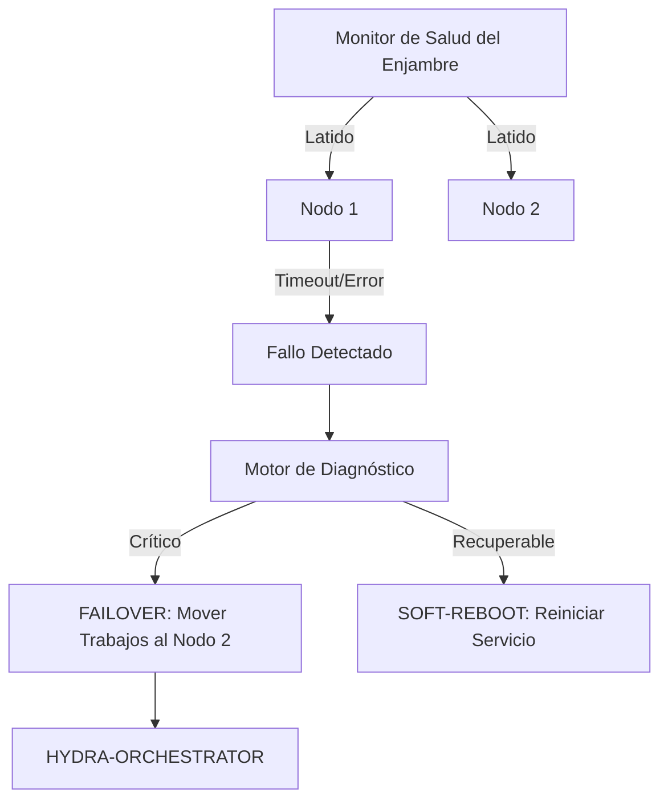

<p align="center">
  
</p>

# 💊 HYDRA-UMC-NODE-HEALING

<p align="center"><a href="README.md">🇺🇸 English</a> | 🇪🇸 <b>Español</b> | <a href="README_fra.md">🇫🇷 Français</a> | <a href="README_ita.md">🇮🇹 Italiano</a> | <a href="README_deu.md">🇩🇪 Deutsch</a> | <a href="README_zho.md">🇨🇳 简体中文</a> | <a href="README_jpn.md">🇯🇵 日本語</a></p>

### 🛡️ Monitor de Alta Disponibilidad y Gestor de Failover para HydraNodes

<p align="left">
  
  
  
</p>

---

## 1. 🛠️ VISIÓN GENERAL TÉCNICA

**HYDRA-UMC-NODE-HEALING** es la capa de resiliencia del enjambre. Monitoriza continuamente la salud de todos los HydraNodes físicos (Controladores) y servicios lógicos, asegurando un tiempo de inactividad cero en la micro-fábrica.

Si un nodo falla debido a un mal funcionamiento del hardware o una caída de la red, el Gestor de Healing activa automáticamente un proceso de failover, redirigiendo sus misiones activas a otros nodos y notificando al operador a través del Orquestador.

### Características Clave:
* 💓 **Latido de Salud (Heartbeat):** Monitorización en menos de 10ms de la disponibilidad del nodo y el estado térmico.
* 🔄 **Failover Automático:** Reasigna de forma transparente misiones de nodos fallidos a nodos sanos.
* 🛡️ **Reinicio Suave:** Intenta la recuperación remota del servicio antes de activar un reinicio completo del hardware.
* 📡 **Alertas al Operador:** Notificación en tiempo real a través de todas las interfaces (Studios, Apps, Watch).
* 🔁 **Reintentos Acotados + Identidad de Nodo Verificada (v0, real):** un fallo de red transitorio ya no marca un nodo como `UNREACHABLE` al primer fallo - `checkNode` reintenta con un backoff exponencial determinista y acotado antes de rendirse; un nodo que responde pero no puede autoidentificarse correctamente se clasifica como `INVALID` y nunca se confía en él, se reintenta, ni se reporta como saludable.

---

## 2. 🔄 FLUJO DE TRABAJO DE HEALING



---

## 3. 🧱 ARQUITECTURA Y DECISIONES DE DISEÑO

* **Por qué la lógica real vive bajo `src/` y no en la raíz del repo.** `src/healthpb` (stubs gRPC generados), `src/watchdog` (el motor de sondeo) y `src/config` (el cargador del registro de nodos) contienen la implementación real; `main.go`/`version.go` siguen en la raíz como el punto de entrada que los conecta.
* **Por qué la detección está separada del orquestador que protege.** Un vigilante de auto-recuperación que corriera DENTRO del proceso del orquestador no podría detectar que ese mismo proceso se ha colgado - correr como servicio independiente es lo que hace posible de verdad 'detectar un nodo sin respuesta y redirigir su trabajo', incluso cuando el nodo sin respuesta es el propio orquestador.
* **Por qué la detección ya es real hoy pero el failover/soft-reboot no.** `src/watchdog` consulta el `HealthService.Check()` (el contrato gRPC compartido `hydra.common.v1` de `HYDRA-UMC-ORCHESTRATOR/proto/hydra_common.proto`) de cada nodo registrado, sobre un intervalo real y una conexión de red real, clasifica el resultado en HEALTHY/DEGRADED/UNHEALTHY/UNREACHABLE, y dispara un callback `Reactor` solo cuando el estado *cambia* (nunca en cada ciclo). Todavía no llama a HYDRA-UMC-ORCHESTRATOR para disparar un failover o soft-reboot real, porque ORCHESTRATOR tampoco tiene todavía una API para eso - `watchdog.Reactor` es el punto de enganche para cuando la tenga. La detección no necesitaba esperar a eso para ser real.
* **Por qué el registro de nodos es un JSON estático y no una consulta en vivo a HYDRA-UMC-SWARM-SYNC.** SWARM-SYNC (la fuente de verdad que el README original citaba para "cada célula del enjambre") tampoco tiene todavía una API real - sigue en etapa de andamiaje. Un `nodes.json` estático (ver `nodes.example.json`) es el v0 honesto, no un placeholder que finge ser dinámico. Sustituir `src/config.LoadNodes` por un cliente real de SWARM-SYNC en cuanto ese proyecto tenga uno.
* **Cómo encaja en el resto del ecosistema.** Un servicio hermano bajo HYDRA-UMC-ORCHESTRATOR - vigila cada nodo de su registro y reporta cambios de estado; redirigir el trabajo lejos del que deja de responder es la siguiente capa, construida sobre esta en cuanto ORCHESTRATOR exponga algo a través de lo cual redirigir trabajo.
* **Por qué un fallo de transporte se reintenta (acotado) pero una identidad no coincidente nunca.** Una conexión rechazada o un timeout de RPC puede ser un fallo genuinamente transitorio - un nodo reiniciándose, un pequeño hipo de red - así que `checkNode` lo reintenta hasta `RetryPolicy.MaxAttempts` veces con backoff exponencial antes de rendirse. Un nodo que responde pero informa el nombre equivocado (o ninguno) es un problema completamente distinto: ninguna espera arregla un servicio conectado al puerto equivocado, así que ese caso se clasifica como `StatusInvalid` de inmediato, sin reintentos.
* **Por qué el backoff no tiene jitter aleatorio.** Una flota de producción real querría jitter para evitar una estampida de reconexiones simultáneas, pero este watchdog ya sondea cada nodo desde su propia goroutine a su propio ritmo - lo único que costaría el jitter aquí es hacer `RetryPolicy.Backoff()` no determinista y más difícil de verificar en tests. Añadir jitter si/cuando este watchdog llegue a sondear cientos de nodos contra un recurso compartido que sea cuello de botella.

Para más detalle, ver [`docs/ARCHITECTURE.md`](docs/ARCHITECTURE.md) (guía de arquitectura), [`docs/BUILD_AND_RUN.md`](docs/BUILD_AND_RUN.md) (flujo de build de release frente a test) y [`docs/INTEGRATION_CONTRACT.md`](docs/INTEGRATION_CONTRACT.md) (el contrato de snapshot de salud versionado que un futuro adaptador debe respetar).

---

## 📂 ESTRUCTURA DE DIRECTORIOS

```text
HYDRA-UMC-NODE-HEALING/
├── src/
│   ├── healthpb/      # Stubs Go generados para hydra.common.v1
│   │                  # (obtenidos de HYDRA-UMC-ORCHESTRATOR/proto/
│   │                  # hydra_common.proto - ver el proto/README.md de
│   │                  # ese repo para el comando de generación)
│   ├── watchdog/      # Bucle de sondeo real: dial, Check(), clasificar,
│   │                  # reaccionar solo ante un cambio de estado, más
│   │                  # retry.go (RetryPolicy)
│   └── config/        # Cargador del registro estático de nodos (JSON)
├── build/             # Binarios compilados (salida de build.sh/build.bat)
├── images/            # Medios y diagramas
├── systemd/
│   └── hydra-umc-node-healing.service # Unidad systemd del watchdog en la CM5 local
├── tools/
│   ├── build_test.py  # Comprobación de compilación sin versionado
│   └── ci_validate.py # Validación de manifiesto/CHANGELOG/docs usada por CI
├── nodes.example.json # Registro de nodos de ejemplo (ver src/config)
├── go.mod / go.sum    # Definición del módulo Go
├── version.go         # const Version = "X.Y.Z" (go.mod no tiene ese campo)
├── main.go            # Punto de entrada: carga el registro y arranca el watchdog
├── bump_version.py    # Bump de versión tipo cuentakilómetros
├── bump_manifest_version.py # Sincroniza la versión de hydra-umc.project.json con la nativa (--sync)
├── build.sh/.bat      # Sube la versión y ejecuta `go build`
├── build-test.sh/.bat # Comprobación de compilación sin versionado
├── run.sh/.bat        # Ejecuta el binario compilado
├── docs/
│   ├── ARCHITECTURE.md
│   ├── BUILD_AND_RUN.md
│   └── INTEGRATION_CONTRACT.md
└── README.md
```

Podado de la plantilla original: `hardware/`, `firmware/`, `os/`, `docs/`,
`images/` y `scripts/` — es un servicio de software puro (binario Go) sin
hardware ni firmware propios, sin imagen de sistema operativo que mantener,
y sin contenido de documentación/medios/scripts de utilidad todavía
suficiente para justificar sus propias carpetas.

---

## 🔧 BUILD Y EJECUCIÓN

Un watchdog real, no solo un esqueleto que compila: contacta a cada nodo
de `nodes.example.json` (o `-nodes <ruta>` para apuntar a tu propio
registro) por gRPC y reporta los cambios de estado por stdout.

```bash
# Windows
build.bat
run.bat -nodes nodes.example.json

# Linux / macOS
./build.sh
./run.sh -nodes nodes.example.json
```

`build.sh`/`build.bat` suben la versión en `version.go` (regla
cuentakilómetros del ecosistema, ver `bump_version.py` - `go.mod` no tiene
campo de versión nativo para binarios de aplicación) y luego ejecutan
`go build`. `run.sh`/`run.bat` ejecutan directamente el binario resultante.

Cada entrada del registro necesita algo real escuchando en su `address` e
implementando `hydra.common.v1.HealthService` (ver
`HYDRA-UMC-ORCHESTRATOR/proto/hydra_common.proto`) para poder reportar
alguna vez como saludable - con nada corriendo todavía en los puertos de
ejemplo, lo esperable es ver `UNKNOWN -> UNREACHABLE` en el primer ciclo
para los tres (ahora solo tras agotar los intentos acotados de
`RetryPolicy`, no en el primer dial - ver la característica "Reintentos
Acotados" arriba), que es el resultado correcto y honesto hoy (todos los
nodos del ecosistema siguen en etapa de andamiaje más allá de la propia
lógica de detección de este repo). Un nodo que responde pero no puede
autoidentificarse correctamente imprime `UNKNOWN -> INVALID` de
inmediato en su lugar.

```bash
go test ./...   # src/config + src/watchdog, round-trips gRPC
                 # reales sobre sockets loopback reales, sin cliente simulado
```

---

## 🚀 HOJA DE RUTA
* **Fase 1:** Sincronización de Digital Twin con telemetría de hardware en tiempo real y latencia sub-10ms.
* **Fase 2:** Integración de Physics Replica con simuladores de grado industrial (Isaac Sim) y soporte para cuerpos deformables.
* **Fase 3:** Patrones de recuperación automatizados de Node Healing para failover descentralizado y detección temprana de degradación de sensores.
* **Fase 4:** Healing predictivo impulsado por IA basado en la degradación temprana de sensores y soporte de HIL Bridge para pruebas de vehículo en el bucle a escala completa.

---

## 🔗 Proyectos Relacionados

Este proyecto es parte del ecosistema de robótica HYDRA-UMC del mismo autor (JuanenRac / Electro Hobby 3D). Vale la pena conocerlo, ya que una petición podría en realidad ser sobre alguno de estos en vez de sobre este repositorio.

**Proyecto Padre**
- **[HYDRA-UMC-ORCHESTRATOR](https://github.com/JuanenRac/HYDRA-UMC-ORCHESTRATOR)** — nodo de integración con un contrato real de informe de salud gRPC/Protobuf y una máquina de estados de misión; el padre del que este repositorio es un servicio de orquestación específico, dentro de su propia capa de coordinación de enjambre.

**Proyectos Hermanos** — los demás servicios de orquestación de la propia capa de coordinación de enjambre de HYDRA-UMC-ORCHESTRATOR
- **[HYDRA-UMC-SWARM-SYNC](https://github.com/JuanenRac/HYDRA-UMC-SWARM-SYNC)** — sincronización de estado real mediante CRDT LWW-Element-Map, con pruebas de propiedades para convergencia multi-celda.
- **[HYDRA-UMC-PATH-PLANNER-3D](https://github.com/JuanenRac/HYDRA-UMC-PATH-PLANNER-3D)** — planificador de rutas 3D real basado en RRT, con validación real de colisión de obstáculos/espacio de trabajo.
- **[HYDRA-UMC-JOB-DISPATCHER](https://github.com/JuanenRac/HYDRA-UMC-JOB-DISPATCHER)** — cola de trabajos real basada en prioridad con deduplicación, sobre una API HTTP real.

**Directamente Relacionados**
- **[HYDRA-UMC-SERVER](https://github.com/JuanenRac/HYDRA-UMC-SERVER)** — el backend headless real (REST/WebSocket) con el que habla de verdad cada cliente de control — este servicio de curación monitoriza instancias en vivo de este backend.

**También Forma Parte del Ecosistema**

*Hardware y Plataforma Base*
- **[HYDRA-UMC](https://github.com/JuanenRac/HYDRA-UMC)** — la placa madre física del brazo robótico: host CM5 + coprocesador STM32H745 de doble núcleo, coordinando hasta 8 brazos herramienta por CAN-OTA/SPI-OTA.
- **[HYDRA-UMC-OS](https://github.com/JuanenRac/HYDRA-UMC-OS)** — capa de producto reproducible sobre Raspberry Pi OS para el CM5: agente de solo lectura, config/perfiles validados, aprovisionamiento WiFi de primer contacto.
- **[HYDRA-UMC-SDK](https://github.com/JuanenRac/HYDRA-UMC-SDK)** — el contrato JSON-Schema compartido y la barrera de seguridad contra la que cada bridge valida sus comandos.

*Backend Central y Clientes*
- **[HYDRA-UMC-STUDIO](https://github.com/JuanenRac/HYDRA-UMC-STUDIO)** — panel de control web con visualización 3D multi-robot en tiempo real.
- **[HYDRA-UMC-SUITE](https://github.com/JuanenRac/HYDRA-UMC-SUITE)** — centro de mando de enjambre de escritorio (PySide6) para varios servidores a la vez, empaquetado como ejecutable independiente.
- **[HYDRA-UMC-ANDROID-CONTROL](https://github.com/JuanenRac/HYDRA-UMC-ANDROID-CONTROL)** — app nativa de control para Android con inicio de sesión biométrico y un compañero Wear OS emparejado.
- **[HYDRA-UMC-IOS-CONTROL](https://github.com/JuanenRac/HYDRA-UMC-IOS-CONTROL)** — app de control para iOS/iPadOS (Flutter) con sincronización en tiempo real por WebSocket.
- **[HYDRA-UMC-DSI](https://github.com/JuanenRac/HYDRA-UMC-DSI)** — interfaz táctil nativa para la pantalla táctil DSI de 7" a bordo, embebida en el propio CM5.
- **[HYDRA-UMC-EDITOR-URDF](https://github.com/JuanenRac/HYDRA-UMC-EDITOR-URDF)** — creador/editor gráfico de URDF de escritorio que envía los modelos terminados al propio catálogo de STUDIO.
- **[HYDRA-UMC-BRIDGE-AMR](https://github.com/JuanenRac/HYDRA-UMC-BRIDGE-AMR)** — barrera de coordinación para flotas AGV/AMR mediante un publicador MQTT VDA 5050 real.
- **[HYDRA-UMC-BRIDGE-CNC](https://github.com/JuanenRac/HYDRA-UMC-BRIDGE-CNC)** — coordinador de alto nivel para celdas CNC con acceso real a estado/bytes de control GRBL.
- **[HYDRA-UMC-BRIDGE-DROIDS](https://github.com/JuanenRac/HYDRA-UMC-BRIDGE-DROIDS)** — barrera de coordinación para droides con patas/humanoides, con un emisor de comandos real para Boston Dynamics Spot.
- **[HYDRA-UMC-BRIDGE-LASER](https://github.com/JuanenRac/HYDRA-UMC-BRIDGE-LASER)** — coordinador de seguridad para celdas láser que lee 3 salvaguardas GPIO reales de llave/carcasa/enclavamiento.
- **[HYDRA-UMC-BRIDGE-OPENPNP](https://github.com/JuanenRac/HYDRA-UMC-BRIDGE-OPENPNP)** — coordinador de alto nivel seguro para el flujo de placas de pick-and-place OpenPnP.
- **[HYDRA-UMC-BRIDGE-PRINTER3D](https://github.com/JuanenRac/HYDRA-UMC-BRIDGE-PRINTER3D)** — barrera de coordinación segura para impresoras 3D Moonraker/Klipper, con comandos de trabajo reales y controlados.
- **[HYDRA-UMC-BRIDGE-ROS2](https://github.com/JuanenRac/HYDRA-UMC-BRIDGE-ROS2)** — coordinador de seguridad con un transporte ROS 2 rclpy real, importado de forma perezosa.
- **[HYDRA-UMC-BRIDGE-UAV](https://github.com/JuanenRac/HYDRA-UMC-BRIDGE-UAV)** — barrera de coordinación para UAV equipados con cámara, con un emisor de comandos MAVLink real.

*Plataforma de Herramientas URTC*
- **[URTC](https://github.com/JuanenRac/URTC)** — firmware para la placa física del Universal Robot Tool Controller, más de 25 perfiles de herramienta por bus CAN.
- **[URTC-FLASHER](https://github.com/JuanenRac/URTC-FLASHER)** — herramienta de escritorio con GUI para flashear placas URTC, CAN-OTA más SWD/JTAG de chip completo.
- **[URTC-TESTER](https://github.com/JuanenRac/URTC-TESTER)** — herramienta de escritorio de diagnóstico CAN-bus en vivo para placas URTC, un panel por perfil de herramienta.
- **[URTC-WEB-STUDIO](https://github.com/JuanenRac/URTC-WEB-STUDIO)** — alternativa basada en navegador a URTC-TESTER mediante la Web Serial API, sin instalación local.

*Nodo IA de Visión (Hailo-8)*
- **[HYDRA-UMC-VISION-NODE](https://github.com/JuanenRac/HYDRA-UMC-VISION-NODE)** — nodo de integración para el pipeline de visión Hailo-8, con una comprobación real de disponibilidad de hardware por etapa.
- **[HYDRA-UMC-DETECTION-HEF](https://github.com/JuanenRac/HYDRA-UMC-DETECTION-HEF)** — registro real de modelos compilados con verificación de carga segura por arquitectura Hailo/checksum.
- **[HYDRA-UMC-VISION-STREAMER](https://github.com/JuanenRac/HYDRA-UMC-VISION-STREAMER)** — generador real de pipeline GStreamer + config MediaMTX, con una frontera de integración HailoRT real.
- **[HYDRA-UMC-VISUAL-SERVOING-API](https://github.com/JuanenRac/HYDRA-UMC-VISUAL-SERVOING-API)** — ley de corrección real de Position-Based Visual Servoing, con puerta de seguridad según el estado de zona previo.
- **[HYDRA-UMC-SAFETY-ZONES](https://github.com/JuanenRac/HYDRA-UMC-SAFETY-ZONES)** — comprobación real de invasión de zona y solicitud de E-STOP, con exigencia de vigencia de calibración.

*Nodo IA Cognitivo (Hailo-10)*
- **[HYDRA-UMC-COGNITIVE-NODE](https://github.com/JuanenRac/HYDRA-UMC-COGNITIVE-NODE)** — nodo de integración para el pipeline cognitivo Hailo-10 (orquestación de LLM/VLA/voz).
- **[HYDRA-UMC-VLA-ENGINE](https://github.com/JuanenRac/HYDRA-UMC-VLA-ENGINE)** — codificación/decodificación real de tokens de acción y generación de trayectoria para un modelo Vision-Language-Action.
- **[HYDRA-UMC-VOICE-UI](https://github.com/JuanenRac/HYDRA-UMC-VOICE-UI)** — front-end de voz real (VAD + analizador de intención) con un relé a Watch acotado y con confirmación.
- **[HYDRA-UMC-SEMANTIC-PLANNER](https://github.com/JuanenRac/HYDRA-UMC-SEMANTIC-PLANNER)** — descomposición real de tareas basada en reglas y recuperación semántica de errores sobre códigos de error del MCU.
- **[HYDRA-UMC-DOCS-QA](https://github.com/JuanenRac/HYDRA-UMC-DOCS-QA)** — búsqueda real de documentos TF-IDF (solo librería estándar) sobre los propios documentos Markdown de este ecosistema.

*Gemelo Digital y Simulación*
- **[HYDRA-UMC-TWIN](https://github.com/JuanenRac/HYDRA-UMC-TWIN)** — nodo de integración para el motor de gemelo digital, con un contrato real de sincronización por compatibilidad de versión.
- **[HYDRA-UMC-HIL-BRIDGE](https://github.com/JuanenRac/HYDRA-UMC-HIL-BRIDGE)** — enclavamiento de seguridad real hardware-in-the-loop que enruta comandos entre simulación y hardware real.
- **[HYDRA-UMC-PHYSICS-REPLICA](https://github.com/JuanenRac/HYDRA-UMC-PHYSICS-REPLICA)** — cinemática directa real y validación de límites articulares sobre un subconjunto real de URDF.
- **[HYDRA-UMC-SYNTHETIC-DATA-GEN](https://github.com/JuanenRac/HYDRA-UMC-SYNTHETIC-DATA-GEN)** — generador real de escenas 2D procedurales con exportación de anotaciones YOLO/COCO.

*Datos y Analítica*
- **[HYDRA-UMC-DATALAKE](https://github.com/JuanenRac/HYDRA-UMC-DATALAKE)** — almacén de series temporales real respaldado por sqlite3, con una API HTTP real de ingesta/consulta.
- **[HYDRA-UMC-ANOMALY-DETECTOR](https://github.com/JuanenRac/HYDRA-UMC-ANOMALY-DETECTOR)** — detector de anomalías real basado en FFT + línea base estadística, con monitorización de deriva.
- **[HYDRA-UMC-PRODUCTION-REPORTS](https://github.com/JuanenRac/HYDRA-UMC-PRODUCTION-REPORTS)** — cálculo real de OEE/disponibilidad sobre el histórico de DATALAKE, con exportación CSV reproducible.
- **[HYDRA-UMC-TELEMETRY-COLLECTOR](https://github.com/JuanenRac/HYDRA-UMC-TELEMETRY-COLLECTOR)** — pipeline real de ingesta CAN/WebSocket hacia DATALAKE, con deduplicación por secuencia.

*Pasarela Industrial*
- **[HYDRA-UMC-GATEWAY-INDUSTRIAL](https://github.com/JuanenRac/HYDRA-UMC-GATEWAY-INDUSTRIAL)** — nodo de integración que retransmite a protocolos industriales, con una capa real de lista blanca de comandos/contrapresión.
- **[HYDRA-UMC-OPCUA-SERVER](https://github.com/JuanenRac/HYDRA-UMC-OPCUA-SERVER)** — espacio de direcciones OPC-UA real, verificado con una sesión de cliente real del protocolo binario.
- **[HYDRA-UMC-MQTT-BROKER](https://github.com/JuanenRac/HYDRA-UMC-MQTT-BROKER)** — broker MQTT real con autenticación por cliente opcional y ACL de tópicos.
- **[HYDRA-UMC-MTCONNECT-ADAPTER](https://github.com/JuanenRac/HYDRA-UMC-MTCONNECT-ADAPTER)** — endpoints XML reales `/probe` y `/current` de MTConnect, con salida en modo degradado.

*Herramientas Complementarias y Operaciones del Ecosistema*
- **[HYDRA-UMC-DASHBOARD-AI](https://github.com/JuanenRac/HYDRA-UMC-DASHBOARD-AI)** — paneles de Resúmenes Inteligentes y Resaltado de Anomalías sobre DATALAKE/ANOMALY-DETECTOR, con un respaldo estadístico honesto.
- **[HYDRA-UMC-TOOL-CLI](https://github.com/JuanenRac/HYDRA-UMC-TOOL-CLI)** — CLI de flota con un contrato real y estable de códigos de salida, cliente real y en vivo de la propia API de HYDRA-UMC-SERVER.
- **[HYDRA-UMC-WATCH](https://github.com/JuanenRac/HYDRA-UMC-WATCH)** — app compañera de WearOS con alertas hápticas reales y un relé de voz al teléfono emparejado.
- **[URTC-SMART-RACK](https://github.com/JuanenRac/URTC-SMART-RACK)** — firmware para un rack de montaje de placas con decodificación real de ID de herramienta y lógica de precalentamiento Smart Idle.
- **[URTC-VISION-TOOL](https://github.com/JuanenRac/URTC-VISION-TOOL)** — firmware más un compañero de visión real en Python para un cabezal de inspección térmica/RGB.
- **[HYDRA-UMC-UPDATER](https://github.com/JuanenRac/HYDRA-UMC-UPDATER)** — herramienta administrativa de escritorio que descubre, clona y actualiza cada repositorio de este ecosistema.
- **[HYDRA-UMC-OS-REBUILDER](https://github.com/JuanenRac/HYDRA-UMC-OS-REBUILDER)** — herramienta de escritorio Windows/Linux que construye una imagen de la CM5 lista para grabar, precargada con las versiones más actuales del ecosistema, con configuración de primer arranque de Wi-Fi/usuario/SSH al estilo de Raspberry Pi Imager.


---

## 📚 Documentación y Comunidad

- **[CONTRIBUTING.md](CONTRIBUTING.md)** — stack tecnológico y pautas de codificación para un pull request.
- **[CODE_OF_CONDUCT.md](CODE_OF_CONDUCT.md)** — los estándares de comportamiento esperados en esta comunidad.
- **[SECURITY.md](SECURITY.md)** — cómo reportar una vulnerabilidad, y las áreas reales de enfoque en seguridad de este proyecto.
- **[SUPPORT.md](SUPPORT.md)** — dónde hacer preguntas y reportar errores.
- **[LICENSE.md](LICENSE.md)** — la licencia propia de este proyecto.

## 👤 AUTOR
**JuanenRac** (Electro Hobby 3D)
📧 electrohobby3d@gmail.com
📺 [youtube.com/@electrohobby3d](https://youtube.com/@electrohobby3d)

## 📜 LICENCIA
GPL-3.0 - Ver archivo LICENSE para más detalles.
