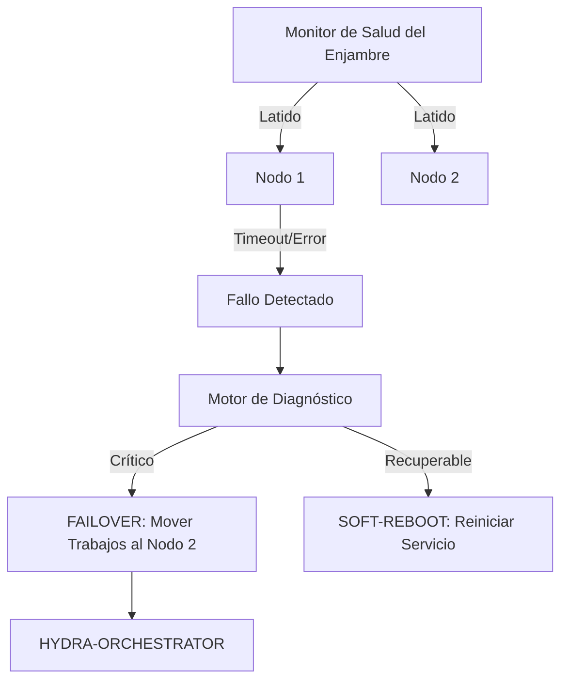

<p align="center">
  
</p>

# 💊 HYDRA-UMC-NODE-HEALING

<p align="center"><a href="README.md">🇺🇸 English</a> | 🇪🇸 <b>Español</b> | <a href="README_fra.md">🇫🇷 Français</a> | <a href="README_ita.md">🇮🇹 Italiano</a> | <a href="README_deu.md">🇩🇪 Deutsch</a> | <a href="README_zho.md">🇨🇳 简体中文</a> | <a href="README_jpn.md">🇯🇵 日本語</a></p>

### 🛡️ Monitor de Alta Disponibilidad y Gestor de Failover para HydraNodes

<p align="left">
  
  
  
</p>

---

## 1. 🛠️ VISIÓN GENERAL TÉCNICA

**HYDRA-UMC-NODE-HEALING** es la capa de resiliencia del enjambre. Monitoriza continuamente la salud de todos los HydraNodes físicos (Controladores) y servicios lógicos, asegurando un tiempo de inactividad cero en la micro-fábrica.

Si un nodo falla debido a un mal funcionamiento del hardware o una caída de la red, el Gestor de Healing activa automáticamente un proceso de failover, redirigiendo sus misiones activas a otros nodos y notificando al operador a través del Orquestador.

### Características Clave:
* 💓 **Latido de Salud (Heartbeat):** Monitorización en menos de 10ms de la disponibilidad del nodo y el estado térmico.
* 🔄 **Failover Automático:** Reasigna de forma transparente misiones de nodos fallidos a nodos sanos.
* 🛡️ **Reinicio Suave:** Intenta la recuperación remota del servicio antes de activar un reinicio completo del hardware.
* 📡 **Alertas al Operador:** Notificación en tiempo real a través de todas las interfaces (Studios, Apps, Watch).
* 🔁 **Reintentos Acotados + Identidad de Nodo Verificada (v0, real):** un fallo de red transitorio ya no marca un nodo como `UNREACHABLE` al primer fallo - `checkNode` reintenta con un backoff exponencial determinista y acotado antes de rendirse; un nodo que responde pero no puede autoidentificarse correctamente se clasifica como `INVALID` y nunca se confía en él, se reintenta, ni se reporta como saludable.

---

## 2. 🔄 FLUJO DE TRABAJO DE HEALING



---

## 3. 🧱 ARQUITECTURA Y DECISIONES DE DISEÑO

* **Por qué la lógica real vive bajo `src/` y no en la raíz del repo.** `src/healthpb` (stubs gRPC generados), `src/watchdog` (el motor de sondeo) y `src/config` (el cargador del registro de nodos) contienen la implementación real; `main.go`/`version.go` siguen en la raíz como el punto de entrada que los conecta.
* **Por qué la detección está separada del orquestador que protege.** Un vigilante de auto-recuperación que corriera DENTRO del proceso del orquestador no podría detectar que ese mismo proceso se ha colgado - correr como servicio independiente es lo que hace posible de verdad 'detectar un nodo sin respuesta y redirigir su trabajo', incluso cuando el nodo sin respuesta es el propio orquestador.
* **Por qué la detección ya es real hoy pero el failover/soft-reboot no.** `src/watchdog` consulta el `HealthService.Check()` (el contrato gRPC compartido `hydra.common.v1` de `HYDRA-UMC-ORCHESTRATOR/proto/hydra_common.proto`) de cada nodo registrado, sobre un intervalo real y una conexión de red real, clasifica el resultado en HEALTHY/DEGRADED/UNHEALTHY/UNREACHABLE, y dispara un callback `Reactor` solo cuando el estado *cambia* (nunca en cada ciclo). Todavía no llama a HYDRA-UMC-ORCHESTRATOR para disparar un failover o soft-reboot real, porque ORCHESTRATOR tampoco tiene todavía una API para eso - `watchdog.Reactor` es el punto de enganche para cuando la tenga. La detección no necesitaba esperar a eso para ser real.
* **Por qué el registro de nodos es un JSON estático y no una consulta en vivo a HYDRA-UMC-SWARM-SYNC.** SWARM-SYNC (la fuente de verdad que el README original citaba para "cada célula del enjambre") tampoco tiene todavía una API real - sigue en etapa de andamiaje. Un `nodes.json` estático (ver `nodes.example.json`) es el v0 honesto, no un placeholder que finge ser dinámico. Sustituir `src/config.LoadNodes` por un cliente real de SWARM-SYNC en cuanto ese proyecto tenga uno.
* **Cómo encaja en el resto del ecosistema.** Un servicio hermano bajo HYDRA-UMC-ORCHESTRATOR - vigila cada nodo de su registro y reporta cambios de estado; redirigir el trabajo lejos del que deja de responder es la siguiente capa, construida sobre esta en cuanto ORCHESTRATOR exponga algo a través de lo cual redirigir trabajo.
* **Por qué un fallo de transporte se reintenta (acotado) pero una identidad no coincidente nunca.** Una conexión rechazada o un timeout de RPC puede ser un fallo genuinamente transitorio - un nodo reiniciándose, un pequeño hipo de red - así que `checkNode` lo reintenta hasta `RetryPolicy.MaxAttempts` veces con backoff exponencial antes de rendirse. Un nodo que responde pero informa el nombre equivocado (o ninguno) es un problema completamente distinto: ninguna espera arregla un servicio conectado al puerto equivocado, así que ese caso se clasifica como `StatusInvalid` de inmediato, sin reintentos.
* **Por qué el backoff no tiene jitter aleatorio.** Una flota de producción real querría jitter para evitar una estampida de reconexiones simultáneas, pero este watchdog ya sondea cada nodo desde su propia goroutine a su propio ritmo - lo único que costaría el jitter aquí es hacer `RetryPolicy.Backoff()` no determinista y más difícil de verificar en tests. Añadir jitter si/cuando este watchdog llegue a sondear cientos de nodos contra un recurso compartido que sea cuello de botella.

---

## 📂 ESTRUCTURA DE DIRECTORIOS

```text
HYDRA-UMC-NODE-HEALING/
├── src/
│   ├── healthpb/      # Stubs Go generados para hydra.common.v1
│   │                  # (obtenidos de HYDRA-UMC-ORCHESTRATOR/proto/
│   │                  # hydra_common.proto - ver el proto/README.md de
│   │                  # ese repo para el comando de generación)
│   ├── watchdog/      # Bucle de sondeo real: dial, Check(), clasificar,
│   │                  # reaccionar solo ante un cambio de estado, más
│   │                  # retry.go (RetryPolicy)
│   └── config/        # Cargador del registro estático de nodos (JSON)
├── build/             # Binarios compilados (salida de build.sh/build.bat)
├── tools/
│   ├── build_test.py  # Comprobación de compilación sin versionado
│   └── ci_validate.py # Validación de manifiesto/CHANGELOG/docs usada por CI
├── nodes.example.json # Registro de nodos de ejemplo (ver src/config)
├── go.mod / go.sum    # Definición del módulo Go
├── version.go         # const Version = "X.Y.Z" (go.mod no tiene ese campo)
├── main.go            # Punto de entrada: carga el registro y arranca el watchdog
├── bump_version.py    # Bump de versión tipo cuentakilómetros
├── build.sh/.bat      # Sube la versión y ejecuta `go build`
├── build-test.sh/.bat # Comprobación de compilación sin versionado
├── run.sh/.bat        # Ejecuta el binario compilado
├── docs/
│   ├── ARCHITECTURE.md
│   ├── BUILD_AND_RUN.md
│   └── INTEGRATION_CONTRACT.md
└── README.md
```

Podado de la plantilla original: `hardware/`, `firmware/`, `os/`, `docs/`,
`images/` y `scripts/` — es un servicio de software puro (binario Go) sin
hardware ni firmware propios, sin imagen de sistema operativo que mantener,
y sin contenido de documentación/medios/scripts de utilidad todavía
suficiente para justificar sus propias carpetas.

---

## 🔧 BUILD Y EJECUCIÓN

Un watchdog real, no solo un esqueleto que compila: contacta a cada nodo
de `nodes.example.json` (o `-nodes <ruta>` para apuntar a tu propio
registro) por gRPC y reporta los cambios de estado por stdout.

```bash
# Windows
build.bat
run.bat -nodes nodes.example.json

# Linux / macOS
./build.sh
./run.sh -nodes nodes.example.json
```

`build.sh`/`build.bat` suben la versión en `version.go` (regla
cuentakilómetros del ecosistema, ver `bump_version.py` - `go.mod` no tiene
campo de versión nativo para binarios de aplicación) y luego ejecutan
`go build`. `run.sh`/`run.bat` ejecutan directamente el binario resultante.

Cada entrada del registro necesita algo real escuchando en su `address` e
implementando `hydra.common.v1.HealthService` (ver
`HYDRA-UMC-ORCHESTRATOR/proto/hydra_common.proto`) para poder reportar
alguna vez como saludable - con nada corriendo todavía en los puertos de
ejemplo, lo esperable es ver `UNKNOWN -> UNREACHABLE` en el primer ciclo
para los tres (ahora solo tras agotar los intentos acotados de
`RetryPolicy`, no en el primer dial - ver la característica "Reintentos
Acotados" arriba), que es el resultado correcto y honesto hoy (todos los
nodos del ecosistema siguen en etapa de andamiaje más allá de la propia
lógica de detección de este repo). Un nodo que responde pero no puede
autoidentificarse correctamente imprime `UNKNOWN -> INVALID` de
inmediato en su lugar.

```bash
go test ./...   # src/config + src/watchdog, round-trips gRPC
                 # reales sobre sockets loopback reales, sin cliente simulado
```

---

## 🚀 HOJA DE RUTA
* **Fase 1:** Sincronización de Digital Twin con telemetría de hardware en tiempo real y latencia sub-10ms.
* **Fase 2:** Integración de Physics Replica con simuladores de grado industrial (Isaac Sim) y soporte para cuerpos deformables.
* **Fase 3:** Patrones de recuperación automatizados de Node Healing para failover descentralizado y detección temprana de degradación de sensores.
* **Fase 4:** Healing predictivo impulsado por IA basado en la degradación temprana de sensores y soporte de HIL Bridge para pruebas de vehículo en el bucle a escala completa.

---

## 🔗 Proyectos Relacionados

Este proyecto forma parte de un ecosistema de robótica más amplio del mismo autor (JuanenRac / Electro Hobby 3D), que abarca firmware, software de control, nodos de IA y herramientas de flota. Vale la pena conocerlo, ya que una petición podría en realidad ser sobre uno de estos proyectos en vez de sobre este repositorio.

### Familia

**Padre:** **[HYDRA-UMC-ORCHESTRATOR](https://github.com/JuanenRac/HYDRA-UMC-ORCHESTRATOR)** — el padre de integración que protege este servicio de auto-recuperación.

**Hermanos:**
- **[HYDRA-UMC-SWARM-SYNC](https://github.com/JuanenRac/HYDRA-UMC-SWARM-SYNC)** — servicio de orquestación hermano, mismo padre.
- **[HYDRA-UMC-PATH-PLANNER-3D](https://github.com/JuanenRac/HYDRA-UMC-PATH-PLANNER-3D)** — servicio de orquestación hermano, mismo padre.
- **[HYDRA-UMC-JOB-DISPATCHER](https://github.com/JuanenRac/HYDRA-UMC-JOB-DISPATCHER)** — servicio de orquestación hermano, mismo padre.

### Relación Directa (fuera de la familia)

- **[HYDRA-UMC-SERVER](https://github.com/JuanenRac/HYDRA-UMC-SERVER)** — monitoriza instancias de este backend.

### Resto del Ecosistema

**Plataforma HYDRA-UMC** — la célula de micro-fábrica multi-robot
- **[HYDRA-UMC](https://github.com/JuanenRac/HYDRA-UMC)** — la placa base CM5 + STM32H745 que orquesta hasta 8 brazos robóticos.
- **[HYDRA-UMC-SERVER](https://github.com/JuanenRac/HYDRA-UMC-SERVER)** — el backend Express/WebSocket con el que habla cada cliente de control.
- **[HYDRA-UMC-STUDIO](https://github.com/JuanenRac/HYDRA-UMC-STUDIO)** — panel de control web, visualización 3D multi-robot.
- **[HYDRA-UMC-ANDROID-CONTROL](https://github.com/JuanenRac/HYDRA-UMC-ANDROID-CONTROL)** — app de control Android por Wi-Fi/Bluetooth.
- **[HYDRA-UMC-IOS-CONTROL](https://github.com/JuanenRac/HYDRA-UMC-IOS-CONTROL)** — app de control iOS/iPadOS construida en Flutter.
- **[HYDRA-UMC-SUITE](https://github.com/JuanenRac/HYDRA-UMC-SUITE)** — centro de mando de enjambre de escritorio (Python/PySide6).
- **[HYDRA-UMC-EDITOR-URDF](https://github.com/JuanenRac/HYDRA-UMC-EDITOR-URDF)** — editor de modelos URDF de escritorio para el catálogo de robots.
- **[HYDRA-UMC-DSI](https://github.com/JuanenRac/HYDRA-UMC-DSI)** — interfaz táctil nativa para la pantalla DSI integrada.

**Plataforma URTC** — el controlador de cabezal de herramienta que lleva cada brazo HYDRA-UMC
- **[URTC](https://github.com/JuanenRac/URTC)** — controlador de cabezal de herramienta CAN, 25 perfiles de herramienta.
- **[URTC-FLASHER](https://github.com/JuanenRac/URTC-FLASHER)** — herramienta de escritorio de flasheo CAN-OTA + SWD/JTAG.
- **[URTC-TESTER](https://github.com/JuanenRac/URTC-TESTER)** — herramienta de escritorio de diagnóstico CAN en vivo.
- **[URTC-WEB-STUDIO](https://github.com/JuanenRac/URTC-WEB-STUDIO)** — alternativa basada en navegador vía Web Serial API.

**🎥 Nodo de IA de Visión (Hailo-8)**
- [HYDRA-UMC-VISION-NODE](https://github.com/JuanenRac/HYDRA-UMC-VISION-NODE)
- [HYDRA-UMC-VISION-STREAMER](https://github.com/JuanenRac/HYDRA-UMC-VISION-STREAMER)
- [HYDRA-UMC-DETECTION-HEF](https://github.com/JuanenRac/HYDRA-UMC-DETECTION-HEF)
- [HYDRA-UMC-SAFETY-ZONES](https://github.com/JuanenRac/HYDRA-UMC-SAFETY-ZONES)
- [HYDRA-UMC-VISUAL-SERVOING-API](https://github.com/JuanenRac/HYDRA-UMC-VISUAL-SERVOING-API)

**🧠 Nodo de IA Cognitiva (Hailo-10)**
- [HYDRA-UMC-COGNITIVE-NODE](https://github.com/JuanenRac/HYDRA-UMC-COGNITIVE-NODE)
- [HYDRA-UMC-VLA-ENGINE](https://github.com/JuanenRac/HYDRA-UMC-VLA-ENGINE)
- [HYDRA-UMC-VOICE-UI](https://github.com/JuanenRac/HYDRA-UMC-VOICE-UI)
- [HYDRA-UMC-SEMANTIC-PLANNER](https://github.com/JuanenRac/HYDRA-UMC-SEMANTIC-PLANNER)
- [HYDRA-UMC-DOCS-QA](https://github.com/JuanenRac/HYDRA-UMC-DOCS-QA)

**🎮 Gemelo Digital y Simulación**
- [HYDRA-UMC-TWIN](https://github.com/JuanenRac/HYDRA-UMC-TWIN)
- [HYDRA-UMC-PHYSICS-REPLICA](https://github.com/JuanenRac/HYDRA-UMC-PHYSICS-REPLICA)
- [HYDRA-UMC-HIL-BRIDGE](https://github.com/JuanenRac/HYDRA-UMC-HIL-BRIDGE)
- [HYDRA-UMC-SYNTHETIC-DATA-GEN](https://github.com/JuanenRac/HYDRA-UMC-SYNTHETIC-DATA-GEN)

**📊 Datos y Analítica**
- [HYDRA-UMC-DATALAKE](https://github.com/JuanenRac/HYDRA-UMC-DATALAKE)
- [HYDRA-UMC-TELEMETRY-COLLECTOR](https://github.com/JuanenRac/HYDRA-UMC-TELEMETRY-COLLECTOR)
- [HYDRA-UMC-ANOMALY-DETECTOR](https://github.com/JuanenRac/HYDRA-UMC-ANOMALY-DETECTOR)
- [HYDRA-UMC-PRODUCTION-REPORTS](https://github.com/JuanenRac/HYDRA-UMC-PRODUCTION-REPORTS)

**🏭 Pasarela Industrial**
- [HYDRA-UMC-GATEWAY-INDUSTRIAL](https://github.com/JuanenRac/HYDRA-UMC-GATEWAY-INDUSTRIAL)
- [HYDRA-UMC-OPCUA-SERVER](https://github.com/JuanenRac/HYDRA-UMC-OPCUA-SERVER)
- [HYDRA-UMC-MQTT-BROKER](https://github.com/JuanenRac/HYDRA-UMC-MQTT-BROKER)
- [HYDRA-UMC-MTCONNECT-ADAPTER](https://github.com/JuanenRac/HYDRA-UMC-MTCONNECT-ADAPTER)

**🛠️ Herramientas Complementarias**
- [URTC-SMART-RACK](https://github.com/JuanenRac/URTC-SMART-RACK)
- [URTC-VISION-TOOL](https://github.com/JuanenRac/URTC-VISION-TOOL)
- [HYDRA-UMC-WATCH](https://github.com/JuanenRac/HYDRA-UMC-WATCH)
- [HYDRA-UMC-TOOL-CLI](https://github.com/JuanenRac/HYDRA-UMC-TOOL-CLI)
- [HYDRA-UMC-DASHBOARD-AI](https://github.com/JuanenRac/HYDRA-UMC-DASHBOARD-AI)


## 👤 AUTOR
**JuanenRac** (Electro Hobby 3D)
📧 electrohobby3d@gmail.com

## 📜 LICENCIA
GPL-3.0 - Ver archivo LICENSE para más detalles.
