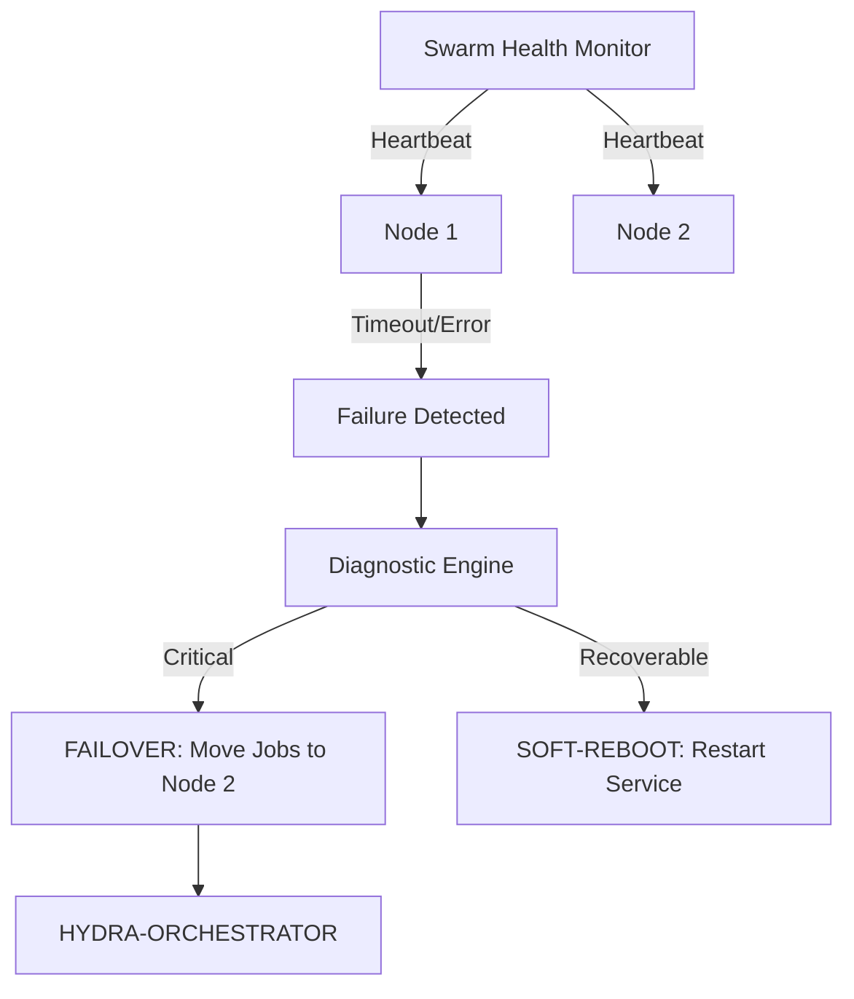

<p align="center">
  
</p>

# 💊 HYDRA-UMC-NODE-HEALING

<p align="center"><a href="README.md">🇺🇸 English</a> | <a href="README_spa.md">🇪🇸 Español</a> | <a href="README_fra.md">🇫🇷 Français</a> | <a href="README_ita.md">🇮🇹 Italiano</a> | <a href="README_deu.md">🇩🇪 Deutsch</a> | 🇨🇳 <b>简体中文</b> | <a href="README_jpn.md">🇯🇵 日本語</a></p>

### 🛡️ 面向 HydraNode 的高可用性监控与故障转移管理器

<p align="left">
  
  
  
</p>

---

## 1. 🛠️ 技术概述

**HYDRA-UMC-NODE-HEALING** 是集群的弹性层。它持续监控所有物理 HydraNode
（控制器）和逻辑服务的健康状况，确保微工厂零停机运行。

如果某个节点因硬件故障或网络中断而失效，自愈管理器会自动触发故障转移
流程，将其活动任务重新定向到其他节点，并通过编排器通知操作员。

### 关键特性：
* 💓 **健康心跳：** 亚 10ms 级别的节点可用性和热状态监控。
* 🔄 **自动故障转移：** 透明地将任务从失效节点重新分配给健康节点。
* 🛡️ **软重启：** 在触发完整硬件重置之前尝试远程服务恢复。
* 📡 **操作员告警：** 跨所有界面（Studio、应用程序、Watch）的实时通知。
* 🔁 **限次重试 + 已验证节点身份（v0，真实）：** 一次瞬时网络故障不再让节点在第一次失败时就被判为 `UNREACHABLE`——`checkNode` 会先以确定性的、有上限的指数退避重试，然后才放弃；一个应答了但无法正确自证身份的节点会被分类为 `INVALID`，永远不会被信任、重试或报告为健康。

---

## 2. 🔄 自愈工作流



---

## 3. 🧱 架构与设计决策

* **为何真正的逻辑位于 `src/` 之下，而非仓库根目录。** `src/healthpb`（生成的 gRPC 存根）、`src/watchdog`（轮询引擎）和 `src/config`（节点注册表加载器）包含实际的实现；`main.go`/`version.go` 仍留在仓库根目录，作为将它们连接在一起的入口点。
* **为何检测机制与其所保护的编排器相互独立。** 如果一个节点自愈看门狗运行在编排器进程*内部*，它就无法检测到该进程自身发生挂起——作为独立服务运行，才能真正实现"检测无响应节点并重新路由其工作"这一目标，即使无响应的节点正是编排器本身。
* **为何检测机制今天已经真实可用，而故障转移/软重启尚未实现。** `src/watchdog` 会对每个已注册的节点真实调用 `HealthService.Check()`（来自 `HYDRA-UMC-ORCHESTRATOR/proto/hydra_common.proto` 的共享 `hydra.common.v1` gRPC 契约），基于真实的时间间隔和真实的网络连接，将结果分类为 HEALTHY/DEGRADED/UNHEALTHY/UNREACHABLE 之一，并且只在状态*发生变化*时触发一次 `Reactor` 回调（绝不会每个轮询周期都触发）。它尚未调用 HYDRA-UMC-ORCHESTRATOR 来触发真正的故障转移或软重启，因为 ORCHESTRATOR 目前同样没有可供调用的相关 API——`watchdog.Reactor` 正是为此预留的接入点。检测功能不需要等到那一步才能成为真实功能。
* **为何节点注册表是静态 JSON 而非对 HYDRA-UMC-SWARM-SYNC 的实时查询。** SWARM-SYNC（README 最初所称"整个蜂群中每个单元"的真相来源）目前同样没有真实 API——它仍处于脚手架阶段。一个静态的 `nodes.json`（见 `nodes.example.json`）才是诚实的 v0 版本，而不是一个假装动态的占位符。一旦 SWARM-SYNC 项目具备真实客户端，即可替换 `src/config.LoadNodes`。
* **这如何融入生态系统的其余部分。** 作为 HYDRA-UMC-ORCHESTRATOR 下的同级服务——监视其注册表中的每个节点并报告状态变化；将工作从停止响应的节点重新路由出去是构建于此之上的下一层，待 ORCHESTRATOR 提供可供路由工作的接口后实现。
* **为何传输失败会被重试（限次），但身份不匹配永远不会。** 连接被拒绝或 RPC 超时可能是真正短暂的故障——一个正在重启的节点、一次短暂的网络卡顿——所以 `checkNode` 会用指数退避重试最多 `RetryPolicy.MaxAttempts` 次才放弃。一个应答了但报告错误名称（或根本没报告）的节点则是完全不同性质的问题：无论等多久都修复不了一个绑在错误端口上的服务，所以这种情况会立即被分类为 `StatusInvalid`，不做任何重试。
* **为何退避没有随机抖动（jitter）。** 一支真正的生产集群会想要抖动，以避免大量连接同时涌回造成的"惊群"效应，但这个看门狗本来就是每个节点各自用自己的 goroutine、按自己的节奏轮询——这里加入抖动唯一的代价就是让 `RetryPolicy.Backoff()` 变得不确定，更难在测试里断言。如果/当这个看门狗有朝一日需要对着数百个节点、共享同一个存在瓶颈的资源做轮询时，再加入抖动。

---

## 📂 目录结构

```text
HYDRA-UMC-NODE-HEALING/
├── src/
│   ├── healthpb/      # 为 hydra.common.v1 生成的 Go 存根
│   │                  # (取自 HYDRA-UMC-ORCHESTRATOR/proto/
│   │                  # hydra_common.proto——生成命令见该仓库的
│   │                  # proto/README.md)
│   ├── watchdog/      # 真实的轮询循环：拨号、Check()、分类，
│   │                  # 仅在状态变化时才作出响应，以及
│   │                  # retry.go（RetryPolicy）
│   └── config/        # 静态 JSON 节点注册表加载器
├── build/             # 编译后的二进制文件（build.sh/build.bat 的输出）
├── images/            # 媒体与图示
├── systemd/
│   └── hydra-umc-node-healing.service # CM5 本地看门狗的 systemd 单元
├── tools/
│   ├── build_test.py  # 不递增版本号的构建检查
│   └── ci_validate.py # CI 使用的清单/CHANGELOG/文档校验
├── nodes.example.json # 示例节点注册表（见 src/config）
├── go.mod / go.sum    # Go 模块定义
├── version.go         # const Version = "X.Y.Z"（go.mod 没有应用版本字段）
├── main.go            # 入口点：加载注册表并启动看门狗
├── bump_version.py    # 里程表式版本递增，由 build.sh/.bat 运行
├── bump_manifest_version.py # 将 hydra-umc.project.json 的版本与原生版本同步（--sync）
├── build.sh/.bat      # 递增版本号，然后执行 `go build`
├── build-test.sh/.bat # 不递增版本号的构建检查
├── run.sh/.bat        # 运行编译后的二进制文件
├── docs/
│   ├── ARCHITECTURE.md
│   ├── BUILD_AND_RUN.md
│   └── INTEGRATION_CONTRACT.md
└── README.md
```

从原始模板中省略：`hardware/`、`firmware/`、`os/`、
`docs/`、`images/` 和 `scripts/`——这是一个纯软件
服务（Go 二进制文件），没有专属硬件或固件，
也没有需要维护的操作系统镜像，目前也还没有
足够多的文档/媒体/实用脚本内容值得为它们
单独建立文件夹。

---

## 🔧 构建与运行

一个真实的看门狗，而不只是一个能编译的骨架：它会通过 gRPC 联系
`nodes.example.json` 中列出的每个节点（或用 `-nodes <路径>` 指向自己的
注册表），并将状态变化输出到 stdout。

```bash
# Windows
build.bat
run.bat -nodes nodes.example.json

# Linux / macOS
./build.sh
./run.sh -nodes nodes.example.json
```

`build.sh`/`build.bat` 会递增 `version.go` 中的版本号（生态系统统一的
里程表规则，见 `bump_version.py`——`go.mod` 没有面向应用二进制文件的原生
版本字段），然后执行 `go build`。`run.sh`/`run.bat` 直接执行生成的二进
制文件。

注册表中的每个条目都需要有真实的服务监听其 `address` 并实现
`hydra.common.v1.HealthService`（见
`HYDRA-UMC-ORCHESTRATOR/proto/hydra_common.proto`），才能被报告为健康
状态——由于示例端口上目前尚无任何服务运行，预计三个节点在第一个轮询
周期都会显示 `UNKNOWN -> UNREACHABLE`（现在只会在 `RetryPolicy` 的
限次重试耗尽之后才会如此，而非第一次拨号就判定——见上方的"限次重试"
特性），这在今天是正确且诚实的结果（生态系统中的每个节点，除了本
仓库自身的检测逻辑外，仍处于脚手架阶段）。一个应答了但无法正确自证
身份的节点则会立即显示 `UNKNOWN -> INVALID`。

```bash
go test ./...   # src/config + src/watchdog，基于真实回环套接字
                 # 的真实 gRPC 往返测试，未使用模拟客户端
```
制文件。

---

## 🚀 路线图
* **第一阶段：** 数字孪生与实时硬件遥测的同步，延迟低于 10ms。
* **第二阶段：** 物理复制品与工业级仿真器（Isaac Sim）的集成，以及可变形体支持。
* **第三阶段：** 用于去中心化故障转移和早期传感器退化检测的节点自愈自动化恢复模式。
* **第四阶段：** 基于早期传感器退化检测的 AI 驱动预测性自愈，以及支持全尺寸车辆在环的 HIL Bridge。

---

## 🔗 相关项目

本项目是同一作者(JuanenRac / Electro Hobby 3D)打造的 HYDRA-UMC 机器人生态系统的一部分。值得了解,因为某个请求实际上可能是关于这些项目之一,而非本仓库本身。

**父项目**
- **[HYDRA-UMC-ORCHESTRATOR](https://github.com/JuanenRac/HYDRA-UMC-ORCHESTRATOR)** — 具备真实 gRPC/Protobuf 健康报告契约与任务状态机的集成中枢;本仓库是其自身集群协调层中一个具体编排服务所属的父项目。

**兄弟项目** —— HYDRA-UMC-ORCHESTRATOR 自身集群协调层中的其他编排服务
- **[HYDRA-UMC-SWARM-SYNC](https://github.com/JuanenRac/HYDRA-UMC-SWARM-SYNC)** — 经过多单元收敛属性测试的真实 CRDT LWW-Element-Map 状态同步。
- **[HYDRA-UMC-PATH-PLANNER-3D](https://github.com/JuanenRac/HYDRA-UMC-PATH-PLANNER-3D)** — 具备真实障碍物/工作空间碰撞校验的真实基于 RRT 的三维路径规划器。
- **[HYDRA-UMC-JOB-DISPATCHER](https://github.com/JuanenRac/HYDRA-UMC-JOB-DISPATCHER)** — 基于真实 HTTP API 的真实优先级任务队列，支持去重。

**直接相关**
- **[HYDRA-UMC-SERVER](https://github.com/JuanenRac/HYDRA-UMC-SERVER)** — 每个控制客户端真正通信的真实无头后端(REST/WebSocket) —— 本自愈服务监控该后端的在线实例。

**生态系统中的其他项目**

*核心硬件与平台*
- **[HYDRA-UMC](https://github.com/JuanenRac/HYDRA-UMC)** — 机器人手臂的真实主板——CM5 主机 + 双核 STM32H745，通过 CAN-OTA/SPI-OTA 协调最多 8 条工具臂。
- **[HYDRA-UMC-OS](https://github.com/JuanenRac/HYDRA-UMC-OS)** — 面向 CM5 的可复现 Raspberry Pi OS 产品层——只读代理、经过验证的配置/配置文件、WiFi 首次配网。
- **[HYDRA-UMC-SDK](https://github.com/JuanenRac/HYDRA-UMC-SDK)** — 每个桥接都据此校验自身指令的共享 JSON-Schema 契约与安全门限边界。

*核心后端与客户端*
- **[HYDRA-UMC-STUDIO](https://github.com/JuanenRac/HYDRA-UMC-STUDIO)** — 具有实时多机器人 3D 可视化的网页控制面板。
- **[HYDRA-UMC-SUITE](https://github.com/JuanenRac/HYDRA-UMC-SUITE)** — 面向多台服务器的桌面(PySide6)集群指挥中心，打包为独立可执行文件。
- **[HYDRA-UMC-ANDROID-CONTROL](https://github.com/JuanenRac/HYDRA-UMC-ANDROID-CONTROL)** — 具有生物识别登录和配对 Wear OS 伴侣应用的原生 Android 控制应用。
- **[HYDRA-UMC-IOS-CONTROL](https://github.com/JuanenRac/HYDRA-UMC-IOS-CONTROL)** — 具有实时 WebSocket 同步的 iOS/iPadOS 控制应用(Flutter)。
- **[HYDRA-UMC-DSI](https://github.com/JuanenRac/HYDRA-UMC-DSI)** — 面向机载 7 英寸 DSI 触摸屏的原生触控界面，直接嵌入 CM5 本体。
- **[HYDRA-UMC-EDITOR-URDF](https://github.com/JuanenRac/HYDRA-UMC-EDITOR-URDF)** — 将完成的模型推送到 STUDIO 自身目录的桌面版图形化 URDF 创建/编辑工具。
- **[HYDRA-UMC-BRIDGE-AMR](https://github.com/JuanenRac/HYDRA-UMC-BRIDGE-AMR)** — 通过真实的 VDA 5050 MQTT 发布者为 AGV/AMR 车队提供的协调边界。
- **[HYDRA-UMC-BRIDGE-CNC](https://github.com/JuanenRac/HYDRA-UMC-BRIDGE-CNC)** — 具备真实 GRBL 状态/控制字节访问能力的高层 CNC 单元协调器。
- **[HYDRA-UMC-BRIDGE-DROIDS](https://github.com/JuanenRac/HYDRA-UMC-BRIDGE-DROIDS)** — 面向足式/人形机器人的协调边界，具备真实的 Boston Dynamics Spot 指令发送器。
- **[HYDRA-UMC-BRIDGE-LASER](https://github.com/JuanenRac/HYDRA-UMC-BRIDGE-LASER)** — 读取 3 项真实钥匙/外壳/联锁 GPIO 安全信号的激光单元安全协调器。
- **[HYDRA-UMC-BRIDGE-OPENPNP](https://github.com/JuanenRac/HYDRA-UMC-BRIDGE-OPENPNP)** — 面向 OpenPnP 贴片机板级流程的安全高层协调器。
- **[HYDRA-UMC-BRIDGE-PRINTER3D](https://github.com/JuanenRac/HYDRA-UMC-BRIDGE-PRINTER3D)** — 面向 Moonraker/Klipper 3D 打印机的安全协调边界，具备真实的受控作业指令。
- **[HYDRA-UMC-BRIDGE-ROS2](https://github.com/JuanenRac/HYDRA-UMC-BRIDGE-ROS2)** — 具备真实的惰性导入 rclpy ROS 2 传输层的安全协调器。
- **[HYDRA-UMC-BRIDGE-UAV](https://github.com/JuanenRac/HYDRA-UMC-BRIDGE-UAV)** — 面向搭载摄像头的无人机的协调边界，具备真实的 MAVLink 指令发送器。

*URTC 工具平台*
- **[URTC](https://github.com/JuanenRac/URTC)** — 面向实体 Universal Robot Tool Controller 板卡的固件，通过 CAN 总线支持 25 种以上工具配置。
- **[URTC-FLASHER](https://github.com/JuanenRac/URTC-FLASHER)** — 面向 URTC 板卡的桌面图形烧录工具，支持 CAN-OTA 以及全芯片 SWD/JTAG。
- **[URTC-TESTER](https://github.com/JuanenRac/URTC-TESTER)** — 面向 URTC 板卡的桌面实时 CAN 总线诊断工具，每种工具配置对应一个面板。
- **[URTC-WEB-STUDIO](https://github.com/JuanenRac/URTC-WEB-STUDIO)** — 通过 Web Serial API 实现的浏览器版 URTC-TESTER 替代方案，无需本地安装。

*视觉 AI 节点(Hailo-8)*
- **[HYDRA-UMC-VISION-NODE](https://github.com/JuanenRac/HYDRA-UMC-VISION-NODE)** — 面向 Hailo-8 视觉流水线的集成中枢，具备逐阶段的真实硬件就绪检测。
- **[HYDRA-UMC-DETECTION-HEF](https://github.com/JuanenRac/HYDRA-UMC-DETECTION-HEF)** — 具备 Hailo 架构/校验和安全加载验证的真实编译模型注册表。
- **[HYDRA-UMC-VISION-STREAMER](https://github.com/JuanenRac/HYDRA-UMC-VISION-STREAMER)** — 具备真实 HailoRT 集成边界的真实 GStreamer 流水线 + MediaMTX 配置生成器。
- **[HYDRA-UMC-VISUAL-SERVOING-API](https://github.com/JuanenRac/HYDRA-UMC-VISUAL-SERVOING-API)** — 具备真实 Position-Based Visual Servoing 修正律，并依据上游区域状态进行安全门控。
- **[HYDRA-UMC-SAFETY-ZONES](https://github.com/JuanenRac/HYDRA-UMC-SAFETY-ZONES)** — 具备校准新鲜度强制检查的真实区域入侵检测与 E-STOP 请求。

*认知 AI 节点(Hailo-10)*
- **[HYDRA-UMC-COGNITIVE-NODE](https://github.com/JuanenRac/HYDRA-UMC-COGNITIVE-NODE)** — 面向 Hailo-10 认知流水线(LLM/VLA/语音编排)的集成中枢。
- **[HYDRA-UMC-VLA-ENGINE](https://github.com/JuanenRac/HYDRA-UMC-VLA-ENGINE)** — 面向 Vision-Language-Action 模型的真实动作 token 编解码与轨迹生成。
- **[HYDRA-UMC-VOICE-UI](https://github.com/JuanenRac/HYDRA-UMC-VOICE-UI)** — 具备受限、需确认的 Watch 中继的真实语音前端(VAD + 意图解析)。
- **[HYDRA-UMC-SEMANTIC-PLANNER](https://github.com/JuanenRac/HYDRA-UMC-SEMANTIC-PLANNER)** — 基于真实规则的任务分解，以及针对 MCU 错误码的语义化错误恢复。
- **[HYDRA-UMC-DOCS-QA](https://github.com/JuanenRac/HYDRA-UMC-DOCS-QA)** — 面向本生态系统自身 Markdown 文档的真实纯标准库 TF-IDF 文档检索。

*数字孪生与仿真*
- **[HYDRA-UMC-TWIN](https://github.com/JuanenRac/HYDRA-UMC-TWIN)** — 面向数字孪生引擎的集成中枢，具备真实的版本兼容性同步契约。
- **[HYDRA-UMC-HIL-BRIDGE](https://github.com/JuanenRac/HYDRA-UMC-HIL-BRIDGE)** — 在仿真与真实硬件之间路由指令的真实硬件在环安全联锁。
- **[HYDRA-UMC-PHYSICS-REPLICA](https://github.com/JuanenRac/HYDRA-UMC-PHYSICS-REPLICA)** — 面向真实 URDF 子集的真实正向运动学与关节限位校验。
- **[HYDRA-UMC-SYNTHETIC-DATA-GEN](https://github.com/JuanenRac/HYDRA-UMC-SYNTHETIC-DATA-GEN)** — 具备 YOLO/COCO 标注导出功能的真实程序化 2D 场景生成器。

*数据与分析*
- **[HYDRA-UMC-DATALAKE](https://github.com/JuanenRac/HYDRA-UMC-DATALAKE)** — 具备真实数据摄入/查询 HTTP API 的真实 sqlite3 时序数据存储。
- **[HYDRA-UMC-ANOMALY-DETECTOR](https://github.com/JuanenRac/HYDRA-UMC-ANOMALY-DETECTOR)** — 具备漂移监测能力的真实 FFT + 统计基线异常检测器。
- **[HYDRA-UMC-PRODUCTION-REPORTS](https://github.com/JuanenRac/HYDRA-UMC-PRODUCTION-REPORTS)** — 基于 DATALAKE 历史数据的真实 OEE/可用率计算，支持可复现的 CSV 导出。
- **[HYDRA-UMC-TELEMETRY-COLLECTOR](https://github.com/JuanenRac/HYDRA-UMC-TELEMETRY-COLLECTOR)** — 面向 DATALAKE 的真实 CAN/WebSocket 数据摄入管道，支持序列去重。

*工业网关*
- **[HYDRA-UMC-GATEWAY-INDUSTRIAL](https://github.com/JuanenRac/HYDRA-UMC-GATEWAY-INDUSTRIAL)** — 中继至工业协议的集成中枢，具备真实的指令白名单/背压控制层。
- **[HYDRA-UMC-OPCUA-SERVER](https://github.com/JuanenRac/HYDRA-UMC-OPCUA-SERVER)** — 经真实二进制协议客户端会话验证的真实 OPC-UA 地址空间。
- **[HYDRA-UMC-MQTT-BROKER](https://github.com/JuanenRac/HYDRA-UMC-MQTT-BROKER)** — 具备可选按客户端认证与主题 ACL 的真实 MQTT 代理。
- **[HYDRA-UMC-MTCONNECT-ADAPTER](https://github.com/JuanenRac/HYDRA-UMC-MTCONNECT-ADAPTER)** — 具备降级模式输出的真实 MTConnect `/probe` 与 `/current` XML 端点。

*辅助工具与生态系统运维*
- **[HYDRA-UMC-DASHBOARD-AI](https://github.com/JuanenRac/HYDRA-UMC-DASHBOARD-AI)** — 基于 DATALAKE/ANOMALY-DETECTOR 的智能摘要与异常高亮面板，具备诚实的统计回退机制。
- **[HYDRA-UMC-TOOL-CLI](https://github.com/JuanenRac/HYDRA-UMC-TOOL-CLI)** — 具备真实、稳定退出码契约的车队 CLI，是 HYDRA-UMC-SERVER 自身 API 的真实在线客户端。
- **[HYDRA-UMC-WATCH](https://github.com/JuanenRac/HYDRA-UMC-WATCH)** — 具备真实触觉提醒与配对手机语音中继功能的 WearOS 伴侣应用。
- **[URTC-SMART-RACK](https://github.com/JuanenRac/URTC-SMART-RACK)** — 面向板卡安装机架的固件，具备真实的工具 ID 解码与 Smart Idle 预热逻辑。
- **[URTC-VISION-TOOL](https://github.com/JuanenRac/URTC-VISION-TOOL)** — 面向热成像/RGB 检测工具头的固件及真实 Python 视觉伴侣程序。
- **[HYDRA-UMC-UPDATER](https://github.com/JuanenRac/HYDRA-UMC-UPDATER)** — 发现、克隆并更新本生态系统中每个仓库的管理类桌面工具。


## 👤 作者
**JuanenRac** (Electro Hobby 3D)
📧 electrohobby3d@gmail.com
📺 [youtube.com/@electrohobby3d](https://youtube.com/@electrohobby3d)

## 📜 许可证
GPL-3.0 —— 详见 LICENSE。
