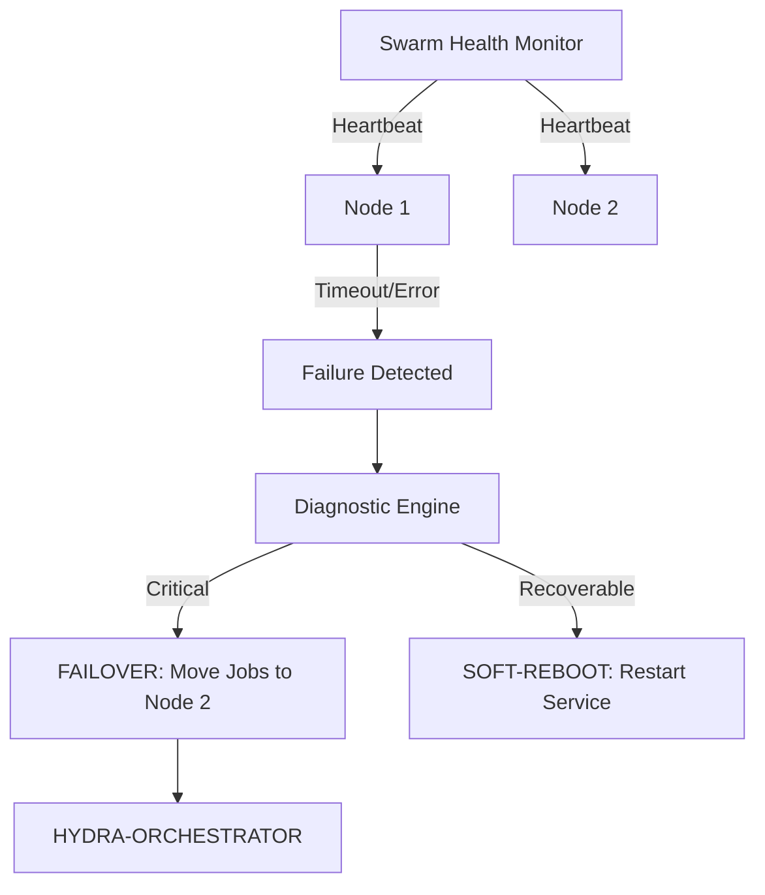

<p align="center">
  
</p>

# 💊 HYDRA-UMC-NODE-HEALING

<p align="center"><a href="README.md">🇺🇸 English</a> | <a href="README_spa.md">🇪🇸 Español</a> | <a href="README_fra.md">🇫🇷 Français</a> | <a href="README_ita.md">🇮🇹 Italiano</a> | <a href="README_deu.md">🇩🇪 Deutsch</a> | 🇨🇳 <b>简体中文</b> | <a href="README_jpn.md">🇯🇵 日本語</a></p>

### 🛡️ 面向 HydraNode 的高可用性监控与故障转移管理器

<p align="left">
  
  
  
</p>

---

## 1. 🛠️ 技术概述

**HYDRA-UMC-NODE-HEALING** 是集群的弹性层。它持续监控所有物理 HydraNode
（控制器）和逻辑服务的健康状况，确保微工厂零停机运行。

如果某个节点因硬件故障或网络中断而失效，自愈管理器会自动触发故障转移
流程，将其活动任务重新定向到其他节点，并通过编排器通知操作员。

### 关键特性：
* 💓 **健康心跳：** 亚 10ms 级别的节点可用性和热状态监控。
* 🔄 **自动故障转移：** 透明地将任务从失效节点重新分配给健康节点。
* 🛡️ **软重启：** 在触发完整硬件重置之前尝试远程服务恢复。
* 📡 **操作员告警：** 跨所有界面（Studio、应用程序、Watch）的实时通知。

---

## 2. 🔄 自愈工作流



---

## 3. 🧱 架构与设计决策

* **为何真正的逻辑位于 `src/` 之下，而非仓库根目录。** `src/healthpb`（生成的 gRPC 存根）、`src/watchdog`（轮询引擎）和 `src/config`（节点注册表加载器）包含实际的实现；`main.go`/`version.go` 仍留在仓库根目录，作为将它们连接在一起的入口点。
* **为何检测机制与其所保护的编排器相互独立。** 如果一个节点自愈看门狗运行在编排器进程*内部*，它就无法检测到该进程自身发生挂起——作为独立服务运行，才能真正实现"检测无响应节点并重新路由其工作"这一目标，即使无响应的节点正是编排器本身。
* **为何检测机制今天已经真实可用，而故障转移/软重启尚未实现。** `src/watchdog` 会对每个已注册的节点真实调用 `HealthService.Check()`（来自 `HYDRA-UMC-ORCHESTRATOR/proto/hydra_common.proto` 的共享 `hydra.common.v1` gRPC 契约），基于真实的时间间隔和真实的网络连接，将结果分类为 HEALTHY/DEGRADED/UNHEALTHY/UNREACHABLE 之一，并且只在状态*发生变化*时触发一次 `Reactor` 回调（绝不会每个轮询周期都触发）。它尚未调用 HYDRA-UMC-ORCHESTRATOR 来触发真正的故障转移或软重启，因为 ORCHESTRATOR 目前同样没有可供调用的相关 API——`watchdog.Reactor` 正是为此预留的接入点。检测功能不需要等到那一步才能成为真实功能。
* **为何节点注册表是静态 JSON 而非对 HYDRA-UMC-SWARM-SYNC 的实时查询。** SWARM-SYNC（README 最初所称"整个蜂群中每个单元"的真相来源）目前同样没有真实 API——它仍处于脚手架阶段。一个静态的 `nodes.json`（见 `nodes.example.json`）才是诚实的 v0 版本，而不是一个假装动态的占位符。一旦 SWARM-SYNC 项目具备真实客户端，即可替换 `src/config.LoadNodes`。
* **这如何融入生态系统的其余部分。** 作为 HYDRA-UMC-ORCHESTRATOR 下的同级服务——监视其注册表中的每个节点并报告状态变化；将工作从停止响应的节点重新路由出去是构建于此之上的下一层，待 ORCHESTRATOR 提供可供路由工作的接口后实现。

---

## 📂 目录结构

```text
HYDRA-UMC-NODE-HEALING/
├── src/
│   ├── healthpb/      # 为 hydra.common.v1 生成的 Go 存根
│   │                  # (取自 HYDRA-UMC-ORCHESTRATOR/proto/
│   │                  # hydra_common.proto——生成命令见该仓库的
│   │                  # proto/README.md)
│   ├── watchdog/      # 真实的轮询循环：拨号、Check()、分类，
│   │                  # 仅在状态变化时才作出响应
│   └── config/        # 静态 JSON 节点注册表加载器
├── build/             # 编译后的二进制文件（build.sh/build.bat 的输出）
├── nodes.example.json # 示例节点注册表（见 src/config）
├── go.mod / go.sum    # Go 模块定义
├── version.go         # const Version = "X.Y.Z"（go.mod 没有应用版本字段）
├── main.go            # 入口点：加载注册表并启动看门狗
├── bump_version.py    # 里程表式版本递增，由 build.sh/.bat 运行
├── build.sh/.bat      # 递增版本号，然后执行 `go build`
├── run.sh/.bat        # 运行编译后的二进制文件
└── README.md
```

从原始模板中省略：`hardware/`、`firmware/`、`os/`、
`docs/`、`images/` 和 `scripts/`——这是一个纯软件
服务（Go 二进制文件），没有专属硬件或固件，
也没有需要维护的操作系统镜像，目前也还没有
足够多的文档/媒体/实用脚本内容值得为它们
单独建立文件夹。

---

## 🔧 构建与运行

一个真实的看门狗，而不只是一个能编译的骨架：它会通过 gRPC 联系
`nodes.example.json` 中列出的每个节点（或用 `-nodes <路径>` 指向自己的
注册表），并将状态变化输出到 stdout。

```bash
# Windows
build.bat
run.bat -nodes nodes.example.json

# Linux / macOS
./build.sh
./run.sh -nodes nodes.example.json
```

`build.sh`/`build.bat` 会递增 `version.go` 中的版本号（生态系统统一的
里程表规则，见 `bump_version.py`——`go.mod` 没有面向应用二进制文件的原生
版本字段），然后执行 `go build`。`run.sh`/`run.bat` 直接执行生成的二进
制文件。

注册表中的每个条目都需要有真实的服务监听其 `address` 并实现
`hydra.common.v1.HealthService`（见
`HYDRA-UMC-ORCHESTRATOR/proto/hydra_common.proto`），才能被报告为健康
状态——由于示例端口上目前尚无任何服务运行，预计三个节点在第一个轮询
周期都会显示 `UNKNOWN -> UNREACHABLE`，这在今天是正确且诚实的结果
（生态系统中的每个节点，除了本仓库自身的检测逻辑外，仍处于脚手架阶段）。

```bash
go test ./...   # src/config + src/watchdog，基于真实回环套接字
                 # 的真实 gRPC 往返测试，未使用模拟客户端
```
制文件。

---

## 🚀 路线图
* **第一阶段：** 数字孪生与实时硬件遥测的同步，延迟低于 10ms。
* **第二阶段：** 物理复制品与工业级仿真器（Isaac Sim）的集成，以及可变形体支持。
* **第三阶段：** 用于去中心化故障转移和早期传感器退化检测的节点自愈自动化恢复模式。
* **第四阶段：** 基于早期传感器退化检测的 AI 驱动预测性自愈，以及支持全尺寸车辆在环的 HIL Bridge。

---

## 🔗 相关项目

本项目是同一作者（JuanenRac / Electro Hobby 3D）打造的更大规模机器人生态
系统的一部分，涵盖固件、控制软件、AI 节点和车队工具。值得了解，因为某个
需求实际上可能是关于这些项目之一，而非本仓库。

### 项目族

**父项目：** **[HYDRA-UMC-ORCHESTRATOR](https://github.com/JuanenRac/HYDRA-UMC-ORCHESTRATOR)** —— 本自愈服务所保护的集成父项目。

**同族项目：**
- **[HYDRA-UMC-SWARM-SYNC](https://github.com/JuanenRac/HYDRA-UMC-SWARM-SYNC)** —— 同级编排服务，同一父项目。
- **[HYDRA-UMC-PATH-PLANNER-3D](https://github.com/JuanenRac/HYDRA-UMC-PATH-PLANNER-3D)** —— 同级编排服务，同一父项目。
- **[HYDRA-UMC-JOB-DISPATCHER](https://github.com/JuanenRac/HYDRA-UMC-JOB-DISPATCHER)** —— 同级编排服务，同一父项目。

### 直接相关（项目族之外）

- **[HYDRA-UMC-SERVER](https://github.com/JuanenRac/HYDRA-UMC-SERVER)** —— 监控此后端的各个实例。

### 生态系统的其余部分

**HYDRA-UMC 平台** —— 多机器人微工厂单元
- **[HYDRA-UMC](https://github.com/JuanenRac/HYDRA-UMC)** —— 协调最多 8 条机械臂的 CM5 + STM32H745 主板。
- **[HYDRA-UMC-SERVER](https://github.com/JuanenRac/HYDRA-UMC-SERVER)** —— 每个控制客户端所对接的 Express/WebSocket 后端。
- **[HYDRA-UMC-STUDIO](https://github.com/JuanenRac/HYDRA-UMC-STUDIO)** —— 基于 Web 的控制仪表盘，多机器人 3D 可视化。
- **[HYDRA-UMC-ANDROID-CONTROL](https://github.com/JuanenRac/HYDRA-UMC-ANDROID-CONTROL)** —— 通过 Wi-Fi/蓝牙的 Android 控制应用。
- **[HYDRA-UMC-IOS-CONTROL](https://github.com/JuanenRac/HYDRA-UMC-IOS-CONTROL)** —— 基于 Flutter 构建的 iOS/iPadOS 控制应用。
- **[HYDRA-UMC-SUITE](https://github.com/JuanenRac/HYDRA-UMC-SUITE)** —— 桌面端集群指挥中心（Python/PySide6）。
- **[HYDRA-UMC-EDITOR-URDF](https://github.com/JuanenRac/HYDRA-UMC-EDITOR-URDF)** —— 用于机器人目录的桌面端 URDF 模型编辑器。
- **[HYDRA-UMC-DSI](https://github.com/JuanenRac/HYDRA-UMC-DSI)** —— 机载 DSI 触摸屏的原生触控 UI。

**URTC 平台** —— 每台 HYDRA-UMC 机械臂搭载的工具头控制器
- **[URTC](https://github.com/JuanenRac/URTC)** —— CAN 总线工具头控制器，25 种工具配置。
- **[URTC-FLASHER](https://github.com/JuanenRac/URTC-FLASHER)** —— 桌面端 CAN-OTA + SWD/JTAG 刷写工具。
- **[URTC-TESTER](https://github.com/JuanenRac/URTC-TESTER)** —— 桌面端实时 CAN 总线诊断工具。
- **[URTC-WEB-STUDIO](https://github.com/JuanenRac/URTC-WEB-STUDIO)** —— 通过 Web Serial API 的浏览器端替代方案。

**🎥 视觉 AI 节点（Hailo-8）**
- [HYDRA-UMC-VISION-NODE](https://github.com/JuanenRac/HYDRA-UMC-VISION-NODE)
- [HYDRA-UMC-VISION-STREAMER](https://github.com/JuanenRac/HYDRA-UMC-VISION-STREAMER)
- [HYDRA-UMC-DETECTION-HEF](https://github.com/JuanenRac/HYDRA-UMC-DETECTION-HEF)
- [HYDRA-UMC-SAFETY-ZONES](https://github.com/JuanenRac/HYDRA-UMC-SAFETY-ZONES)
- [HYDRA-UMC-VISUAL-SERVOING-API](https://github.com/JuanenRac/HYDRA-UMC-VISUAL-SERVOING-API)

**🧠 认知 AI 节点（Hailo-10）**
- [HYDRA-UMC-COGNITIVE-NODE](https://github.com/JuanenRac/HYDRA-UMC-COGNITIVE-NODE)
- [HYDRA-UMC-VLA-ENGINE](https://github.com/JuanenRac/HYDRA-UMC-VLA-ENGINE)
- [HYDRA-UMC-VOICE-UI](https://github.com/JuanenRac/HYDRA-UMC-VOICE-UI)
- [HYDRA-UMC-SEMANTIC-PLANNER](https://github.com/JuanenRac/HYDRA-UMC-SEMANTIC-PLANNER)
- [HYDRA-UMC-DOCS-QA](https://github.com/JuanenRac/HYDRA-UMC-DOCS-QA)

**🎮 数字孪生与仿真**
- [HYDRA-UMC-TWIN](https://github.com/JuanenRac/HYDRA-UMC-TWIN)
- [HYDRA-UMC-PHYSICS-REPLICA](https://github.com/JuanenRac/HYDRA-UMC-PHYSICS-REPLICA)
- [HYDRA-UMC-HIL-BRIDGE](https://github.com/JuanenRac/HYDRA-UMC-HIL-BRIDGE)
- [HYDRA-UMC-SYNTHETIC-DATA-GEN](https://github.com/JuanenRac/HYDRA-UMC-SYNTHETIC-DATA-GEN)

**📊 数据与分析**
- [HYDRA-UMC-DATALAKE](https://github.com/JuanenRac/HYDRA-UMC-DATALAKE)
- [HYDRA-UMC-TELEMETRY-COLLECTOR](https://github.com/JuanenRac/HYDRA-UMC-TELEMETRY-COLLECTOR)
- [HYDRA-UMC-ANOMALY-DETECTOR](https://github.com/JuanenRac/HYDRA-UMC-ANOMALY-DETECTOR)
- [HYDRA-UMC-PRODUCTION-REPORTS](https://github.com/JuanenRac/HYDRA-UMC-PRODUCTION-REPORTS)

**🏭 工业网关**
- [HYDRA-UMC-GATEWAY-INDUSTRIAL](https://github.com/JuanenRac/HYDRA-UMC-GATEWAY-INDUSTRIAL)
- [HYDRA-UMC-OPCUA-SERVER](https://github.com/JuanenRac/HYDRA-UMC-OPCUA-SERVER)
- [HYDRA-UMC-MQTT-BROKER](https://github.com/JuanenRac/HYDRA-UMC-MQTT-BROKER)
- [HYDRA-UMC-MTCONNECT-ADAPTER](https://github.com/JuanenRac/HYDRA-UMC-MTCONNECT-ADAPTER)

**🛠️ 配套工具**
- [URTC-SMART-RACK](https://github.com/JuanenRac/URTC-SMART-RACK)
- [URTC-VISION-TOOL](https://github.com/JuanenRac/URTC-VISION-TOOL)
- [HYDRA-UMC-WATCH](https://github.com/JuanenRac/HYDRA-UMC-WATCH)
- [HYDRA-UMC-TOOL-CLI](https://github.com/JuanenRac/HYDRA-UMC-TOOL-CLI)
- [HYDRA-UMC-DASHBOARD-AI](https://github.com/JuanenRac/HYDRA-UMC-DASHBOARD-AI)


## 👤 作者
**JuanenRac**（Electro Hobby 3D）
📧 electrohobby3d@gmail.com

## 📜 许可证
GPL-3.0 —— 详见 LICENSE。

## 🛠️ BUILD & RUN

请在发布构建前使用不改动版本的构建检查：

| 操作 | Windows | Linux / macOS |
|---|---|---|
| 构建检查（不修改版本或 CHANGELOG） | `build-test.bat` | `./build-test.sh` |
| 运行 / 开发（如提供） | `run*.bat` 或 `dev*.bat` | `./run*.sh` 或 `./dev*.sh` |

`build-test.bat` 和 `build-test.sh` 会编译或验证项目技术栈，但不会递增 `hydra-umc.project.json`，也不会修改 `CHANGELOG.md`。它们仅可能生成正常的编译器输出。现有的 `build*.bat`、`build*.sh`、`run*` 和 `dev*` 脚本保留各自的版本化或运行时行为；需要该行为时请使用它们。